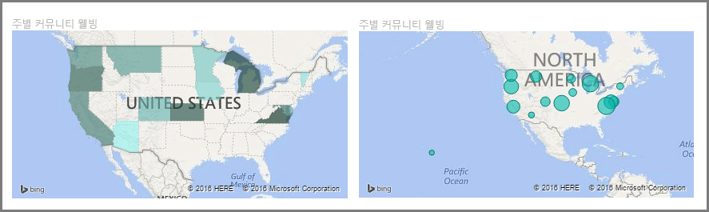
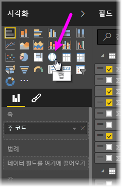
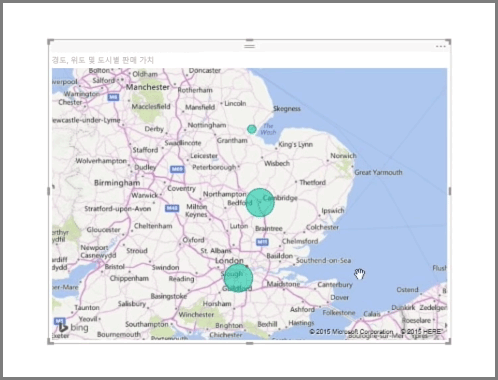
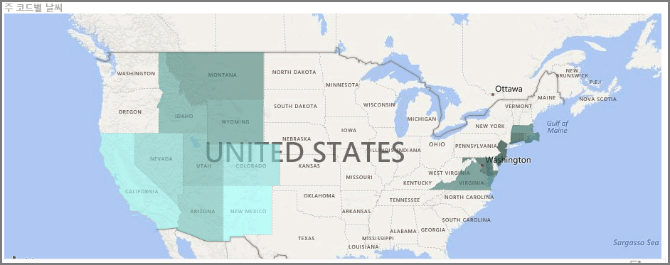
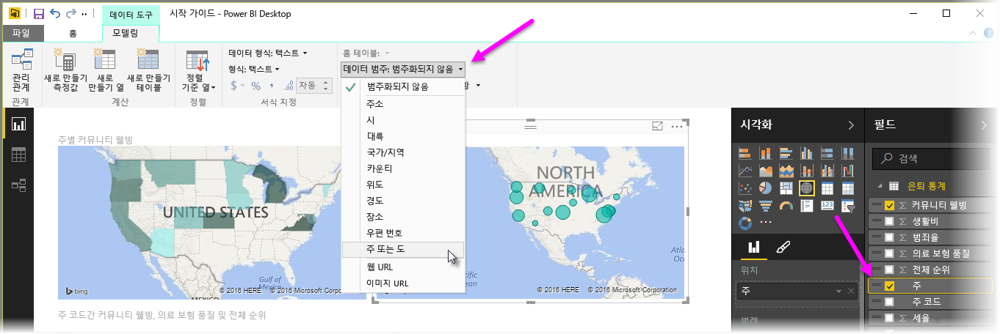

Power BI에는 두 가지 유형의 지도 시각화가 있습니다. 하나는 지리적 지점 위에 거품을 배치하는 거품형 지도이고, 다른 하나는 시각화할 영역의 윤곽선을 실제로 표시하는 도형 지도입니다.

> [!NOTE]
> 국가 또는 지역 작업 시, 지오코딩이 지도 시각화에서 제대로 작동되도록 세 글자 약어를 사용하세요. 일부 국가나 지역이 제대로 인식되지 않을 수 있으므로 두 글자 약어는 사용하지 *마십시오*.
> 두 글자로만 된 약어가 있는 경우 [이 외부 블로그 게시물](https://blog.ailon.org/how-to-display-2-letter-country-data-on-a-power-bi-map-85fc738497d6#.yudauacxp)을 확인하여 두 글자 국가/지역 약어를 세 글자 국가/지역 약어와 연결하는 방법에 대한 단계를 수행합니다.
> 
> 

## 거품형 지도 만들기
거품형 지도를 만들려면 **시각화** 창에서 **맵** 옵션을 선택합니다. 지도 시각적 개체를 사용하려면 **시각화** 옵션에서 *위치* 버킷에 값을 추가해야 합니다.

Power BI는 도시 이름이나 공항 코드와 같은 일반적인 정보부터 매우 구체적인 위도 및 경도 데이터까지 허용되는 위치 값 유형이 유연합니다. **크기** 버킷에 필드를 추가하여 각 지도 위치에 대한 거품 크기를 변경합니다.

## 도형 지도 만들기
도형 지도를 만들려면 시각화 창에서 **등치 지역도** 옵션을 선택합니다. 거품형 지도와 마찬가지로 이 시각적 개체를 사용하려면 위치 버킷에 일종의 값을 추가해야 합니다. 크기 버킷에 필드를 추가하여 채우기 색의 강도를 변경합니다.

시각적 개체의 왼쪽 위에 있는 경고 아이콘은 지도에 값을 정확하게 그리기 위해 더 많은 위치 데이터가 필요함을 나타냅니다. 이는 주 또는 지역을 나타낼 수 있는 Washington과 같은 지역 이름을 사용하는 등 위치 필드의 데이터가 모호한 경우에 매우 일반적인 문제입니다.  이 문제를 해결하는 한 가지 방법은 열 이름을 State와 같은 매우 특정한 이름으로 바꾸는 것입니다.  이를 해결하는 또 다른 방법은 모델링 탭에서 **데이터 범주**를 선택하여 데이터 범주를 수동으로 다시 설정하는 것입니다. 여기에서 "State" 또는 "City"와 같은 범주를 데이터에 할당할 수 있습니다.

