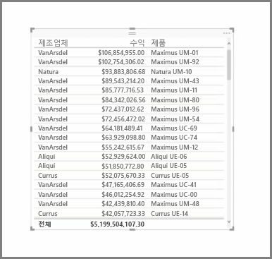
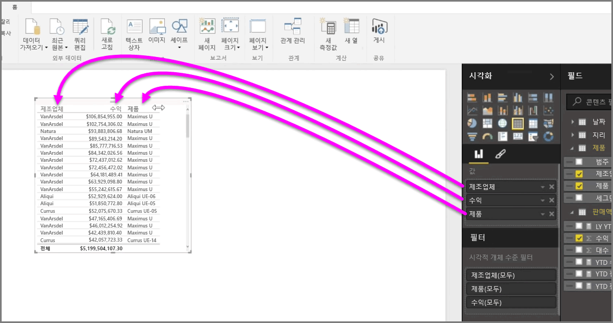
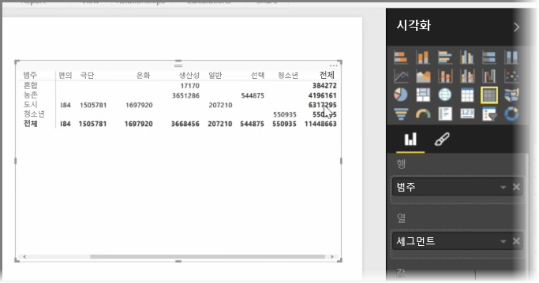

다양한 차트 외에 Power BI Desktop은 테이블 형식의 시각화도 지원합니다. 실제로 범주 필드 또는 텍스트 필드를 보고서 캔버스로 끌어오면 기본적으로 결과 테이블이 생성됩니다. 테이블을 위와 아래로 스크롤할 수 있으며 초기에는 사전순으로 정렬됩니다.

테이블에 수익과 같은 숫자 정보가 있는 경우 맨 아래에 합계가 표시됩니다. 머리글을 클릭해 오름차순 또는 내림차순으로 전환하여 각 열을 기준으로 수동으로 정렬할 수 있습니다. 열 너비가 작아 일부 내용이 표시되지 않는 경우 머리글을 클릭하고 옆으로 끌어 확장합니다.

**시각화** 창의 *값* 버킷에 있는 필드의 순서에 따라 테이블에 표시되는 항목의 순서가 결정됩니다.

**행렬**은 테이블과 유사하지만 열과 행의 범주 머리글이 서로 다릅니다. 테이블과 마찬가지로 숫자 정보는 행렬의 아래쪽과 오른쪽을 따라 자동으로 합산됩니다.

열 자동 크기 조정, 행 및 열 합계 전환, 색 설정 등 행렬에 사용할 수 있는 여러 디자인 옵션이 있습니다. 행렬을 만들 때 범주 데이터 (숫자가 아닌 데이터)가 행렬의 왼쪽에 오고 숫자 파일은 오른쪽에 오는지 확인하여 수평 스크롤 바가 나타나고 스크롤 동작이 제대로 작동하게 합니다.

