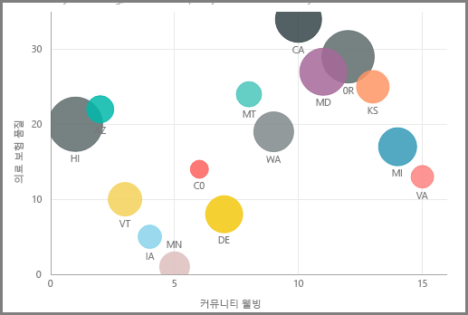
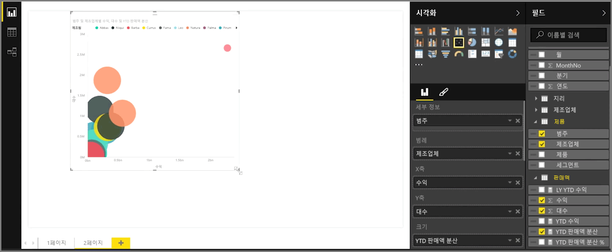
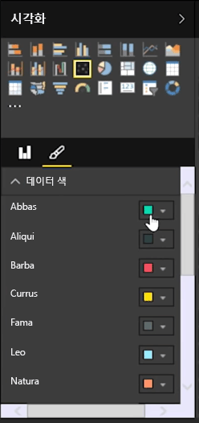
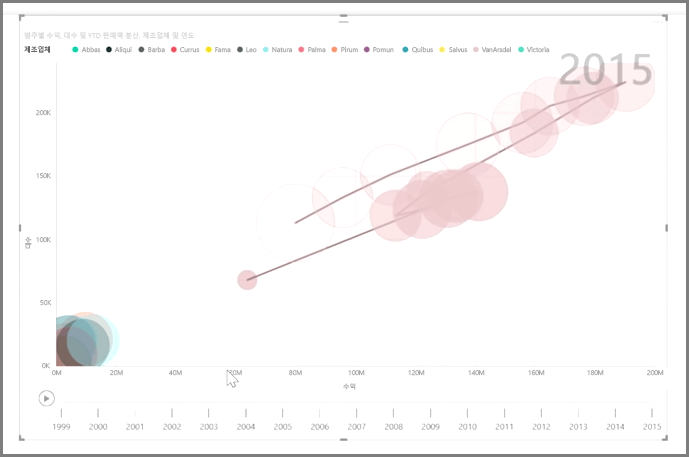

단위 판매량 및 수익과 같은 두 가지 측정값을 비교하려는 경우에 일반적으로 사용되는 시각화는 분산형 차트입니다.

빈 차트를 만들려면 **시각화** 창에서 **분산형 차트**를 선택합니다. 비교할 두 필드를 **필드** 창에서 *X축* 및 *Y축* 버킷 옵션으로 끌어 놓습니다. 이때 분산형 차트에는 시각적 개체의 가운데에 작은 거품이 있을 수 있습니다. 데이터를 분할할 방법을 지정하려면 *세부 정보* 버킷에 측정값을 추가해야 합니다. 예를 들어 품목 판매량과 수익을 비교하는 경우 범주, 제조업체 또는 판매 월별로 데이터를 분할할 수 있습니다.

*범례* 버킷에 다른 필드를 추가하면 해당 필드의 값에 따라 거품의 색 코드가 지정됩니다. 또한 *크기* 버킷에 필드를 추가하여 해당 값에 따라 거품 크기를 변경할 수도 있습니다.

분산형 차트에는 색이 지정된 각 거품에 대한 윤곽선을 설정하고 개별 레이블을 전환하는 등 다양한 시각적 서식 지정 옵션도 있습니다. 다른 차트 종류의 데이터 색도 변경할 수 있습니다.

*재생 축* 버킷에 시간 기반 필드를 추가하여 시간에 따른 거품형 차트의 변경 내용에 대한 애니메이션을 만들 수 있습니다. 애니메이션 중에 거품을 클릭하면 해당 경로를 추적할 수 있습니다.

>[!NOTE]
>분산형 차트에 하나의 거품만 표시되는 경우 Power BI에서 데이터를 집계하고 있기 때문이며, 이는 기본 동작입니다. **시각화** 창에서 *세부 정보* 버킷에 범주를 추가하여 추가 거품을 가져올 수 있습니다.
> 
> 

