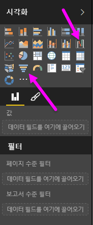
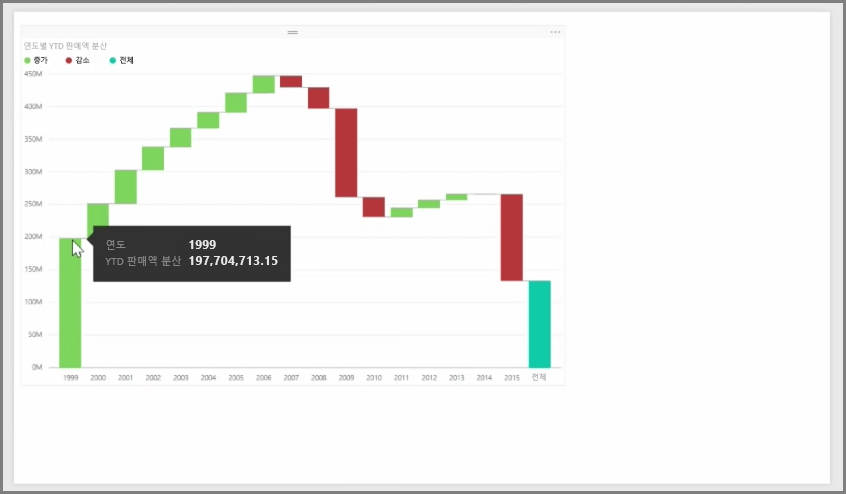
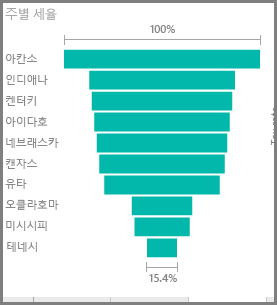

폭포 및 깔때기형 차트에는 Power BI에 포함된 흥미롭고 일반적이지 않은 두 가지 표준 시각화가 있습니다. 두 종류 중 하나의 빈 차트를 만들려면 **시각화** 창에서 해당 아이콘을 선택합니다.

**폭포 차트**는 일반적으로 시간이 지남에 따른 특정 값의 변경 내용을 표시하는 데 사용됩니다.

폭포만 두 가지 버킷: *범주* 하 고 *Y 축*합니다. *년* 과 같은 시간 기반 필드를 *범주* 버킷으로 끌어 오고 추적할 값을 *Y축* 버킷으로 끌어 옵니다. 값이 증가한 기간은 기본적으로 녹색으로 표시되고, 값이 감소한 기간은 빨간색으로 표시됩ㄴ니다.

**깔때기형 차트**는 일반적으로 영업 파이프라인 또는 웹 사이트 유지 노력 등 특정 프로세스의 변경 내용을 표시하는 데 사용됩니다.

**폭포** 차트와 **깔때기형** 차트 둘 다 조각화하고 시각적으로 사용자 지정할 수 있습니다.

