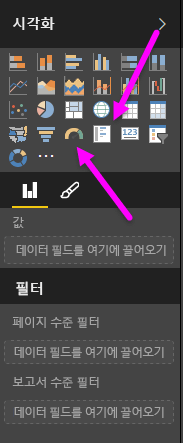
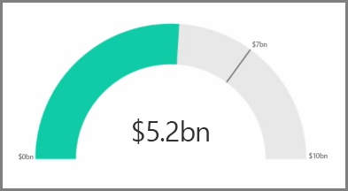
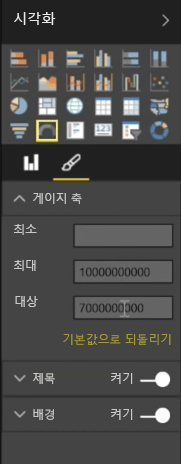
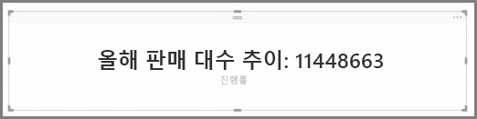

일반적으로 시각화는 둘 이상의 값을 비교하는 데 사용됩니다. 그러나 보고서를 작성할 때 단일 KPI(핵심 성과 지표) 또는 시간에 따른 메트릭을 추적하려는 경우가 있을 수 있습니다. Power BI Desktop에서 이 작업을 수행하려면 **계기** 또는 **단일 숫자** 카드 시각적 개체를 사용합니다. 두 종류 중 하나의 빈 차트를 만들려면 **시각화** 창에서 해당 아이콘을 선택합니다.

계기는 대시보드를 작성하고 특정 목표의 진행률을 표시하려는 경우에 특히 유용합니다. 계기를 만들려면 **시각화** 창에서 해당 아이콘을 선택하고 추적할 필드를 *값* 버킷으로 끌어 옵니다.

계기는 기본적으로 50% 또는 값의 두 배로 표시되며, 두 가지 방법으로 이 설정을 조정할 수 있습니다.  값을 동적으로 설정하려면 최소, 최대, 및 목표 값 버킷으로 필드를 끌어 옵니다.    또는 시각적 서식 지정 옵션을 사용하여 계기 범위를 수동으로 사용자 지정합니다.

카드 시각화는 필드의 숫자 표현을 보여줄 뿐입니다. 기본적으로 카드 시각적 개체는 표시 단위를 사용하여 숫자를 짧게 유지합니다(예: "$5,000,000,000" 대신 "$5bn" 표시). 시각적 서식 지정 옵션을 사용하여 사용 중인 단위를 변경하거나 완전히 사용하지 않도록 설정할 수 있습니다.

한 가지 흥미로운 적용 사례는 카드에 텍스트와 연결된 사용자 지정 측정값을 표시하는 것입니다. 사용자 지정 측정값과 함께 위 예제를 사용하려는 경우 카드에 고급 DAX 함수를 포함하고 "Total revenue this year: $5bn" 또는 "Progress on unit sales this year"와 같은 내용을 표시한 다음 진행률을 나타내는 숫자를 추가하면 됩니다.

