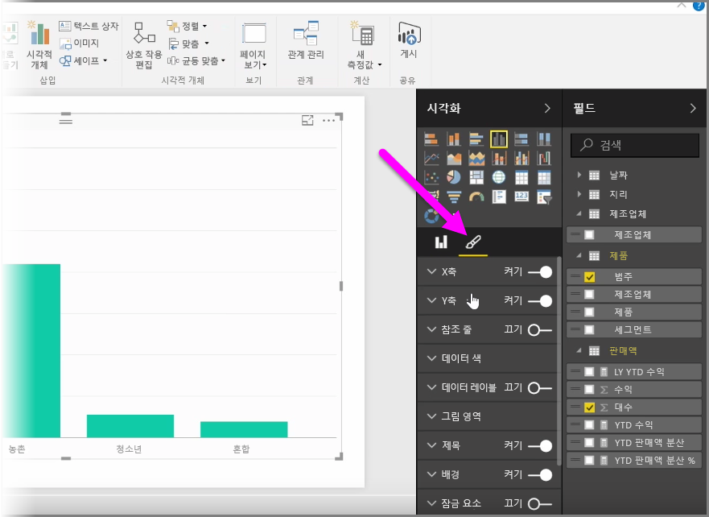
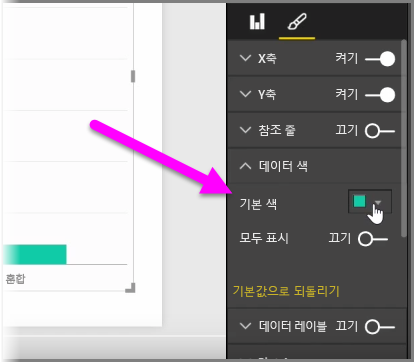
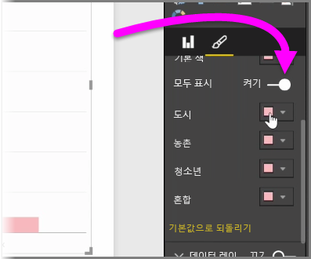
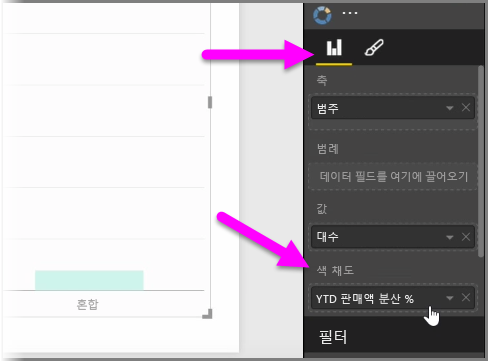
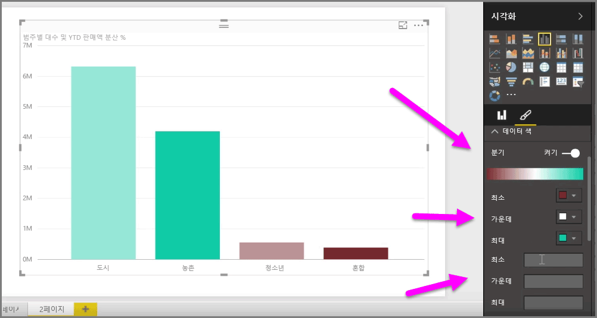
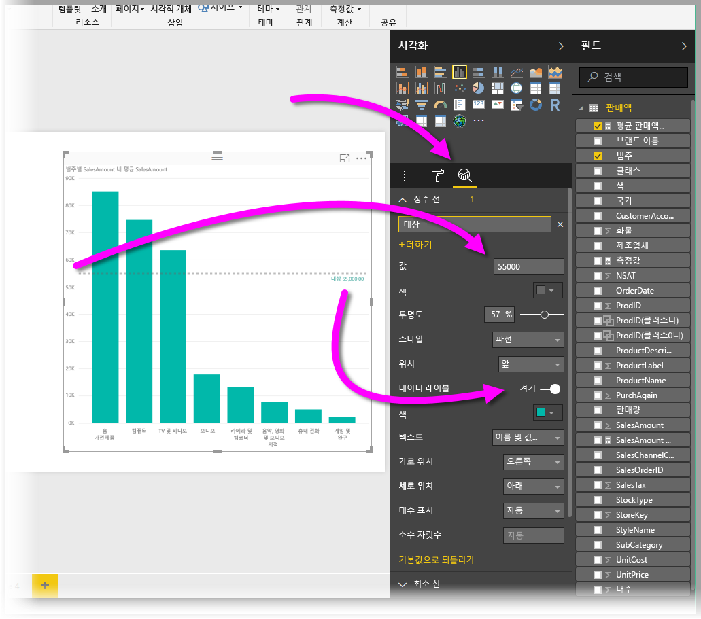
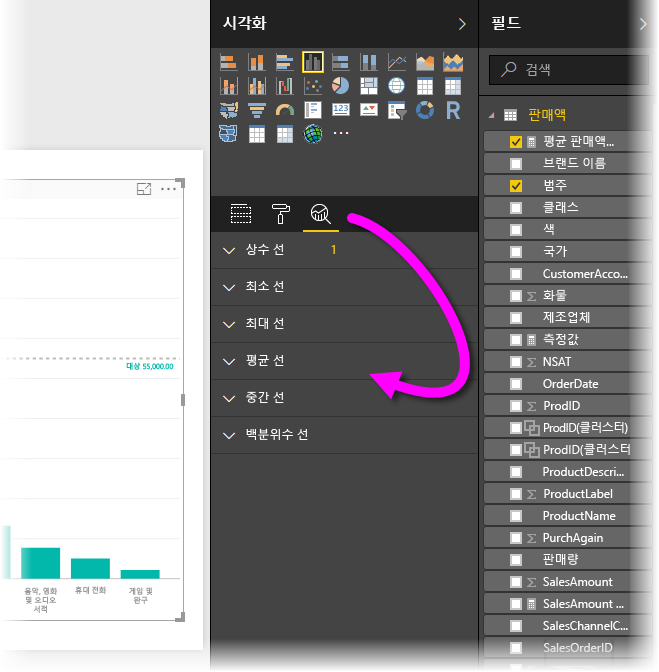

차트 또는 시각적 개체에 사용된 색을 수정하려는 경우가 자주 있습니다. Power BI에서는 색이 표시되는 방식에 대한 다양한 제어 옵션을 제공합니다. 시작하려면 **시각화** 창에서 시각적 개체를 선택한 다음 **그림판** 아이콘을 클릭합니다.

시각적 개체의 색 또는 서식을 변경할 수 있는 여러 옵션이 있습니다. **기본 색** 옆의 색 선택을 선택한 다음 원하는 색을 선택하여 시각적 개체의 모든 막대에 대한 색을 변경할 수 있습니다.

또한 **모두 표시** 슬라이더를 설정하여 각 막대(또는 선택한 시각적 개체의 유형에 따라 다른 요소)의 색을 변경할 수 있습니다. 이렇게 하면 각 요소에 대해 색 선택기가 나타납니다.

값 또는 측정값에 따라 색을 변경할 수도 있습니다. 이렇게 하려면 시각화 창에서 **색 채도** 버킷으로 필드를 끌어옵니다(이 옵션은 **그림판** 섹션이 아니라 **필드 웰** 섹션에서 사용할 수 있음).

또한 데이터 요소 색을 채울 때 사용되는 눈금 및 색을 변경할 수 있습니다. 색 눈금을 세 가지 색으로 구분할 수 있도록 분기 슬라이더를 설정하면 분기 눈금을 선택할 수 있습니다. 차트에 표시되는 *최소*, *중앙* 및 *최대* 값을 설정할 수도 있습니다.

또한 이러한 값을 사용하여 0보다 큰 값을 특정 색으로 설정하고 0보다 작은 값을 다른 색으로 설정하는 등 규칙을 만들 수 있습니다.

색을 사용하기 위한 또 다른 유용한 도구는 *상수 선*을 설정하는 것이며, 이는 종종 *참조선*이라고도 합니다. 상수 선 값과 해당 색을 설정할 수 있으며, 참조선에 레이블을 포함할 수도 있습니다. 상수 선(및 기타 만들 선)을 만들려면 **분석 창**(돋보기처럼 보임)을 선택한 다음 **참조선** 섹션을 확장합니다.

최소, 최대, 평균, 중앙값 및 백분위수 선 등 **분석 창**에서도 찾을 수 있는 시각적 개체에 대해 만들 수 있는 여러 선들이 있습니다.

마지막으로, 개별 시각화 주위에 테두리를 만들고 다른 컨트롤처럼 해당 테두리의 색을 지정할 수도 있습니다.

