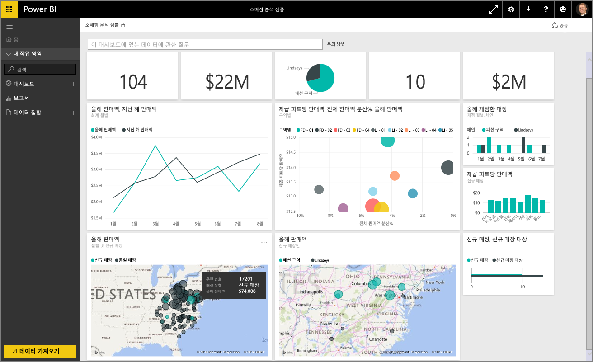

Power BI에 대한 **단계별 학습** 과정의 **데이터 탐색** 단원을 시작하겠습니다. Power BI Desktop 및 데이터를 가져오고 시각화하는 방법을 알았으므로 Power BI 서비스에서 데이터를 탐색할 준비가 되었습니다.

이 단원에서는 Power BI의 멋진 대화형 작업 및 공유 기능과 함께 다양한 내용을 학습합니다. 매력적이고 흥미로운 단원을 학습할 준비를 하세요.

## Power BI 서비스 소개
*Power BI 서비스를 통해 조직에서 얻을 수 있는 이점을 알아봅니다.*

Power BI 서비스는 **Power BI Desktop**의 자연스로운 확장으로서, 해당 기능에는 보고서 업로드, 대시보드 만들기, 자연어를 사용하여 데이터에 대해 질문하기 등이 있습니다. 서비스를 사용하여 데이터 새로 고침 시간을 설정하고, 데이터를 조직과 공유하고, 사용자 지정 서비스 팩을 만들 수 있습니다.

다음 항목에서는 Power BI 서비스를 둘러보고, 이를 통해 비즈니스 인텔리전스 데이터를 데이터 통찰력 및 공동 작업을 통한 의사 결정 환경으로 전환할 수 있는 방법을 알아봅니다.

