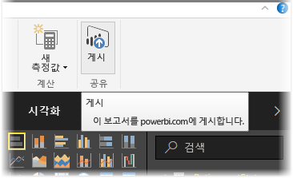
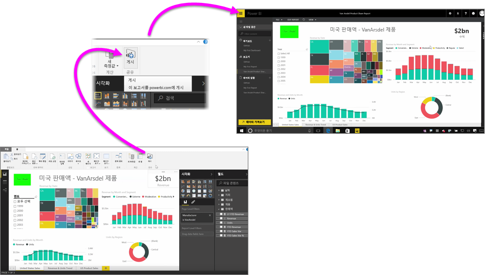

Power BI 서비스에 보고서를 빠르고 쉽게 게시할 수 있습니다.

**Power BI Desktop**에서 보고서 작성을 완료한 후 Power BI Desktop의 **홈** 탭에서 **게시** 단추를 선택하기만 하면 프로세스가 시작됩니다.

시각화, 쿼리 및 사용자 지정 측정값을 포함하여 보고서 및 데이터가 함께 패키지되어 Power BI 서비스에 업로드됩니다.

> 참고: 일반적으로 Power BI Desktop 보고서를 **.pbix** 파일이라고 하며 이는 Windows에서 지정된 확장명입니다.
> 
> 

업로드가 완료되면 게시 프로세스가 성공적으로 완료되었음을 알리는 대화 상자가 나타나고 해당 대화 상자에 웹 브라우저에서 Power BI 서비스의 보고서로 직접 이동하는 링크가 제공됩니다.

이와 같이 Power BI Desktop에서 Power BI 서비스에 보고서를 게시하는 작업은 간단합니다.

