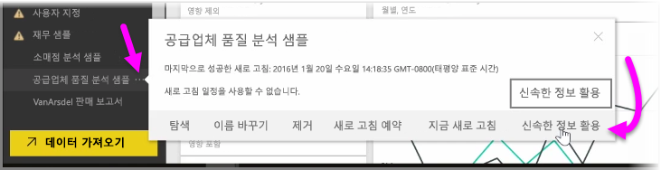
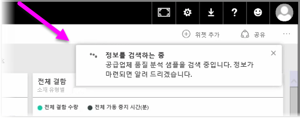
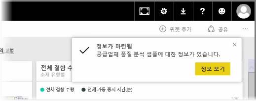
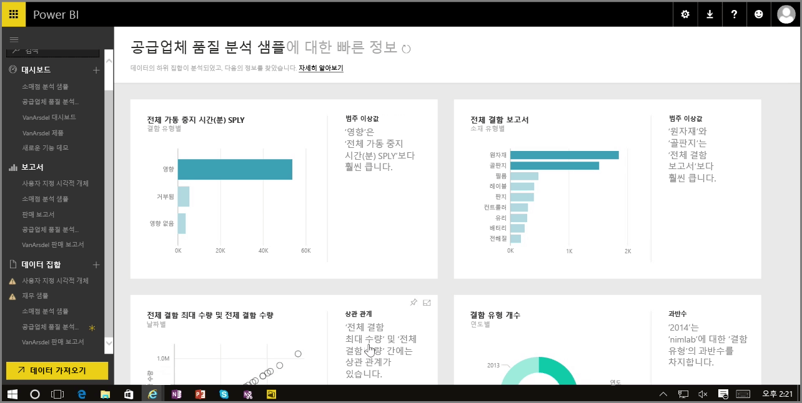

Power BI 서비스에서 대시보드, 보고서 또는 데이터 세트를 사용하는 경우 Power BI에서 데이터 정보를 신속하게 활용할 수 있습니다. Power BI의 왼쪽 창에 있는 **데이터 세트** 섹션에서 관심 있는 데이터 세트 옆의 *줄임표*(...)를 선택합니다. 옵션 메뉴가 나타나고 맨 오른쪽에 **빠른 정보 활용**이라는 옵션이 표시됩니다.

빠른 정보 활용을 선택하면 Power BI에서 일부 기계 학습을 수행하고 데이터를 검색한 후 이를 분석하여 빠른 정보 활용을 찾습니다. 서비스의 오른쪽에 Power BI가 정보를 찾고 있음을 나타내는 알림이 표시됩니다.

15초 정도 지난 후 Power BI에서 몇 가지 정보를 찾았음을 알 수 있도록 알림이 변경됩니다.

알림에서 **정보 보기** 단추를 선택하면 다음 그림처럼 Power BI에서 찾은 정보가 표시된 시각적 개체 페이지가 제공됩니다. 많은 정보가 있는 경우 페이지를 아래로 스크롤하여 보고 검토할 수 있습니다.

다른 시각적 개체와 마찬가지로 빠른 정보 활용 페이지에서 시각적 개체와 상호 작용할 수 있으며, 원하는 시각적 개체를 대시보드에 고정하거나 하나 이상의 시각적 개체를 추가로 필터링하여 궁금한 추가 정보를 검색할 수도 있습니다.

**빠른 정보 활용**을 사용하면 Power BI에서 데이터의 이상값 및 추세를 발견한 다음 대시보드에서 이를 사용하거나 더욱 구체화하고 필터링하여 자신에게 가장 중요한 정보를 얻을 수 있습니다.

