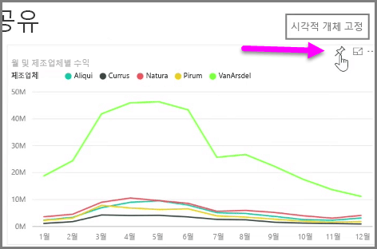
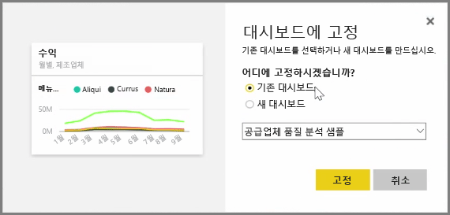
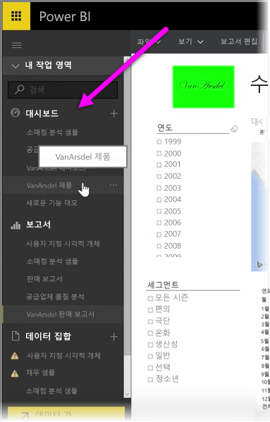
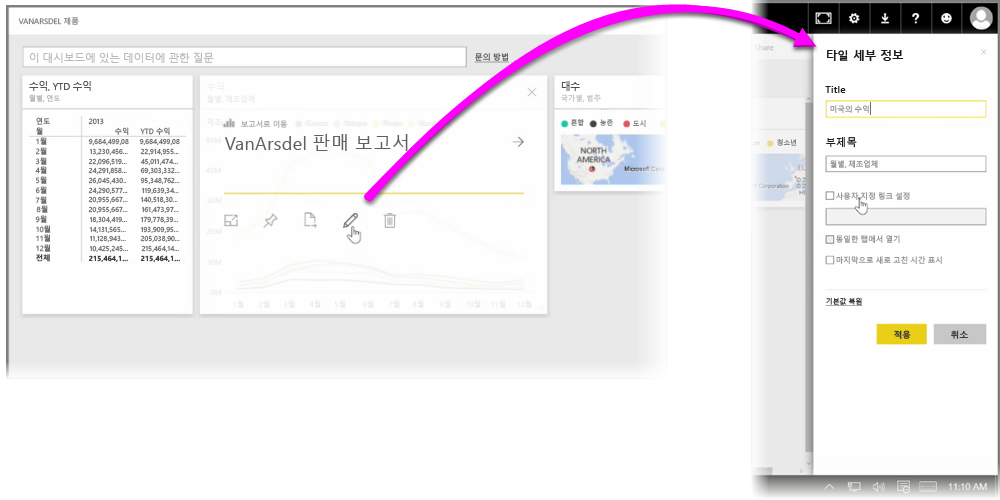

Power BI의 **대시보드**는 Power BI 서비스 내에서 생성된 한 페이지로 된 시각화의 컬렉션입니다. Power BI Desktop을 사용하여 작성하고 게시한 보고서의 시각화 또는 Power BI 서비스 자체 내에서 만든 시각화를 **고정**하여 대시보드를 만듭니다. 시각적 개체를 대시보드에 **고정**하는 것은 그림을 벽에 거는 것과 같습니다. 다른 사람이 볼 수 있도록 특정 지점에 시각적 개체를 부착하는 것입니다. 시각적 개체를 고정하려면 Power BI 서비스에서 해당 보고서를 엽니다. 고정하려는 시각적 개체를 마우스로 가리키고 **고정** 아이콘을 선택합니다.

드롭다운 메뉴에서 시각적 개체에 대한 대상 대시보드를 선택하거나 새 대시보드를 만들 수 있는 대화 상자가 나타납니다. 고정된 시각적 개체가 대시보드에 어떻게 표시되는지를 미리 볼 수도 있습니다. 여러 보고서 및 페이지의 시각화를 단일 대시보드에 고정하여 여러 데이터 세트 및 소스를 단일 정보 페이지에 통합할 수 있습니다.

**대시보드**에서 "고정"하여 그래프, 지도, 이미지, 도형 등 모든 종류의 시각화를 추가할 수 있습니다. 시각적 개체가 대시보드에 고정되면 이를 **타일**이라고 합니다.

모든 새 대시보드를 포함하여 대시보드는 Power BI 서비스의 왼쪽에 있는 대시보드 섹션에 표시됩니다. 목록에서 대시보드를 선택하면 해당 대시보드가 표시됩니다.

대시보드에서 시각적 개체의 레이아웃을 원하는 대로 변경할 수 있습니다. 타일 크기를 조정하려면 핸들을 끕니다. 타일을 이동하려면 클릭하여 대시보드의 다른 위치로 끌어 옵니다. 타일을 가리키고 **연필** 아이콘을 클릭하면 **제목** 또는 **부제목**을 변경할 수 있는 **타일 세부 정보**가 열립니다.

대시보드 타일을 클릭하면 원래의 보고서가 표시됩니다. 이를 통해 시각적 개체의 기본 데이터를 신속하게 볼 수 있습니다. 또한 **타일 세부 정보**에서 **사용자 지정 링크 설정** 필드를 사용하여 해당 링크를 변경할 수 있습니다.

예를 들어 대시보드 컬렉션이 있을 때 하나의 요약 대시보드를 만들려는 경우 하나의 대시보드에서 다른 대시보드로 타일을 고정할 수 있습니다. 프로세스는 동일합니다. 타일을 가리키고 **고정 아이콘**을 선택합니다. 대시보드는 만들고 변경하기 쉽습니다. 또한 한 페이지 대시보드에 정확히 필요한 내용만 표시되도록 대시보드를 사용자 지정할 수 있습니다.

