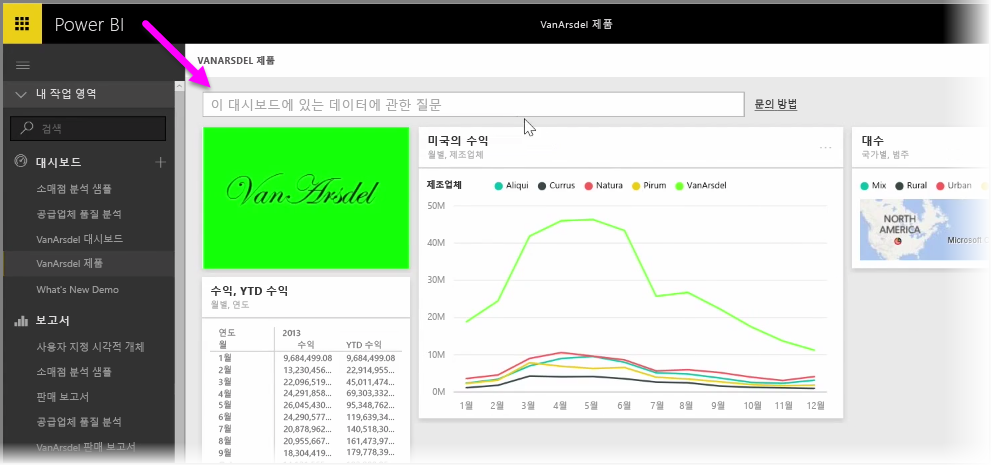
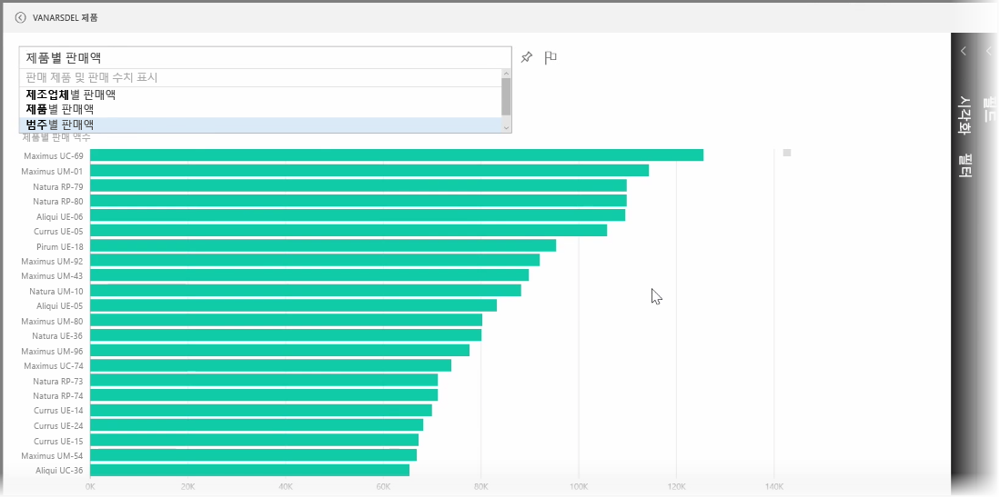
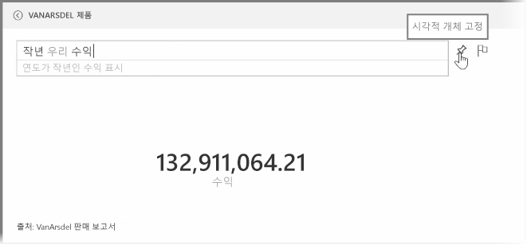
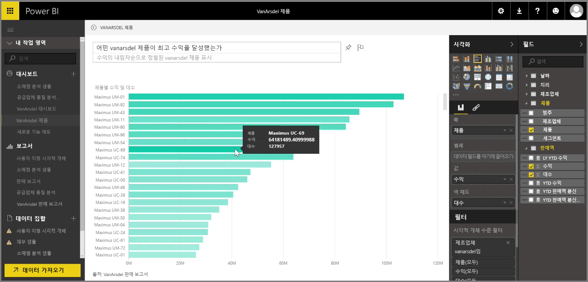

Power BI에는 대화 구문과 질문을 사용하여 데이터에 대해 질문할 수 있는 강력한 언어 인식 엔진이 제공됩니다. Power BI를 사용하여 보고서 및 시각화를 작성할 때 간단한 질문을 통해 차트 및 그래프를 만들 수 있습니다.

데이터에 대해 질문하려면 Power BI에서 대시보드를 엽니다. 그러면 화면 위에 표시된 데이터에 대해 질문할 수 있는 입력 상자가 표시됩니다. 이 기능을 질문 및 답변이라고도 하며, 종종 **Q&A**라고도 합니다. 

상자를 클릭하면 Power BI에서 데이터를 기반으로 "YTD revenue"와 같은 몇 가지 제안된 용어를 표시합니다. 제안된 용어를 클릭하면 결과가 표시되는데, 종종 간단한 테이블 또는 카드로 표시됩니다. 제안된 구문 중 하나를 선택하면 해당 구문에 따라 자동으로 시각적 개체가 실시간으로 생성됩니다.

"What was our revenue last year?" 또는 "What product had the highest sales in March 2014?"와 같은 자연어를 사용하여 질문할 수도 있습니다. Power BI에서 질문에 대한 해석을 표시하고 답변을 나타내는 데 가장 적합한 유형의 시각적 개체를 선택합니다. Power BI의 다른 시각적 개체와 마찬가지로 **고정** 아이콘을 클릭하여 선택한 대시보드에 **고정**할 수 있습니다.

언제든지 자연어 질문 또는 구문으로 생성된 시각적 개체를 편집할 수 있습니다. 화면 오른쪽에 있는 **시각화** 및 **필드** 창을 사용하면 됩니다. Power BI의 다른 모든 시각적 개체와 마찬가지로 레이아웃을 변경하고, 필터를 조정하고, 필드 입력을 변경할 수 있습니다.

대시보드에 시각화를 저장하려면 완벽한 시각적 개체를 만든 후 질문 입력 상자 옆의 **고정** 아이콘을 선택하기만 하면 됩니다.

