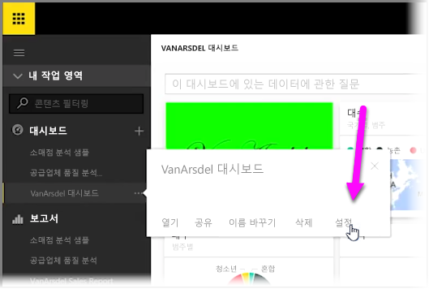
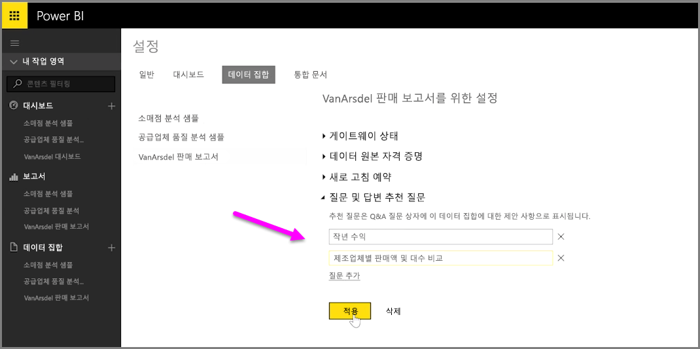

Power BI를 사용하면 대시보드에 자연어 쿼리 상자를 사용하는 다른 사용자에 대한 사용자 고유의 제안된 질문을 추가할 수 있습니다. 이를 종종 **Q&A** 상자라고 합니다. 이러한 제안된 질문은 사용자가 대시보드 위에 있는 입력 상자를 클릭하면 나타납니다.

사용자 고유의 질문을 추가하려면 사용할 대시보드 이름 옆의 줄임표(...)를 선택한 다음 메뉴에서 **설정**을 선택합니다.

 그러면 대시보드에 대한 **설정** 페이지 및 기본 데이터 집합 또는 통합 문서가 열립니다. Q&A 검색 입력 상자를 **설정** 페이지의 **대시보드** 섹션에서 완전히 사용하지 않도록 설정할 수 있지만 질문을 추가할 것이므로 **데이터 집합** 섹션을 선택합니다.

**데이터 집합** 섹션에는 대시보드와 연결된 모든 데이터 집합이 표시됩니다. 목록에서 대시보드와 연결된 데이터 집합을 선택하고, **추천 Q&A 질문**을 선택한 다음, **질문 추가** 링크를 선택합니다. 입력 상자에 질문 또는 프롬프트를 입력하고 **적용**을 선택합니다.

이제 누구든 선택된 대시보드에서 검색 입력 상자를 클릭하면 프롬프트 목록 위에 제안된 항목이 표시되며, 이 질문을 선택하면 Q&A 답변으로 바로 이동합니다. 이는 대시보드 사용자가 사용 가능한 데이터 형식과 이를 최대한 활용할 수 있는 방법을 생각하는 데 매우 유용합니다.

