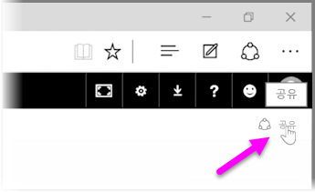
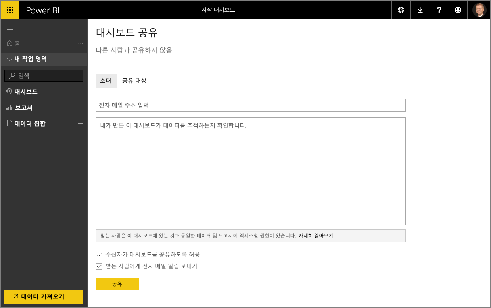

Power BI를 통해 데이터를 찾고, 데이터 모델에 수집하고, 이 데이터를 사용하여 보고서 및 시각화를 작성하는 방법은 이미 살펴보았습니다. 또한 이러한 보고서를 Power BI 서비스에 게시하고 시간에 따른 정보를 모니터링하는 데 도움이 되는 대시보드를 만드는 방법도 살펴보았습니다. 이 모든 기능은 조직의 다른 사람과 정보를 공유할 때 훨씬 더 강력합니다. 다행히 대시보드를 쉽게 공유할 수 있습니다.

대시보드를 공유하려면 Power BI 서비스에서 대시보드를 열고 오른쪽 위에 있는 **공유** 링크를 선택합니다.

**대시보드 공유** 페이지가 나타납니다. 여기서 **초대** 섹션을 선택한 다음, 대시보드에 대한 액세스 권한을 부여하려는 사람으로 **이메일 주소** 입력 상자를 채울 수 있습니다. 이메일 주소를 입력할 때 Power BI에서는 사용자 도메인 및 Office 365 도메인 계정을 확인하여 가능한 경우 자동으로 완성합니다. 이메일 주소를 이 상자에 복사하여 붙여 넣거나, 메일 그룹, 보안 그룹 또는 Office 365 그룹을 사용하여 여러 사람에게 한 번에 연결할 수 있습니다.

아래쪽에 있는 *받는 사람에게 이메일 알림 보내기* 확인란을 선택한 경우 받는 사람에게 링크를 포함하여 대시보드가 공유되었음을 알리는 메일이 제공됩니다. 받는 사람에게 제공되는 메일에 메모를 추가하거나, Power BI에서 생성된 메모(메일 주소 입력란 바로 아래의 상자에 있음)를 보낼 수 있습니다.

>[!NOTE]
>기존 Power BI 계정이 없는 받는 사람은 등록 프로세스를 거쳐야 대시보드를 볼 수 있습니다.
> 
> 

대시보드를 공유하는 모든 사람은 정확히 사용자와 동일한 방식으로 대시보드를 보고 상호 작용할 수 있습니다. 그러나 기본 보고서에 대한 *읽기 전용* 권한을 가지며, 기본 데이터 집합에 대한 *액세스 권한은 없습니다*.

대시보드 공유 페이지에서 **공유 대상** 탭을 선택하여 이전에 이 대시보드를 공유한 대상을 볼 수 있습니다.

