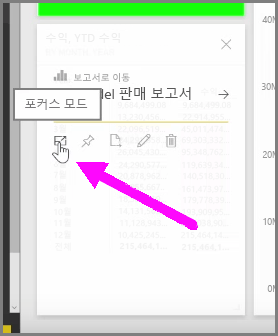
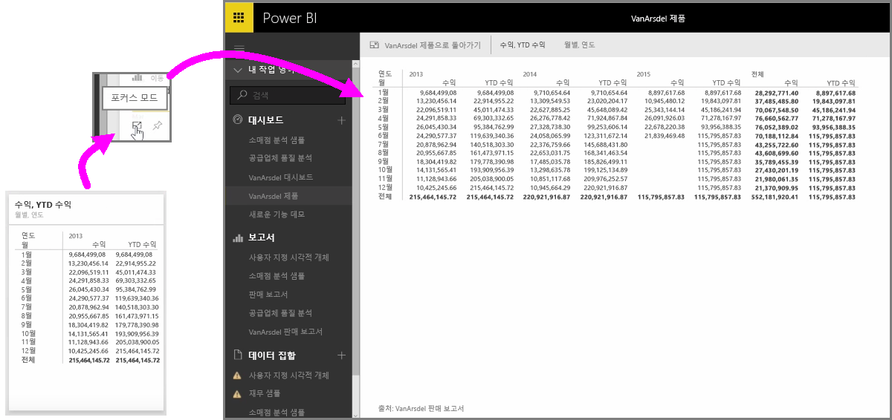

서비스에서 Power BI 대시보드 또는 보고서를 확인할 때 개별 차트 또는 시각화에 포커스를 두는 것이 유용할 때가 있습니다. 두 가지 방법으로 이를 수행할 수 있습니다.

대시보드에서 타일을 가리키면 오른쪽 위에 몇 가지 아이콘 옵션이 표시됩니다. 줄임표(...)를 선택하면 타일에서 수행할 수 있는 작업을 나타내는 아이콘 컬렉션이 표시됩니다.

맨 왼쪽에 있는 아이콘에는 **포커스 모드**로 레이블이 지정됩니다. 이 아이콘을 선택하면 전체 대시보드 공간을 포함하도록 타일이 확장됩니다.

**포커스 모드**에서는 시각적 개체 및 범례에 대한 보다 자세한 정보를 볼 수 있습니다. 예를 들어 Power BI에서 타일 크기를 조정할 때 타일의 사용 가능한 공간 때문에 일부 열이 표시되지 않을 수 있습니다.

**포커스 모드**에서는 모든 데이터를 볼 수 있습니다. 또한 **고정** 아이콘을 선택하여 포커스 모드에서 다른 대시보드로 시각적 개체를 직접 고정할 수 있습니다. **포커스 모드**를 종료하려면 **포커스 모드** 왼쪽 위에 있는 **뒤로...** 아이콘을 선택합니다.

보고서를 볼 때와 프로세스와 유사합니다. 시각적 개체를 가리키면 오른쪽 위에 세 개의 아이콘이 표시됩니다. 여기서 **포커스 모드** 아이콘을 선택합니다. 이 아이콘을 선택하면 전체 보고서 캔버스를 포함하도록 시각화가 확장됩니다. 이 모드에서는 시각화 간의 교차 필터 효과가 일시적으로 손실되지만 시각적 개체는 여전히 대화형입니다.

확장된 타일 또는 보고서를 가리키고 왼쪽 위에 있는 **뒤로...** 왼쪽 삽입 아이콘을 선택하면 이전 뷰로 돌아갑니다.

