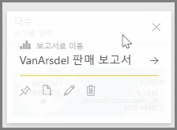
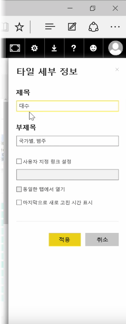
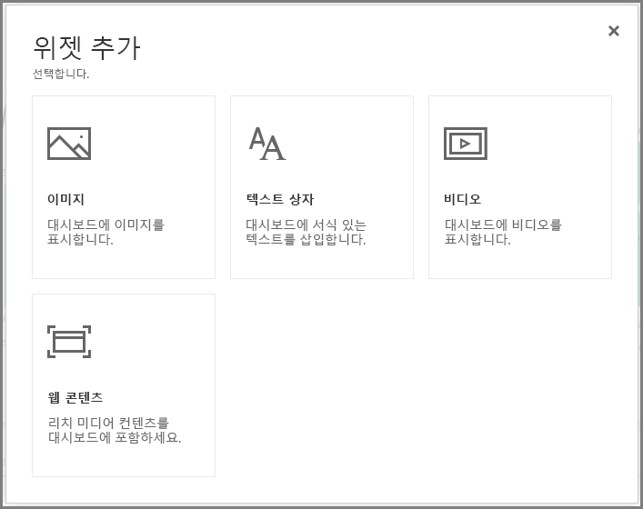
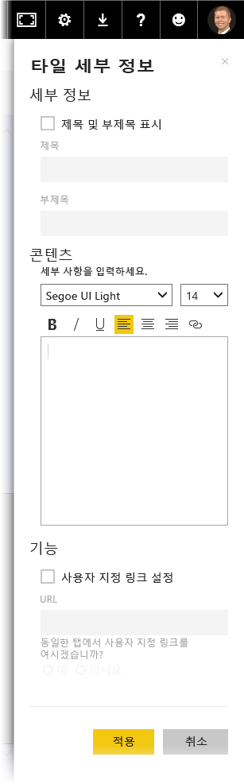

대시보드를 작성한 후에는 Power BI 서비스에서 해당 * 타일을 편집하여 몇 가지 서식을 변경할 수 있습니다. 

타일을 변경하려면 해당 타일을 가리키고 줄임표(...)를 선택하여 타일을 변경하는 데 사용할 수 있는 아이콘 컬렉션을 표시합니다.

**펜** 아이콘을 선택하면 **타일 세부 정보** 창이 열립니다. 여기에서 타일의 **제목**, **부제목**을 변경하고, 마지막 새로 고침 시간 및 날짜를 포함할 수 있으며 사용자 지정 링크 만들기와 같은 기타 세부 정보를 변경할 수 있습니다.

대시보드 타일을 클릭하면 기본적으로 원래의 보고서로 이동합니다. 이 동작을 변경하려면 **타일 세부 정보** 창에서 **사용자 지정 링크 설정** 필드를 사용합니다. 이 기능은 사용자가 로고 이미지를 클릭하면 조직의 홈 페이지로 이동하는 경우 등에 널리 사용됩니다.

## 대시보드에 위젯 추가
대시보드에 위젯을 추가할 수도 있습니다. **위젯**은 시각화를 포함하는 대신 이미지, 온라인 동영상, 텍스트 상자 또는 풍부한 웹 콘텐츠 등의 다른 항목을 포함하는 특수한 대시보드 타일입니다.

대시보드 오른쪽 위에서 위젯 추가 링크를 선택하면 **위젯 추가** 대화 상자가 나타납니다.

예를 들어 텍스트 상자를 추가하는 경우 오른쪽에 **타일 세부 정보** 창이 나타납니다. 이 창에서 타일의 세부 정보를 편집할 때 사용할 수 있는 것과 유사한 세부 정보를 편집할 수 있습니다. 그러나 위젯을 사용하면 위젯 내용을 정의하거나 수정할 수 있는 섹션(텍스트 상자에 제공되는 서식 있는 텍스트 편집기와 유사)도 제공됩니다.

위젯 및 타일 세부 정보 편집 기능을 통해 대시보드를 사용자 지정하고 원하는 방식으로 표시할 수 있습니다.

