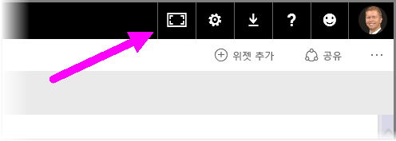
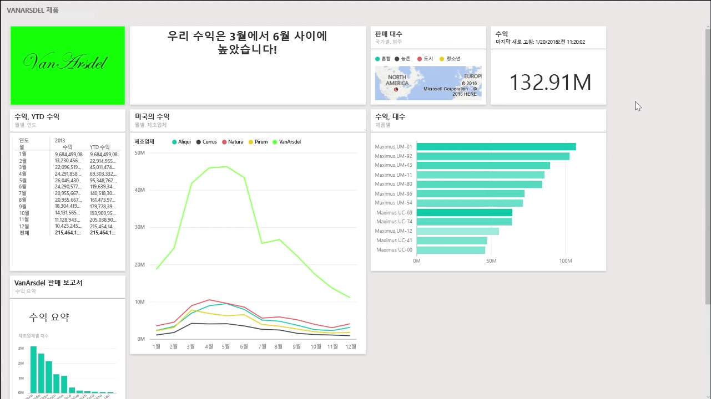
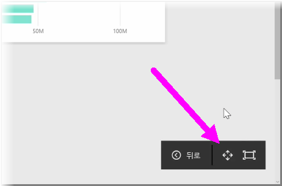
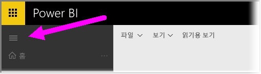

대시보드를 만들 때 캔버스에 표시할 수 있는 것보다 콘텐츠가 더 많은 경우가 있을 수 있습니다. 전체 대시보드 내용을 볼 수 있도록 대시보드 공간 표시 방법을 관리하는 데 도움이 되는 몇 가지 솔루션이 있습니다.

전체 대시보드를 하나의 화면에 표시하는 가장 쉬운 방법은 대시보드의 오른쪽 위에 있는 **전체 화면 모드** 단추를 선택하는 것입니다.

**전체 화면 모드** 단추를 선택하면 브라우저가 전체 화면 모드로 전환되며, 대시보드 주위의 모든 크롬 요소가 제거되어 볼 수 있는 공간이 증가합니다.

**전체 화면 모드** 내에서 **화면에 맞추기** 옵션을 선택하면 스크롤 막대 없이 단일 화면에 표시되도록 모든 타일이 축소됩니다. 이를 일반적으로 TV 모드라고 하며, 대시보드를 사용하여 프레젠테이션을 제공하거나 복도 모니터에 대시보드를 표시하는 데 유용합니다. 

대시보드 공간을 관리하는 또 다른 방법은 햄버거 아이콘을 선택하여 페이지 왼쪽에 있는 탐색 창을 축소하는 것입니다. 탐색 창을 확장하려면 해당 아이콘을 다시 클릭합니다.

다음을 URL 끝에 추가하여 대시보드에서 항상 축소된 탐색 모음을 유지할 수 있습니다.

> ?collapseNavigation=true
> 
> 

이 링크를 따르는 사용자에게는 축소된 탐색 모음이 있는 대시보드가 열립니다.

