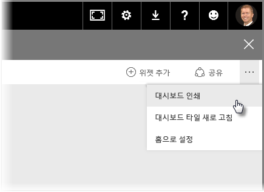
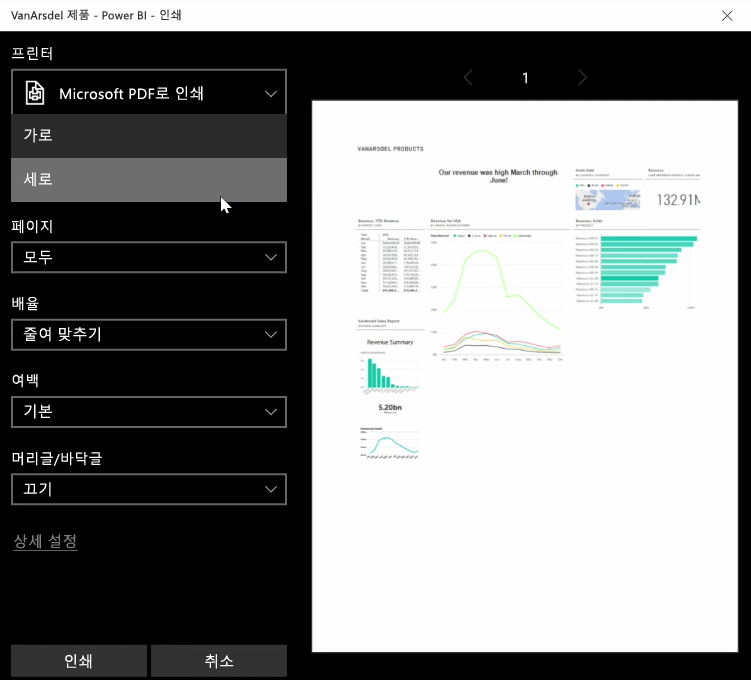
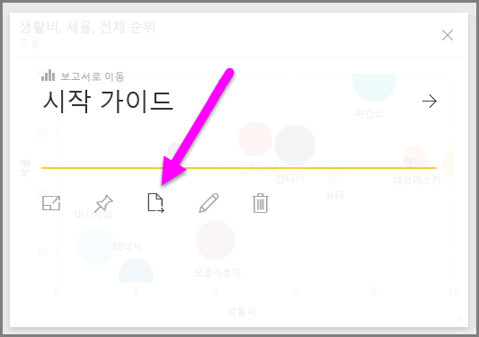
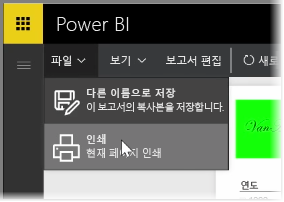

다른 사람과 공유할 수 있도록 인쇄된 보고서 또는 대시보드를 가지고 회의에 참석해야 할 경우가 있습니다. Power BI를 사용하면 시각적 개체 인쇄물을 만들 수 있는 몇 가지 방법이 있습니다.

Power BI 서비스에서 오른쪽 위에 있는 줄임표(...)를 선택한 다음 **대시보드 인쇄**를 선택합니다.

대시보드를 보낼 수 있는 프린터 및 *세로* 또는 *가로* 방향과 같은 표준 인쇄 옵션을 선택할 수 있는 **인쇄** 대화 상자가 나타납니다.

## 시각적 개체에서 데이터 내보내기
Power BI 서비스에서 모든 시각적 개체의 데이터를 내보낼 수도 있습니다. 시각적 개체에서 줄임표를 선택한 다음 **데이터 내보내기** 단추(가운데 단추)를 선택하기만 하면 됩니다. 이렇게 하면 .CSV 파일이 생성되고 로컬 컴퓨터에 다운로드되며, 브라우저에서 시작된 다른 모든 다운로드와 마찬가지로 다운로드가 완료되었음을 알리는 메시지가 브라우저에 표시됩니다.

또한 보고서에서 직접 인쇄하거나 내보낼 수 있습니다. Power BI 서비스에서 보고서를 볼 때 **파일 > 인쇄**를 선택하여 인쇄 대화 상자를 엽니다.

대시보드와 마찬가지로 시각적 개체에 대한 내보내기 단추를 선택하여 보고서 내의 시각적 개체에서 데이터를 내보낼 수 있습니다.

