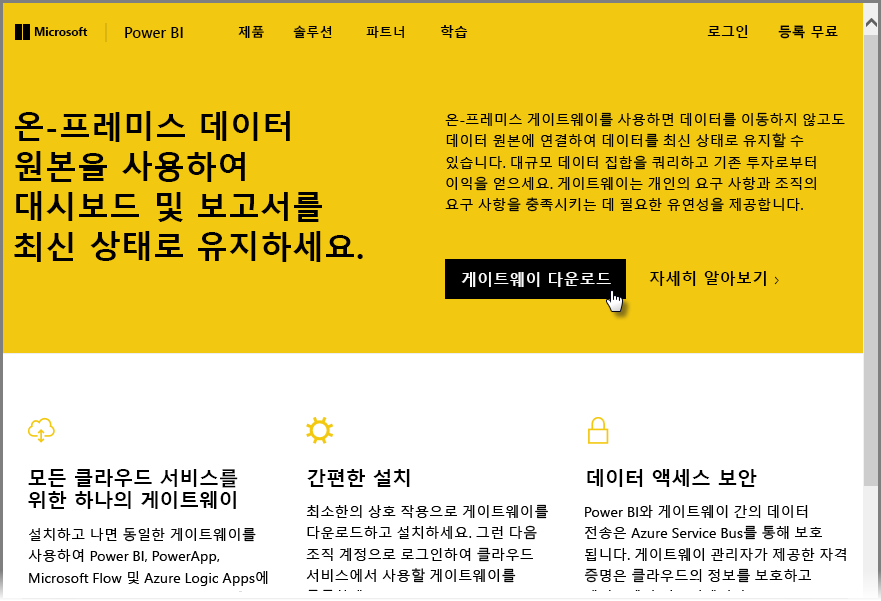
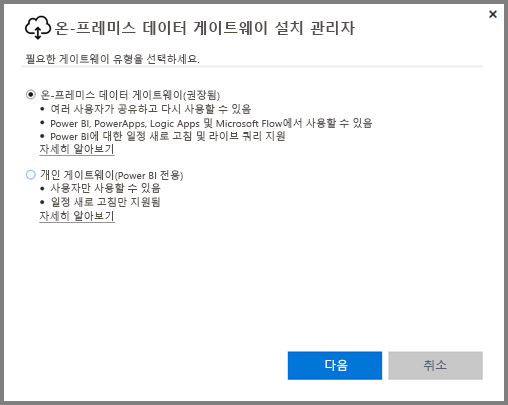
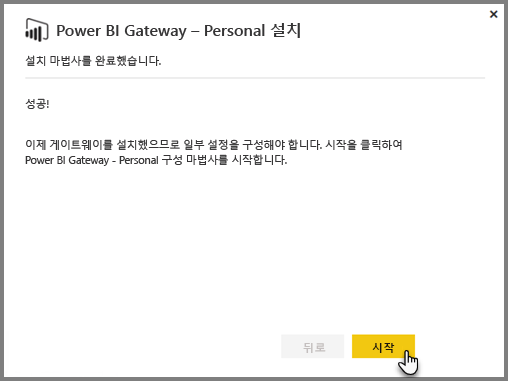
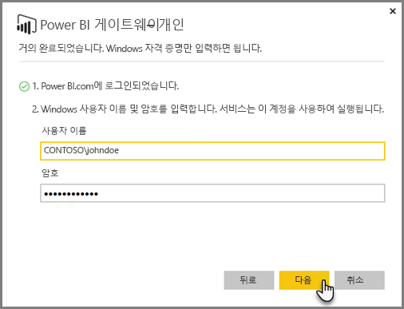
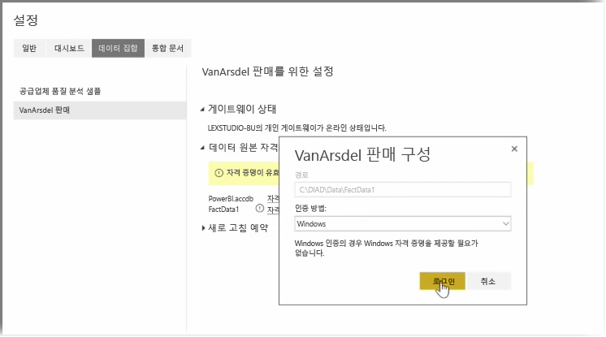
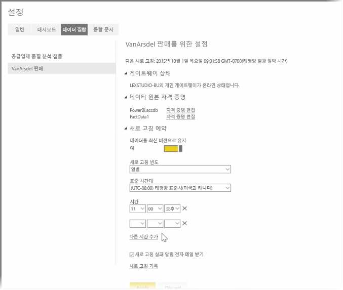

이전 항목에서는 Power BI를 사용하여 데이터 소스에 연결하는 방법 및 Power BI 서비스에서 데이터 집합을 수동으로 새로 고치는 방법을 알아보았습니다. 그러나 데이터 변경 내용을 매번 수동으로 새로 고치지는 않을 것이므로 Power BI를 사용하여 예약된 새로 고침을 설정할 수 있습니다. 예약된 새로 고침은 자동으로 데이터에 연결하여 Power BI 서비스에 데이터를 게시합니다. 이를 통해 서비스를 Excel 파일, Access 데이터베이스, SQL 데이터베이스 등의 모든 온-프레미스 데이터 소스에 연결할 수도 있습니다.

온-프레미스 데이터 소스를 Power BI 서비스에 연결할 수 있도록 해주는 시스템을 **데이터 게이트웨이**라고 합니다. 이는 사용자 컴퓨터에서 실행되는 작은 응용 프로그램으로, 미리 정렬된 일정을 사용하여 데이터에 연결하고 업데이트를 수집한 후 Power BI 서비스에 푸시합니다. **개인 게이트웨이**는 관리자 구성 없이도 사용할 수 있는 **데이터 게이트웨이**의 한 버전입니다.

>[!NOTE]
>**개인 게이트웨이**가 제대로 작동하려면 Power BI 개인 게이트웨이를 실행하는 컴퓨터가 *반드시* 켜져 있고 인터넷에 연결되어 있어야 합니다.
> 

**개인 게이트웨이**를 설치하려면 먼저 Power BI 서비스에 로그인합니다. 화면 오른쪽 위에서 **다운로드**를 선택한 다음 메뉴에서 **Data Gateways**를 선택합니다.

그러면 아래와 같이 **Power BI Gateway - Personal**을 선택할 수 있는 웹 페이지로 이동합니다.

다운로드가 완료되면 응용 프로그램을 실행하고 설치 마법사를 완료합니다.

그런 다음 게이트웨이를 설정하기 위해 구성 마법사를 시작하라는 메시지가 나타납니다.

Power BI 서비스 계정에 로그인한 다음, 게이트웨이 서비스가 사용자의 계정 하에 실행되기 때문에 머신의 Windows 계정에 로그인하라는 메시지가 표시됩니다.

Power BI 서비스로 돌아갑니다. 새로 고치려는 데이터 집합 옆의 줄임표(...)를 선택한 다음 **새로 고침 예약**을 선택합니다. 그러면 **새로 고침 설정** 페이지가 열립니다. Power BI에서 **개인 게이트웨이**를 설치했는지 검색하여 해당 상태를 알려 줍니다.

적용 가능한 각 데이터 소스 옆의 **자격 증명 편집**을 선택하고 인증을 설정합니다.

마지막으로, **새로 고침 예약** 아래의 옵션을 설정하여 자동 업데이트를 활성화하고 업데이트 발생 시기 및 빈도를 설정합니다.

이것으로 끝입니다! 예약된 시간에 Power BI는 사용자가 제공한 자격 증명 및 **개인 게이트웨이**가 실행 중인 컴퓨터에 대한 연결을 사용하여 이러한 데이터 소스에 연결한 후 일정에 따라 보고서 및 데이터 집합을 업데이트합니다. 다음에 Power BI로 이동하면 이러한 대시보드, 보고서 및 데이터 집합에 가장 최근 예약된 새로 고침 일자의 데이터가 반영됩니다.

## 다음 단계
**축하합니다!** Power BI에 대한 **단계별 학습** 과정의 이 **데이터 탐색** 단원을 완료하셨습니다. Power BI 서비스는 데이터를 탐색하고, 정보를 공유하고, 시각적 개체와 상호 작용할 수 있는 다양한 흥미로운 방법을 제공합니다. 또한 어디서든 브라우저를 통해 현재 위치에 연결할 수 있는 서비스에서 액세스할 수 있습니다.

Power BI의 널리 알려진 강력한 파트너 중 하나는 **Excel**입니다. Power BI와 Excel은 함께 원활하게 작동하도록 설계되었습니다. 따라서 Power BI에서 통합 문서를 자유롭게 사용할 수 있습니다.

얼마나 쉬운지는 다음 단원인 **Power BI 및 Excel** 단원에서 정확히 알아보겠습니다.

다음 단원에서 뵙겠습니다!

