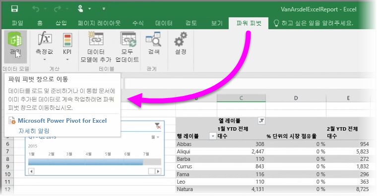

데이터를 쿼리하고 로드하는 **파워 쿼리**(Excel 2016에서는 **가져오기 및 변환**이라고 함), 강력한 데이터 모델을 만드는 **파워 피벗**, 동적 보고서를 만드는 **파워 뷰** 등 Excel의 고급 BI 기능을 사용하는 경우 이러한 기능도 Power BI로 가져올 수 있습니다.

**파워 피벗**을 사용하여 여러 관련 테이블, 측정값, 계산 열 및 계층이 있는 데이터 모델과 같은 고급 데이터 모델을 만든 경우 Power BI는 이러한 데이터 모델도 모두 가져옵니다.

통합 문서에 **파워 뷰 시트**가 있는 경우에도 문제 없습니다. Power BI에서 이를 새 **보고서**로 다시 만듭니다. 지금 바로 시각화를 대시보드에 고정할 수 있습니다.

이때 Power BI의 뛰어난 기능 중 하나가 있습니다. 파워 쿼리 또는 파워 피벗을 사용하여 외부 데이터 소스에서 데이터를 쿼리하고 로드하는 경우 Power BI로 통합 문서를 가져온 후 **예약된 새로 고침**을 설정할 수 있습니다. 예약된 새로 고침을 사용하면 Power BI에서 통합 문서의 연결 정보를 사용하여 데이터 소스에 직접 연결하고 변경된 데이터를 쿼리 및 로드합니다. 보고서의 모든 시각화도 자동으로 업데이트됩니다.

