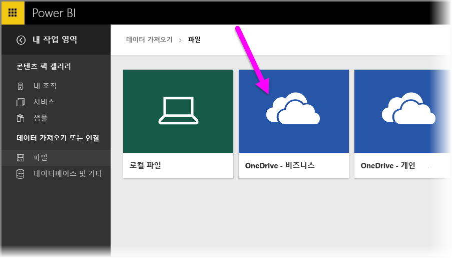
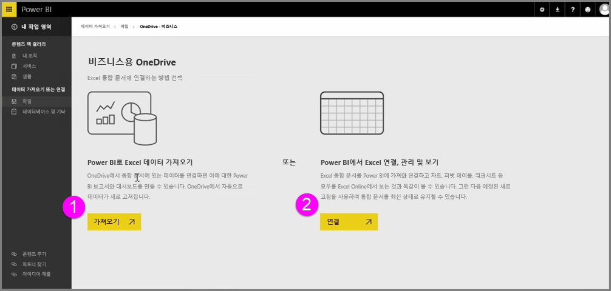
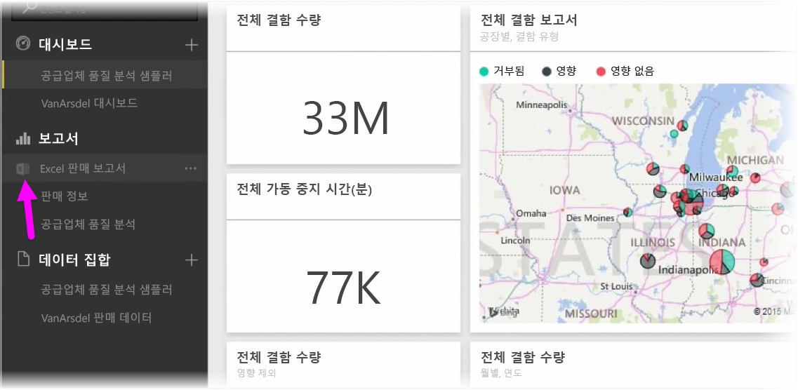
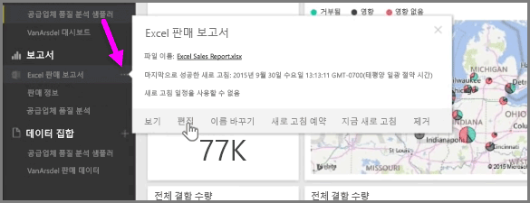

OneDrive에 Excel 통합 문서를 저장하면 Power BI와 Excel이 원활하게 통합됩니다.

OneDrive는 클라우드에 있으므로 Power BI와 마찬가지로 Power BI와 OneDrive 간에 활성 연결이 설정됩니다. OneDrive에서 통합 문서를 변경한 경우 이러한 변경 내용은 Power BI와 자동으로 동기화 됩니다.  보고서 및 대시보드의 시각화는 최신 상태로 유지됩니다. 통합 문서를 데이터베이스 또는 OData 피드와 같은 외부 데이터 소스에 연결한 경우 Power BI의 **새로 고침 예약** 기능을 사용하여 업데이트를 확인할 수 있습니다. 통합 문서의 데이터에 대한 질문이 있으신가요? 그러나 문제가 되지 않습니다. Power BI의 **Q&A** 기능을 사용하여 질문할 수 있습니다.

비즈니스용 OneDrive에서 Excel 파일에 연결하는 방법에는 두 가지 방법이 있습니다.

1. Power BI로 Excel 데이터 가져오기
2. Power BI에서 Excel 연결, 관리 및 보기

### Power BI로 Excel 데이터 가져오기
Power BI로 Excel 데이터를 가져오는 경우 통합 문서의 테이블이 Power BI의 새 데이터 세트에 로드됩니다. 통합 문서에 **파워 뷰** 시트가 있는 경우 해당 시트로 가져오며 Power BI에서 자동으로 새 보고서가 생성됩니다.

Power BI는 비즈니스용 OneDrive의 통합 문서 파일과의 연결을 유지합니다. 통합 문서를 변경한 경우 이를 저장하면 일반적으로 1시간 이내에 해당 변경 내용이 Power BI와 자동으로 동기화*됩니다.  통합 문서를 외부 데이터 원본에 연결한 경우 Power BI의 데이터 세트가 최신 상태로 유지되도록 예약된 새로 고침을 설정할 수 있습니다. Power BI에서 보고서 및 대시보드의 시각화는 데이터 세트의 데이터를 사용하므로 탐색 시 쿼리가 빠르게 실행됩니다.

### Power BI에서 Excel 연결, 관리 및 보기
Excel 통합 문서에 연결한 경우 Excel의 통합 문서와 Power BI로 원활하게 작업할 수 있습니다. 이러한 방식으로 연결하면 통합 문서의 보고서 옆에 작은 Excel 아이콘이 표시됩니다.

**Excel Online**에서 보는 것과 마찬가지로 Power BI에서 보고서의 Excel 통합 문서를 볼 수 있습니다. 줄임표 메뉴에서 편집을 선택하여 Excel Online에서 워크시트를 탐색하고 편집할 수 있습니다. 변경한 경우 대시보드에 고정한 모든 시각화가 자동으로 업데이트됩니다.

데이터 세트는 Power BI에 생성되지 않습니다. 모든 데이터가 OneDrive의 통합 문서에 유지됩니다. 이 접근 방식의 장점 중 하나는 통합 문서가 외부 데이터 소스에 연결된 경우 **예약된 새로 고침**을 설정할 수 있다는 점입니다. 피벗 테이블 및 차트와 같은 요소를 선택하여 Power BI의 대시보드에 바로 **고정**할 수 있습니다. 변경한 경우 Power BI에 자동으로 반영됩니다. 또한 Power BI의 놀라운 **Q&A** 기능을 사용하여 통합 문서의 데이터에 대해 질문할 수 있습니다.  

