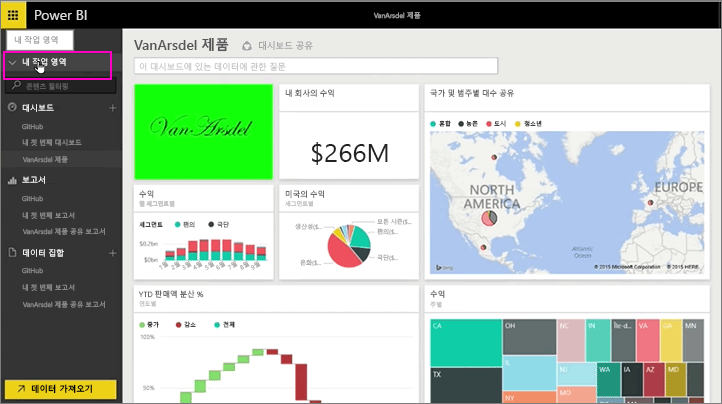
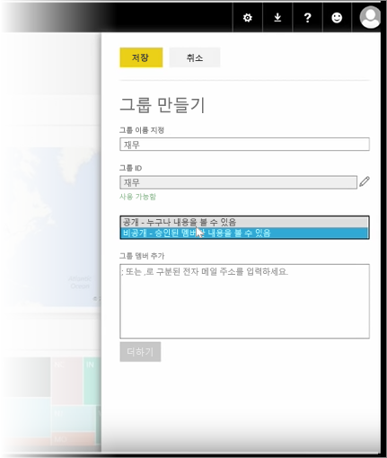
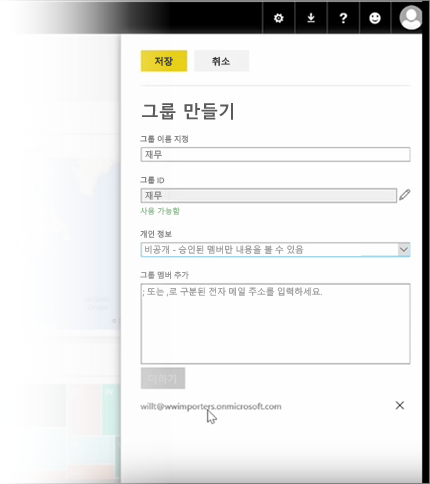

이 단원에서는 먼저 그룹을 만듭니다. **그룹**은 특정 대시보드, 보고서 및 데이터에 대한 액세스 권한이 있는 사용자 집합을 정의합니다.

Power BI의 그룹은 Office 365의 그룹을 기반으로 하므로 Office 365 그룹을 사용하여 그룹의 전자 메일, 일정 및 문서를 관리하는 경우 Power BI는 동일한 기능을 제공합니다. Power BI에서 그룹을 만드는 경우 실제로는 Office 365 그룹을 만드는 것입니다.

이 모듈에서는 새 재무 그룹을 설정하는 시나리오를 사용합니다. 그룹을 설정하고, 대시보드 보고서 및 데이터 집합을 그룹에 공유하고, 그룹에서 항목에 액세스할 수 있는 구성원을 추가하는 방법을 알아보겠습니다.

여기서는 내 작업 영역에서 시작합니다. 이것은 제가 만들었거나 다른 사람이 저와 공유한 대시보드, 보고서 및 데이터 집합입니다.

내 작업 영역을 확장한 경우 **그룹 만들기**를 선택할 수 있습니다.

여기서 이름을 지정할 수 있습니다. 재무 그룹 시나리오를 사용하므로 재무라고 지정하겠습니다. Power BI에서 이름이 도메인에 없는지 확인합니다.

조직의 모든 구성원이 그룹의 콘텐츠를 볼 수 있는지 또는 해당 그룹의 구성원만 볼 수 있는지를 결정하여 개인 정보 수준을 설정할 수 있습니다.

여기에 전자 메일 주소, 보안 그룹 및 메일 그룹을 입력합니다. **추가**를 선택하여 이들을 그룹의 구성원으로 지정하고 그룹을 저장합니다.

다음 단원으로 넘어가겠습니다!

