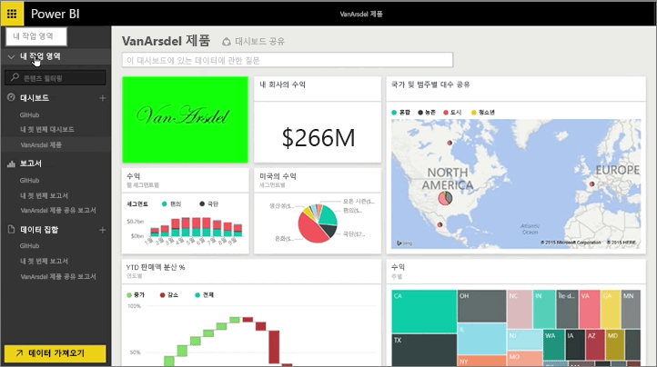
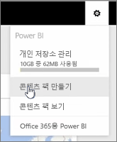
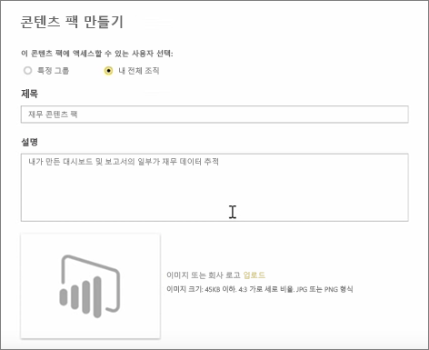
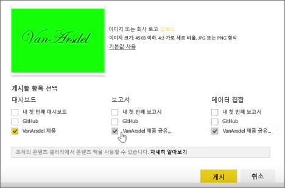
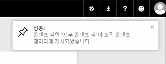

이 단원에서는 Power BI에 이미 있는 기존 아티팩트로 콘텐츠 팩을 만들고 동료와 공유합니다. 

**내 작업 영역**에 대시보드, 보고서 및 데이터 집합이 있습니다. 조직의 구성원이 이를 사용할 수 있도록 패키지로 공유하려고 합니다.

**설정** 아이콘(서비스의 오른쪽 위에 있는 기어)을 선택하면 사용한 저장소 양을 보고 콘텐츠 팩을 만들 수 있습니다.

대화 상자가 나타나면 이를 특정 개인에게 배포할지 또는 그룹에 배포할지 선택하고 제목을 지정할 수 있습니다. 또한 콘텐츠 팩을 찾아보는 사람이 포함되거나 제공되는 내용을 알 수 있도록 **설명** 상자에 자세한 설명을 제공하는 것이 좋습니다.

대화 상자 아래쪽에서 콘텐츠 팩의 이미지를 업로드한 다음 가장 중요한 단계를 수행할 수 있습니다. 콘텐츠 팩에 포함할 대시보드를 선택하면 Power BI에서 대시보드에 사용된 보고서 및 데이터 집합을 자동으로 선택합니다. 콘텐츠 팩에 포함하려는 대시보드에 필요하므로 보고서 또는 데이터 집합의 선택을 취소할 수 없습니다.

다른 대시보드, 보고서 및 데이터 집합을 선택할 수 있지만 지금을 그러지 않을 것입니다.

게시하면 조직의 콘텐츠 갤러리에 콘텐츠 팩이 추가됩니다.

다음 단원으로 넘어가겠습니다!

