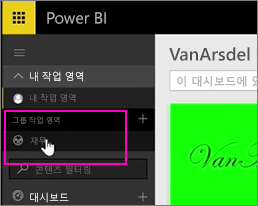
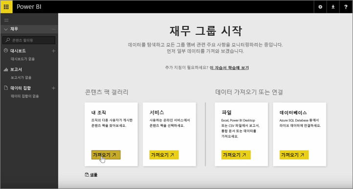
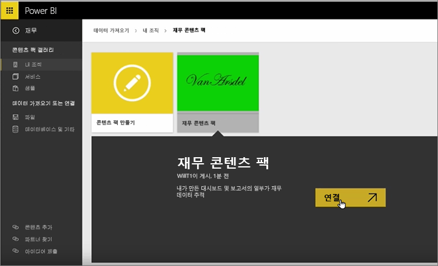
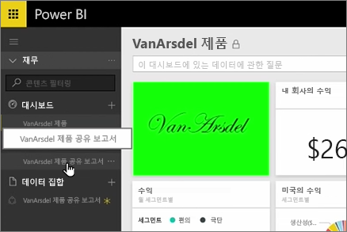
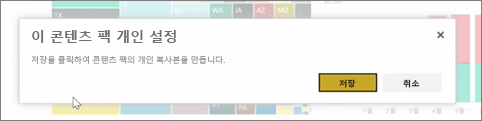
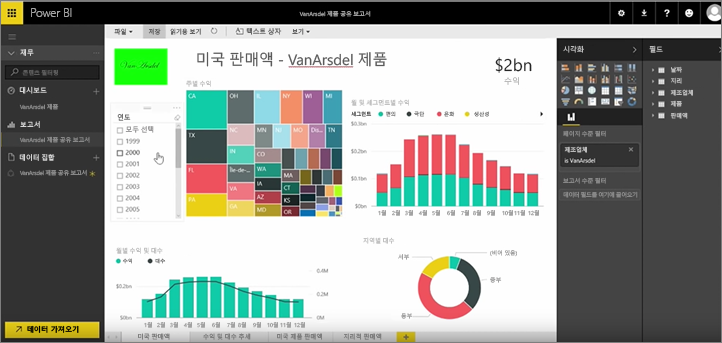

이전 단원에서 이미 콘텐츠 팩 및 그룹을 만들었습니다. 이 단원에서는 그룹의 모든 사용자를 위한 콘텐츠 팩 인스턴스를 만듭니다.

내 작업 영역에서 시작합니다.

이전 단원에서 만든 재무 그룹으로 다시 전환합니다.

그룹에 아직 대시보드, 보고서 또는 데이터 세트가 없습니다. 만든 앱을 사용 하도록 하겠습니다. 타사 서비스 대신 조직 내에서 앱 검색 합니다.

1 분 전 만든 앱을 찾을 수 있습니다. 사용자가 쉽게 찾을 수 있도록 적절한 제목, 설명 및 이미지를 지정하는 것이 중요합니다. 콘텐츠 팩에 연결합니다.

Power BI 대시보드, 보고서 및 앱에 있는 데이터 집합을 가져옵니다.

데이터 집합을 선택 하는 경우 Power BI 앱을 개인 설정 하려는 경우 요청 합니다.

변경할 수 있는 앱의 복사본을 만드는 했으며 게시 된 버전의 앱에서 연결을 끊는 중 고 합니다. 앱 작성자가 게시 된 버전을 변경 하는 경우 자동으로 이러한 업데이트는 받지 않습니다 I.

하지만 원하는 경우 대시보드, 보고서 및 데이터 세트를 편집할 수 있습니다.

따라서 앱이 조직의 다른 사람이 만든 콘텐츠를 다시 사용 하는 간단한 방법입니다.

다음 단원으로 넘어가겠습니다!

