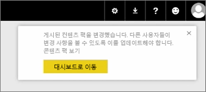
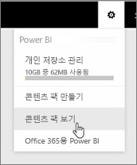
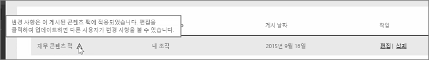

이 단원에서는 이전에 만든 원래 콘텐츠 팩을 편집하고 연결된 다른 사용자가 어떻게 업데이트되는지 알아봅니다.

원래 대시보드를 편집할 수 있는 내 작업 영역으로 돌아가겠습니다.

대시보드를 변경할 때마다 콘텐츠 팩에서 다른 사용자와 공유하는 항목을 변경했으므로 공유 버전을 업데이트하라는 알림이 표시됩니다.

설정 아이콘으로 다시 이동하여 **콘텐츠 팩 보기**를 클릭하면 이미 게시한 콘텐츠 팩이 표시됩니다.

제가 작성한 콘텐츠 팩을 확인합니다. 이 작은 아이콘은 콘텐츠 팩의 항목을 변경했으므로 다른 사용자가 변경 내용을 볼 수 있도록 콘텐츠 팩을 편집해야 함을 나타냅니다.

**편집**을 선택하면 제목 및 설명을 편집할 수 있는 화면으로 돌아가지만 이번에는 **업데이트** 단추가 있으므로 이를 선택합니다.

Power BI에서 이러한 변경 내용을 가져와 콘텐츠 팩 갤러리에 업데이트된 콘텐츠 팩을 게시합니다.

제 콘텐츠 팩에 연결된 모든 사용자에게 콘텐츠 팩이 변경되었음을 알리고, 변경 내용을 적용할지 또는 이전 버전을 유지할지 묻는 메시지가 표시됩니다.

콘텐츠 팩 소유자는 동료가 사용 중인 버전을 관리할 수 있습니다.

