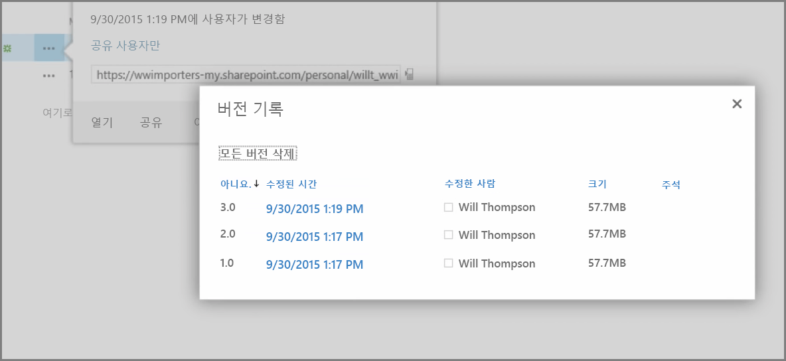
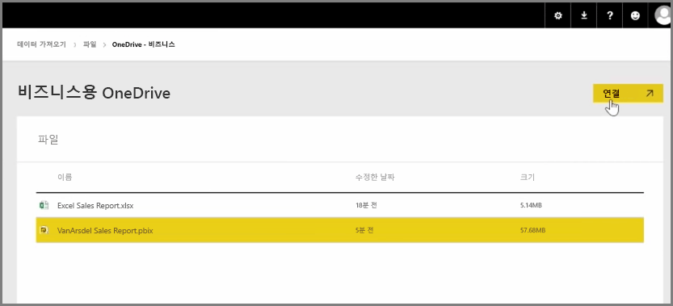
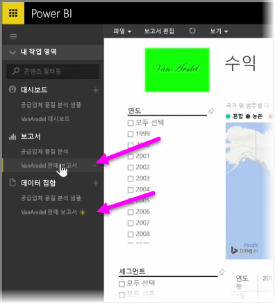

이전 문서에서는 조직에서 Power BI에 있는 콘텐츠를 쉽게 관리하고 공동 작업을 수행할 수 있도록 그룹을 만드는 방법을 살펴보았습니다. Power BI/Office 365 그룹을 사용하여 **비즈니스용 OneDrive**를 통해 공동 작업 및 공유할 수도 있습니다.

비즈니스용 OneDrive를 Power BI 콘텐츠 소스로 사용하면 버전 기록과 같은 여러 가지 유용한 도구에 액세스할 수 있습니다. 또한 비즈니스용 OneDrive 내에서 Office 365 그룹과 파일을 공유하여 액세스를 제공하고 여러 사람이 동일한 Power BI 또는 Excel 파일에서 작업하도록 허용할 수 있습니다.

비즈니스용 OneDrive에서 PBIX(Power BI Desktop) 파일에 연결하려면 Power BI 서비스에 로그인하여 **데이터 가져오기**를 선택합니다. 데이터 가져오기 또는 연결 아래에서 **파일**을 선택한 다음 **OneDrive - 비즈니스**를 선택합니다. 원하는 파일을 강조 표시하고 **연결**을 선택합니다.

탐색 모음의 왼쪽에 콘텐츠가 표시됩니다.

이제 **비즈니스용 OneDrive**에서 파일에 적용된 변경 내용이 Power BI 환경에도 자동으로 반영되며 버전 기록에 기록됩니다.

