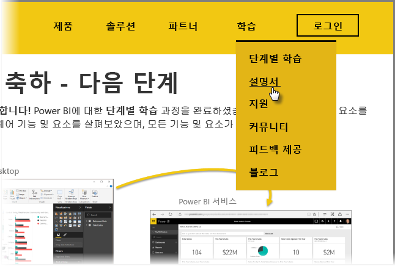

이제 완료되었습니다. **축하합니다!** Power BI에 대한 **단계별 학습** 과정을 완료하셨습니다. Power BI의 기본 요소를 배우고, 해당 소프트웨어 기능 및 요소를 살펴보았으며, 모든 기능 및 요소가 함께 작동하는 방식을 알아보았습니다.

모든 섹션을 순서대로 진행해 온 결과 이제 이 과정의 마지막 섹션이자 DAX를 배우지 않는다면 최종 항목에 도달했습니다. 잘하셨습니다! 다음과 같은 **중요한 개념**을 완전히 파악하셨을 것입니다.

* [Power BI의 정의](../gettingstarted.yml?tutorial-step=1)
* Power BI의 [구성 요소](../gettingstarted.yml?tutorial-step=3)
* 데이터 [가져오기](../gettingdata.yml?tutorial-step=3) 및 [모델링](../modeling.yml?tutorial-step=1)
* [시각화](../visualizations.yml?tutorial-step=1)
* Power BI 서비스에서 [데이터 탐색](../exploringdata.yml?tutorial-step=1)
* [Excel 및 Power BI](../powerbiandexcel.yml?tutorial-step=1) 함께 사용
* 작업 [게시 및 공유](../publishingandsharing.yml?tutorial-step=1)

이제 이 모든 지식을 활용할 준비가 되었습니다. 여기에는 몇몇 **다운로드할 링크** 또는 **Power BI 서비스에 연결된** 브라우저를 가져올 수 있는 링크가 나와 있습니다.

* 언제든지 [최신 Power BI Desktop을 다운로드](https://powerbi.microsoft.com/desktop)할 수 있습니다.
* [Power BI 서비스](https://powerbi.microsoft.com/)로 쉽게 이동할 수 있습니다.
* [Power BI용 모바일 앱](https://powerbi.microsoft.com/mobile/)도 간편하게 다운로드할 수 있습니다.

유용한 **도움말 및 참조** 콘텐츠도 많이 있습니다. 이 페이지의 맨 위로 이동하여 **학습 > 설명서**를 선택하면 다양한 Power BI 참조 콘텐츠 집합을 볼 수 있습니다.

이 **Power BI 단계별 학습** 과정이 유익한 시간이 되셨기 바랍니다. Power BI 시각적 개체는 언제나 멋지고 몰입도가 뛰어날 수 있습니다.

## DAX 사용자를 위한 더 많은 섹션
더 보시겠습니까? **DAX(데이터 분석 식)** 를 사용하여 Power BI에서 사용자 지정 열과 테이블을 만들거나 필터링하거나 사용하는 데 관심이 있으십니까? Power BI에서 코드 작업을 하려는 사람들을 대상으로 하는 추가 섹션은 **DAX 소개**입니다. 관심이 있으시면 살펴보겠습니다. 단계별 학습의 나머지와 같은 친숙한 방법을 사용합니다.

