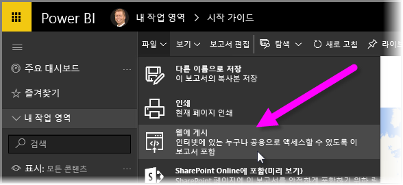
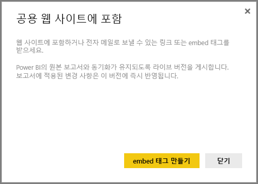
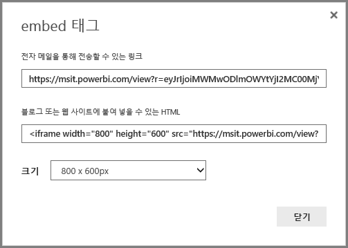
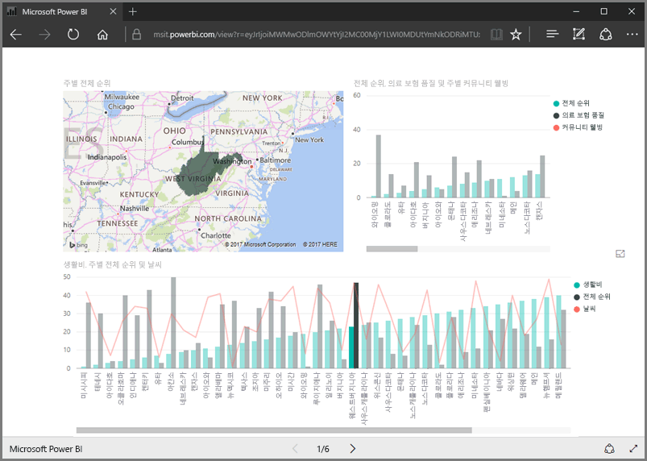
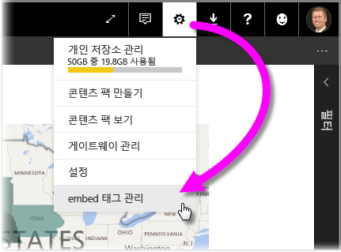
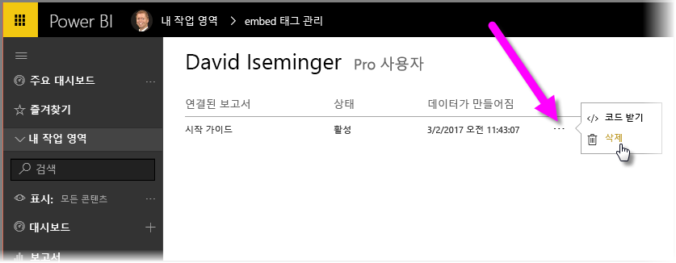

이 단원에서는 간단히 몇 단계를 거쳐 웹 페이지에 Power BI 보고서를 공유하거나 전자 메일을 통해 공유하는 방법을 설명합니다. Power BI의 이 기능은 **웹에 게시**라고 하며 쉽게 사용하고 관리할 수 있습니다.

Power BI에서 공유하려는 보고서를 선택하여 캔버스에 보고서가 표시됩니다. 그런 다음 메뉴에서 **파일 > 웹에 게시**를 선택합니다.

여기에서 웹 사이트 또는 메일에서 보고서를 포함할 수 있도록 하는 *embed 태그* 를 가져오는 방법에 대해 설명하는 대화 상자가 표시됩니다.

**embed 태그 만들기** 를 선택하면 Power BI에서는 모든 사용자와 인터넷에 있는 데이터를 공유하게 된다는 점을 알려주는 다른 대화 상자를 표시합니다. 맞는지 확인하세요.

Power BI는 두 개의 링크가 있는 대화 상자를 표시합니다.

* 전자 메일에서 공유할 수 있는 링크는 보고서를 웹 페이지로 표시합니다.
* HTML 코드(iframe 내의 링크)는 웹 페이지에 직접 보고서를 포함할 수 있습니다.

HTML 링크의 경우 포함된 보고서에 대해 미리 정의된 크기 중에서 선택하거나 직접 iframe 코드를 수정하고 크기를 사용자 지정할 수 있습니다.

브라우저에 전자 메일 링크를 붙여넣기만 하면 웹으로 보고서를 볼 수 있습니다. Power BI에서 보고서를 보고 있던 경우와 마찬가지로 해당 웹 페이지와 상호 작용할 수 있습니다. 다음 이미지에서는 해당 링크가 해당 대화 상자에서 브라우저에 직접 복사된 경우 **웹에 게시** 페이지를 표시합니다.

iframe 링크를 블로그 게시물이나 웹 사이트 또는 Sway에도 포함할 수 있습니다.

만든 embed 태그를 삭제하시겠습니까? 그러나 문제가 되지 않습니다. Power BI에서 오른쪽 위에 있는 **기어** 아이콘을 선택한 다음 **embed 태그 관리** 를 선택합니다.

Power BI 작업 영역에는 만든 embed 태그를 표시합니다(아래 이미지에서는 한 개임). 줄임표를 클릭하면 embed 태그의 코드를 가져오거나 embed 태그를 완전히 삭제하도록 선택할 수 있습니다.

Power BI 보고서를 웹에 게시하여 전 세계와 공유하는 방법은 여기까지입니다. 간단합니다.

