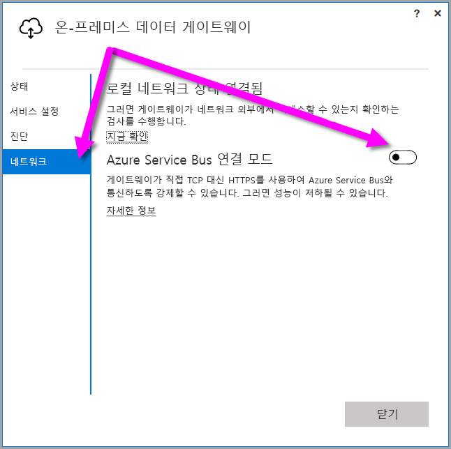
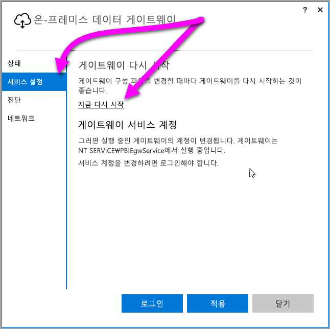

## <a name="sign-in-account"></a>로그인 계정

사용자는 회사 또는 학교 계정으로 로그인합니다. 이 계정은 **조직 계정**입니다. Office 365 제품에 로그인하였고 실제 직장 전자 메일을 입력하지 않은 경우 nancy@contoso.onmicrosoft.com처럼 보일 수 있습니다. 계정은 AAD(Azure Active Directory)의 테넌트 내에 저장됩니다. 대부분의 경우에서 AAD 계정의 UPN은 전자 메일 주소와 일치합니다.

## <a name="windows-service-account"></a>Windows 서비스 계정

온-프레미스 데이터 게이트웨이는 Windows 서비스 로그온 자격 증명에 대해 *NT SERVICE\PBIEgwService*를 사용하도록 구성됩니다. 기본적으로 게이트웨이를 설치하는 머신의 컨텍스트에서 서비스로 로그온 권한이 있습니다. 이 계정은 온-프레미스 데이터 원본에 연결하는 데 사용되는 동일한 계정이 아닙니다. 또한 클라우드 서비스로 로그인하는 회사 또는 학교 계정이 아닙니다.

> [!NOTE]
> 개인 모드를 선택한 경우 Windows 서비스 계정을 개별적으로 구성합니다.

프록시 서버에 인증 문제가 발생하는 경우, Windows 서비스 계정을 도메인 사용자 또는 관리형 서비스 계정으로 변경해 보세요. 자세한 내용은 [프록시 구성](../service-gateway-proxy.md#changing-the-gateway-service-account-to-a-domain-user)을 참조하세요.

## <a name="ports"></a>포트

게이트웨이는 Azure 서비스 버스에 대한 아웃바운드 연결을 만듭니다. 이 게이트웨이는 아웃바운드 포트 TCP 443(기본값), 5671, 5672, 9350~9354에서 통신합니다.  게이트웨이에는 인바운드 포트가 필요하지 않습니다.

방화벽에, 데이터 영역에 대한, IP 주소 허용 목록을 작성하는 것이 좋습니다. 매주 업데이트되는 [Microsoft Azure 데이터 센터 IP 목록](https://www.microsoft.com/download/details.aspx?id=41653)을 다운로드할 수 있습니다. 게이트웨이는 정규화된 도메인 이름(FQDN)과 함께 IP 주소를 사용하여 Azure Service Bus와 통신합니다. 게이트웨이가 HTTPS를 사용하여 통신하도록 강제 적용하는 경우 엄격하게 FQDN만을 사용하며 IP 주소를 사용하여 통신이 발생하지 않습니다.

> [!NOTE]
> Azure 데이터 센터 IP 목록에 나열되는 IP 주소는 CIDR 표기법 형식입니다. 예를 들어, 10.0.0.0/24는 10.0.0.0에서 10.0.0.24까지를 의미하지 않습니다. [CIDR 표기법](http://whatismyipaddress.com/cidr)에 대해 자세히 알아보세요.

게이트웨이에 사용되는 정규화된 도메인 이름의 목록입니다.

| 도메인 이름 | 아웃바운드 포트 | 설명 |
| --- | --- | --- |
| *.download.microsoft.com |80 |설치 프로그램을 다운로드하는 데 사용하는 HTTP입니다. |
| *.powerbi.com |443 |HTTPS |
| *.analysis.windows.net |443 |HTTPS |
| *.login.windows.net |443 |HTTPS |
| *.servicebus.windows.net |5671-5672 |AMQP(고급 메시지 큐 프로토콜) |
| *.servicebus.windows.net |443, 9350-9354 |TCP를 통한 서비스 버스 릴레이의 수신기(액세스 제어 토큰 획득에는 443 필요) |
| *.frontend.clouddatahub.net |443 |HTTPS |
| *.core.windows.net |443 |HTTPS |
| login.microsoftonline.com |443 |HTTPS |
| *.msftncsi.com |443 |게이트웨이를 Power BI 서비스에 연결할 수 없는 경우 인터넷 연결을 테스트하는 데 사용합니다. |
| *.microsoftonline-p.com |443 |구성에 따라 인증에 사용됩니다. |

> [!NOTE]
> Visualstudio.com 또는 visualstudioonline.com으로 향하는 트래픽은 App Insights용이며 게이트웨이가 작동하는 데는 필요하지 않습니다.

## <a name="forcing-https-communication-with-azure-service-bus"></a>HTTPS가 Azure Service Bus와 통신하도록 강제 적용

게이트웨이가 직접 TCP 대신 HTTPS를 사용하여 Azure Service Bus와 통신하도록 강제할 수 있습니다. HTTPS를 사용하면 성능에 영향을 줄 수 있습니다. 이렇게 하려면 이 단락 바로 다음에 나오는 코드 조각에 표시된 것과 같이 `AutoDetect`에서 `Https`로 값을 변경하여 *Microsoft.PowerBI.DataMovement.Pipeline.GatewayCore.dll.config* 파일을 수정합니다. 해당 파일은(기본적으로)  C:\Program Files\온-프레미스 데이터 게이트웨이 에 있습니다.

```
<setting name="ServiceBusSystemConnectivityModeString" serializeAs="String">
    <value>Https</value>
</setting>
```

*ServiceBusSystemConnectivityModeString* 매개 변수의 값은 대/소문자를 구분합니다. 유효한 값은 *AutoDetect* 및 *Https*입니다.

또는 게이트웨이가 게이트웨이 사용자 인터페이스를 사용하여 이 동작을 채택하도록 강제 적용할 수 있습니다. 게이트웨이 사용자 인터페이스에서 **네트워크**를 선택한 다음 **Azure Service Bus 연결 모드**를 **설정**으로 전환합니다.



변경한 후에 **적용**(변경을 할 때만 표시되는 단추)을 선택하면 변경이 적용되도록 *게이트웨이Windows 서비스* 가 자동으로 다시 시작됩니다.

나중에 참조하려면 **서비스 설정**을 선택한 다음 *지금 다시 시작*을 선택하여 사용자 인터페이스 대화 상자에서 *게이트웨이 Windows 서비스* 를 다시 시작할 수 있습니다.



## <a name="support-for-tls-12"></a>TLS 1.2에 대한 지원

기본적으로 온-프레미스 데이터 게이트웨이는 TLS(전송 계층 보안) 1.2를 사용하여 Power BI 서비스와 통신합니다. 모든 게이트웨이 트래픽이 TLS 1.2를 사용하도록 하려면 게이트웨이 서비스를 실행 중인 머신에 다음 레지스트리 키를 추가하거나 수정해야 할 수 있습니다.

```
[HKEY_LOCAL_MACHINE\SOFTWARE\Microsoft\.NETFramework\v4.0.30319]"SchUseStrongCrypto"=dword:00000001
[HKEY_LOCAL_MACHINE\SOFTWARE\Wow6432Node\Microsoft\.NETFramework\v4.0.30319]"SchUseStrongCrypto"=dword:00000001
```

> [!NOTE]
> 이러한 레지스트리 키를 추가하거나 수정하면 변경 내용이 모든 .NET 애플리케이션에 적용됩니다. 다른 애플리케이션에 대한 TLS에 영향을 주는 레지스트리 변경에 대한 정보는 [TLS(전송 계층 보안) 레지스트리 설정](https://docs.microsoft.com/windows-server/security/tls/tls-registry-settings)을 참조하세요.

## <a name="how-to-restart-the-gateway"></a>게이트웨이를 다시 시작하는 방법

게이트웨이는 Windows 서비스로 실행됩니다. Windows 서비스와 마찬가지로 시작하고 중지할 수 있습니다. 명령 프롬프트에서 이를 수행하는 방법을 다음과 같습니다.

1. 게이트웨이가 실행 중인 컴퓨터에서 관리자 명령 프롬프트를 시작합니다.
2. 다음 명령을 사용하여 서비스를 중지합니다.
   
   net stop PBIEgwService
3. 다음 명령을 사용하여 서비스를 시작합니다.
   
   net start PBIEgwService

