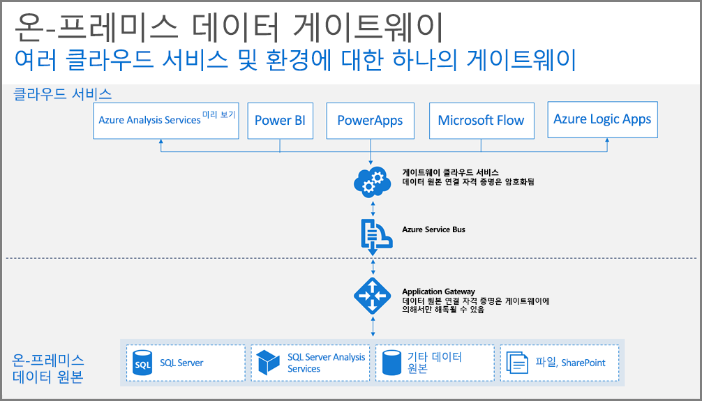

## 게이트웨이 작동 방법

먼저 사용자가 온-프레미스 데이터 원본에 연결된 요소를 조작하는 경우 어떻게 되는지 살펴보겠습니다. 

> [!NOTE]
> Power BI의 경우 게이트웨이에 대한 데이터 원본을 구성해야 합니다.

1. 쿼리는 온-프레미스 데이터 원본에 대한 암호화된 자격 증명과 함께 클라우드 서비스에 의해 생성되며 게이트웨이 처리를 위해 큐로 보내집니다.
2. 게이트웨이 클라우드 서비스에서 쿼리를 분석하고 요청을 [Azure Service Bus](/azure/service-bus-messaging/service-bus-messaging-overview/)에 푸시합니다.
3. 온-프레미스 데이터 게이트웨이는 대기 중인 요청에 대해 Azure Service Bus를 폴링합니다.
4. 게이트웨이는 쿼리를 가져오고 자격 증명의 암호를 해독하며 해당 자격 증명을 사용하여 데이터 원본에 연결합니다.
5. 게이트웨이는 실행에 대한 데이터 원본에 쿼리를 전송합니다.
6. 결과는 데이터 원본에서 다시 게이트웨이로, 그런 다음 클라우드 서비스에 전송됩니다. 서비스는 결과를 사용합니다.

