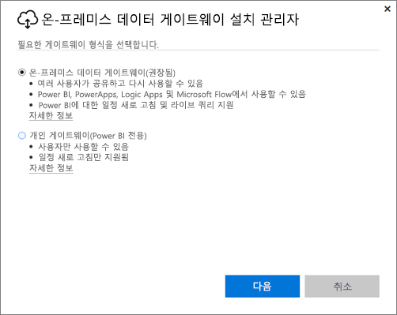
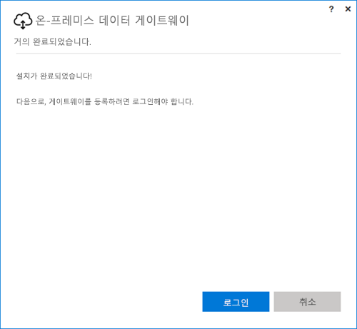
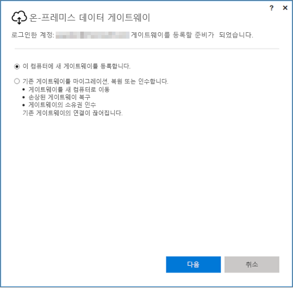
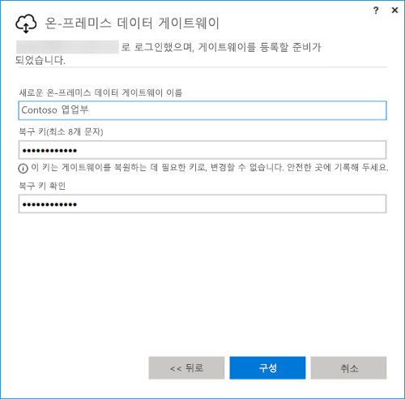

## 온-프레미스 데이터 게이트웨이 설치
데이터 게이트웨이가 컴퓨터에서 설치되고 실행됩니다. 항상 실행 중으로 둘 수 있는 컴퓨터에 게이트웨이를 설치하는 것이 좋습니다.

> [!NOTE]
> 게이트웨이는 64비트 Windows 운영 체제에서만 지원됩니다.
> 
> 

Power BI의 경우 수행해야 하는 첫 번째 선택은 게이트웨이의 모드입니다.

* **온-프레미스 데이터 게이트웨이** 이 모드에서는 여러 사용자가 게이트웨이를 공유 및 재사용할 수 있습니다. Power BI, PowerApps, 흐름 또는 Logic Apps에서 이 게이트웨이를 사용할 수 있습니다. Power BI의 경우 새로 고침 예약 및 DirectQuery에 대한 지원을 포함합니다.
* **개인:** Power BI 전용이며 관리자 구성 없이 개인이 사용할 수 있습니다. 요청 시 새로 고침 및 새로 고침 예약에만 사용될 수 있습니다. 개인 게이트웨이 설치가 시작됩니다.

게이트웨이를 설치할 때 두 가지 모드 모두 다음에 유의해야 합니다.

* 두 게이트웨이에 모두 64비트 Windows 운영 체제 필요
* 도메인 컨트롤러에 게이트웨이를 설치할 수 없음
* 각 모드(개인 및 표준)에서 실행 중인, 동일한 컴퓨터에 최대 두 개의 온-프레미스 데이터 게이트웨이를 설치할 수 있습니다. 
* 동일한 컴퓨터의 동일한 모드에서 실행 중인 둘 이상의 게이트웨이를 사용할 수 없습니다.
* 여러 온-프레미스 데이터 게이트웨이를 서로 다른 컴퓨터에 설치하고 모두 동일한 Power BI Gateway 관리 인터페이스에서 관리할 수 있습니다(개인 제외, 다음 글머리 기호 참조).
* 각 Power BI 사용자에 대해 실행하는 개인 모드 게이트웨이는 하나만 사용할 수 있습니다. 다른 컴퓨터에도 동일한 사용자에 대한 다른 개인 모드 게이트웨이를 설치하는 경우 가장 최근 설치가 기존의 이전 설치를 대신합니다.

다음은 게이트웨이를 설치하기 전에 고려해야 할 몇 가지 사항입니다.

* 노트북에 설치하는 경우 노트북이 꺼져 있고 인터넷에 연결되어 있지 않거나 절전 모드인 경우 게이트웨이는 작동하지 않고 클라우드 서비스의 데이터는 온-프레미스 데이터와 동기화되지 않습니다.
* 컴퓨터가 무선 네트워크에 연결되어 있는 경우 게이트웨이는 더 느리게 수행될 수 있으며 이로 인해 클라우드 서비스의 데이터와 온-프레미스 데이터가 동기화하는 데 더 오래 걸립니다.

게이트웨이가 설치되면 회사 또는 학교 계정으로 로그인해야 합니다.

로그인한 후 새 게이트웨이를 구성하거나 기존 게이트웨이를 마이그레이션, 복원 또는 인수하는 옵션을 가집니다.

## 새 게이트웨이 구성
1. 게이트웨이에 대한 **이름** 을 입력합니다.
2. **복구 키** 를 입력합니다. 최소 8자이어야 합니다.
3. **구성** 을 선택합니다.

> [!NOTE]
> 게이트웨이를 마이그레이션, 복원 또는 인수해야 하는 경우 복구 키가 필요합니다. 이 키를 안전한 장소에 보관해야 합니다.
> 
> 

### 기존 게이트웨이 마이그레이션, 복원 또는 인수
복구하려는 게이트웨이를 선택하고 게이트웨이를 만드는 데 사용된 복구 키를 제공해야 합니다.

### 온-프레미스 데이터 게이트웨이 연결
게이트웨이가 구성되면 이를 사용하여 온-프레미스 데이터 원본에 연결할 수 있습니다.

게이트웨이가 Power BI용인 경우 Power BI 서비스 내에서 데이터 원본을 게이트웨이에 추가해야 합니다. 이 작업은 **게이트웨이 관리** 영역 내에서 수행됩니다. 자세한 내용은 데이터 소스 관리 문서를 참조하세요.

PowerApps의 경우 지원되는 데이터 원본에 대해 정의된 연결에 대한 게이트웨이를 선택해야 합니다. 흐름 및 Logic Apps의 경우 이 게이트웨이를 온-프레미스 연결에 사용할 수 있습니다.

