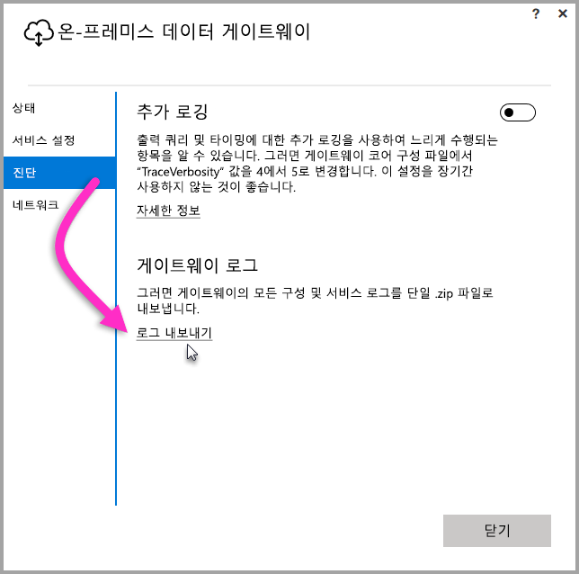
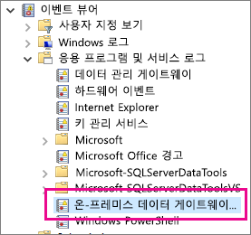

## 문제 해결을 위한 도구
<a name="logs" />

### 게이트웨이 구성기에서 로그 수집
게이트웨이에 대해 수집할 수 있는 여러 로그가 있으며, 항상 로그로 시작해야 합니다. 게이트웨이를 설치한 후 로그를 수집하는 가장 간단한 방법은 사용자 인터페이스를 이용하는 것입니다. **온-프레미스 데이터 게이트웨이** 사용자 인터페이스에서 **진단**을 선택하고 다음 그림에 나와 있는 것처럼 페이지 하단에 있는 **로그 내보내기** 링크를 선택합니다.

**설치 관리자 로그**

    %localappdata%\Temp\On-premises_data_gateway_*.log

**구성 로그**

    %localappdata%\Microsoft\On-premises Data Gateway\GatewayConfigurator*.log

**온-프레미스 데이터 게이트웨이 서비스 로그**

    C:\Users\PBIEgwService\AppData\Local\Microsoft\On-premises Data Gateway\Gateway*.log

### 이벤트 로그
**온-프레미스 데이터 게이트웨이 서비스** 이벤트 로그는 **응용 프로그램 및 서비스 로그** 아래에서 제공됩니다.

<a name="fiddler" />

### Fiddler 추적
[Fiddler](http://www.telerik.com/fiddler)는 HTTP 트래픽을 모니터링하는 Telerik의 무료 도구입니다.  클라이언트 컴퓨터에서 Power BI 서비스를 사용하여 앞뒤로 볼 수 있습니다. 오류 및 다른 관련 정보를 표시할 수 있습니다.

