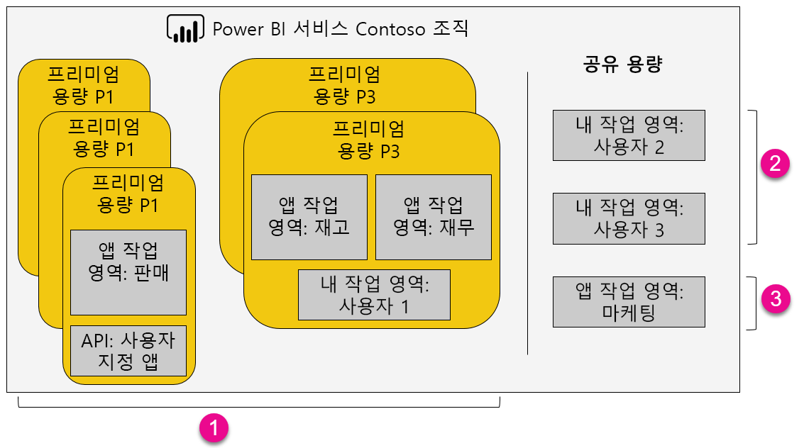

1. 프리미엄 용량 내 항목
   
   * 앱 작업 영역(멤버 또는 관리자로)에 액세스하고 앱을 게시하려면 Power BI Pro 라이선스가 필요합니다.
   * 앱 독자는 Power BI Pro 또는 무료 사용자일 수 있습니다.
   * 공유하려면 Power BI Pro 라이선스가 필요하지만 수신자는 Power BI Pro 또는 무료 사용자일 수 있습니다.
   * 대시보드 수신자는 Power BI Pro 라이선스가 있든, 무료 라이선스가 있든, 데이터 경고를 설정할 수 있습니다.
   * 포함에 대한 REST API는 사용자가 아니라 Power BI Pro 라이선스가 있는 서비스 계정을 사용합니다.
2. 공유 용량에서 내 작업 영역
   
   * 공유하려면 Pro 라이선스가 필요합니다. 수신자도 Pro 라이선스가 필요합니다.
3. 공유 용량에서 앱 작업 영역
   
   * 앱 사용 현황에는 Pro 라이선스가 필요합니다.

