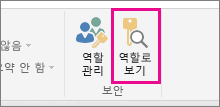
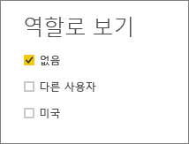
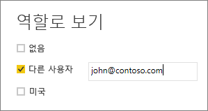

## Power BI Desktop 내에서 역할 유효성 검사
역할을 만든 후에 Power BI Desktop 내에서 역할의 결과를 테스트합니다.

1.  **역할로 보기**를 선택합니다. 

    

    **역할로 보기**에서 사용자가 만든 역할을 볼 수 있습니다.

    

3. 만든 역할> **확인** 을 선택하여 해당 역할을 적용합니다. 보고서는 해당 역할과 관련된 데이터를 렌더링합니다. 

4. 또한 **다른 사용자**를 선택하고 지정된 사용자를 제공할 수 있습니다. Power BI 서비스 및 Power BI Report Server가 사용하는 UPN(사용자 계정 이름)을 제공하는 것이 가장 좋습니다.

    

1.  **확인** 을 선택하면 해당 사용자가 볼 수 있는 내용에 따라 보고서가 렌더링됩니다. 

Power BI Desktop 내에서 **다른 사용자**는 DAX 식을 기반으로 하는 동적 보안을 사용하는 경우에만 다른 결과가 표시됩니다. 

