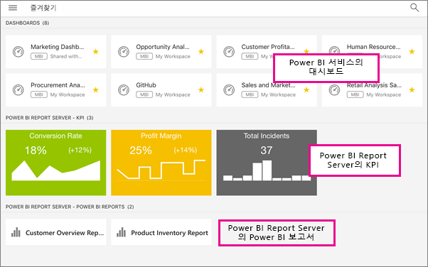

# Power BI 모바일 앱에서 온-프레미스 보고서 서버 보고서 및 KPI 보기
적용 대상:

|  |  |  |  |
|:--- |:--- |:--- |:--- |
| iPhone |iPad |Android 휴대폰 |Android 태블릿 |

Power BI Report Server 및 SQL Server 2016 Reporting Services(SSRS)에서 Power BI 모바일 앱은 중요한 온-프레미스 비즈니스 정보에 대한 터치 기반의 라이브 모바일 액세스를 제공합니다. 

 

## 먼저 수행할 중요한 작업
**모바일 앱은 Power BI 콘텐츠를 만드는 위치가 아닌 보는 위치에 있습니다.**

* 사용자 및 조직의 다른 보고서 작성자는 [Power BI Desktop을 사용하여 Power BI 보고서를 만든 다음 Power BI Report Server 웹 포털에 게시합니다](report-server/quickstart-create-powerbi-report.md). 
* [웹 포털에서 바로 KPI](https://docs.microsoft.com/sql/reporting-services/working-with-kpis-in-reporting-services)를 만들어 폴더에 정리하고 즐겨찾기로 표시하여 쉽게 찾을 수 있습니다. 
* SQL Server 2016 Enterprise Edition 모바일 보고서 게시자를 사용하여 [Reporting Services 모바일 보고서를 만들고](https://docs.microsoft.com/sql/reporting-services/mobile-reports/create-mobile-reports-with-sql-server-mobile-report-publisher) [Reporting Services 웹 포털](https://docs.microsoft.com/sql/reporting-services/web-portal-ssrs-native-mode)에 게시합니다.  

그런 다음 Power BI 모바일 앱은 최대 5개의 Report Server에 연결하여 폴더에 정리되어 있거나 즐겨찾기로 모아놓은 Power BI 보고서와 KPI를 봅니다. 

## 서버 연결 없이 모바일 앱에서 샘플 탐색
Reporting Services 웹 포털에 대한 액세스가 없더라도, Reporting Services 모바일 보고서 및 KPI의 기능을 탐색할 수 있습니다. 

1. 왼쪽 위 모퉁이에서  전역 탐색 단추를 탭한 다음 오른쪽 위에 있는 기어 아이콘을 탭합니다. .
2. **Reporting Services 샘플**을 누른 다음 KPI 및 모바일 보고서와 상호 작용할 샘플을 찾아봅니다.
   
   

## 온-프레미스 서버에 연결
Power BI 모바일 앱에서 온-프레미스 Power BI 보고서, Reporting Services 모바일 보고서 및 KPI를 볼 수 있습니다. 

1. 모바일 장치에서 Power BI 앱을 엽니다.
2. Power BI에 아직 로그인하지 않은 경우 **Reporting Server**를 누릅니다.
   
   
   
   Power BI 앱에 이미 로그인한 경우 전역 탐색 버튼을 탭한 다음, 기어 아이콘을 탭합니다.  오른쪽 위에 있습니다.
3. **서버에 연결**을 탭합니다.
   
    

     모바일 앱은 어떤 식으로든 서버에 액세스해야 합니다. 그 방법은 몇 가지가 있습니다.

    - 동일한 네트워크에 연결/VPN 사용이 가장 쉬운 방법입니다.
    - 조직 외부에서 웹 응용 프로그램 프록시를 사용하여 연결할 수도 있습니다. 자세한 내용은 [OAuth를 사용하여 Reporting Services에 연결](mobile-oauth-ssrs.md)을 참조하세요. 
    - 방화벽에서 연결 (포트)를 엽니다.

1. 서버 주소, 사용자 이름, 암호를 입력합니다. 서버 주소에 대해 다음 형식을 사용합니다.
   
     `http://<servername>/reports`
   
     또는
   
     `https://<servername>/reports`
   
   연결 문자열 앞에 **http** 또는 **https**를 포함합니다.
   
    
5. (선택 사항) 원하는 경우 **고급 옵션**에서 서버 이름을 지정할 수 있습니다.
6. 이제 이 예에서 "power bi report server"라고 하는 서버가 왼쪽 탐색 모음에 표시됩니다.
   
   

## Power BI 앱에서 Power BI 보고서 및 KPI 보기
Power BI 보고서, Reporting Services 모바일 보고서 및 KPI는 Reporting Services 웹 포털에서와 동일한 폴더에 표시됩니다. 

* Power BI 보고서 탭 . 그러면 가로 모드로 열리고 Power BI 앱에서 상호 작용할 수 있습니다.
  
    
* Power BI Desktop에서 보고서 소유자는 Power BI 모바일 앱에 [보고서를 최적화](desktop-create-phone-report.md)할 수 있습니다. 휴대전화에서 최적화된 보고서에는 특수 아이콘  및 레이아웃이 있습니다.
  
    
* 포커스 모드로 보려면 KPI를 누릅니다.
  
    

## 즐겨찾는 KPI 및 보고서 보기
웹 포털에서 KPI와 보고서를 즐겨찾기로 표시한 다음 모바일 장치에서 Power BI 즐겨찾기 대시보드와 함께 하나의 폴더에서 편리하게 볼 수 있습니다.

* **즐겨찾기**를 누릅니다.
  
   
  
   웹 포털의 즐겨 찾는 KPI 및 보고서는 Power BI 서비스의 Power BI 대시보드와 함께 이 페이지에 모두 표시됩니다.
  
   

## 보고서 서버에 대한 연결을 제거합니다.
1. 왼쪽 탐색 창의 맨 아래에 있는 **설정**을 누릅니다.
2. 연결하지 않으려는 서버 이름을 누릅니다.
3. **서버 제거**를 탭합니다.

## 다음 단계
* [Power BI 시작](service-get-started.md)  
* 궁금한 점이 더 있나요? [Power BI 커뮤니티에 질문합니다.](http://community.powerbi.com/)

