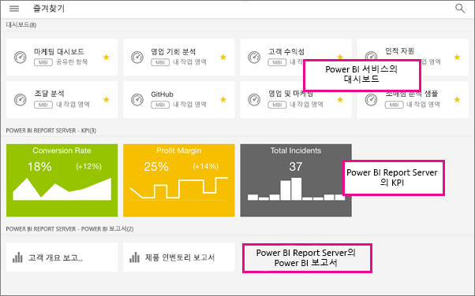

# Power BI 모바일 앱에서 즐겨찾는 대시보드, 앱 및 온-프레미스 보고서 만들기
적용 대상:

|  |  |  |  |  |
|:--- |:--- |:--- |:--- |:--- |
| iPhone |iPad |Android 휴대폰 |Android 태블릿 |Windows 10 장치 |

모바일 앱의 즐겨찾기 페이지에서 즐겨 찾는 온-프레미스 Power BI Report Server 및 Reporting Services KPI와 모바일 보고서와 함께 즐겨 찾는 Power BI 대시보드 및 앱을 볼 수 있습니다. Power BI 모바일 앱에서 대시보드 또는 앱을 *즐겨찾기* 로 만들면 즐겨찾기 페이지에서 Power BI 서비스([https://powerbi.com](https://powerbi.com)) 및 모든 모바일 장치를 볼 수 있습니다. 

또한 [Power BI 서비스에서 Power BI 대시보드 및 앱 즐겨찾기를](service-dashboard-favorite.md) 만들 수도 있습니다. 그런 다음 모바일 앱의 즐겨찾기 페이지에서 이를 볼 수 있습니다.

Power BI Report Server 또한 Reporting Services 웹 포털에서 KPI와 보고서를 즐겨찾기로 표시하고 모바일 장치에서 Power BI 즐겨찾기 대시보드와 함께 하나의 폴더로 편리하게 볼 수 있습니다.

## 즐겨 찾는 Power BI 대시보드 및 앱, 온-프레미스 보고서와 KPI 보기
* 맨 위의 탐색 메뉴 를 누른 다음, **즐겨찾기**를 누릅니다.
  
  
  
  이 페이지에 모든 즐겨찾기를 함께 표시합니다.
  
  

## 앱을 즐겨찾기로 만들기
1. 모바일 앱의 앱 목록에서 앱 > **즐겨찾기** 옆의 줄임표(...)를 누릅니다.
   
    
   
    이제 다른 즐겨 찾는 대시보드 및 앱이 함께 나열됩니다.
   
    

## iOS 및 Windows 10 모바일 앱에서 대시보드를 즐겨찾기로 만들기
대시보드 목록 또는 대시보드 자체에서 Power BI 대시보드 또는 앱을 즐겨찾기로 만들 수 있습니다.

* 모바일 앱의 대시보드 목록에서 대시보드 이름 옆에 있는 빈 별표 를 누릅니다. 별표가 노란색 으로 바뀝니다.
  
    
* 대시보드에서 맨 위의 리본에 있는 빈 별표 를 누릅니다. 별표가 노란색 으로 바뀝니다.
  
    

## Android 모바일 앱에서 대시보드를 즐겨찾기로 만들기
대시보드 목록 또는 대시보드 자체에서 대시보드를 즐겨찾기로 만들 수 있습니다.

* 모바일 앱의 대시보드 목록에서 대시보드 이름 옆에 있는 세로 줄임표(...)를 누른 다음 **즐겨찾기**를 누릅니다. 이름 옆에 노란색 별표 가 표시됩니다.
  
    
* 대시보드에서 맨 위의 리본에 있는 빈 별표 를 누릅니다. 별표가 진한 회색 으로 바뀝니다.
  
    

## 즐겨 찾는 Power BI Report Server 및 Reporting Services 보고서 및 KPI 만들기
Power BI 모바일 앱에서 즐겨 찾는 Power BI Report Server 및 Reporting Services 보고서 및 KPI를 볼 수 있지만 모바일 앱에서 즐겨찾기로 만들 수 없습니다. [웹 포털에서 즐겨찾기로 태그](report-server/getting-around.md#tag-your-favorite-reports-and-kpis)합니다. 

## 다음 단계
* [Power BI 서비스의 즐겨 찾는 대시보드](service-dashboard-favorite.md) 
* 궁금한 점이 더 있나요? [Power BI 커뮤니티에 질문합니다.](http://community.powerbi.com/)

