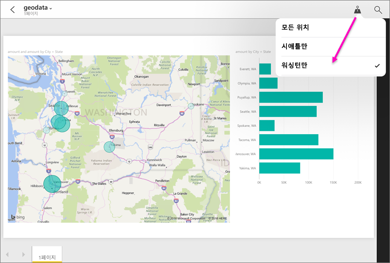

# Power BI 모바일 앱의 지리적 위치별 보고서 필터링
적용 대상:

|  |  |  |  |  |
|:--- |:--- |:--- |:--- |:--- |
| iPhone |iPad |Android 휴대폰 |Android 태블릿 |Windows 10 휴대폰 |

모바일 장치에서 Power BI 보고서를 볼 때 오른쪽 위 모서리에 작은 압정 아이콘이 보이십니까? 그렇다면, 지리적 위치에 따라 해당 보고서를 필터링할 수 있습니다.

> [!NOTE]
> 보고서의 지리적 이름이 영어인 경우(예: "New York City" 또는 "Germany") 위치에 따라 필터링할 수 있습니다. Windows 10 태블릿 및 PC는 지리적 필터링을 지원하지 않지만 Windows 10 휴대폰은 지원합니다.
> 
> 

## 지리적 위치에 따라 보고서 필터링
1. 모바일 장치의 Power BI 모바일 앱에서 보고서를 엽니다.
2. 보고서에 지리적 데이터가 있는 경우 Power BI가 사용자의 위치에 액세스할 수 있도록 허용할지 묻는 메시지가 나타납니다. **허용**을 클릭하고 **허용**을 다시 탭합니다.
3. 압정을 탭합니다. . 보고서의 데이터에 따라 시, 시/도 또는 국가/지역을 필터링할 수 있습니다. 필터는 현재 위치와 일치하는 옵션만을 나열합니다.
   
    

## 보고서에 위치 태그가 표시되지 이유는 무엇입니까?
위치 태그를 표시하려면 다음 세 가지 조건이 모두 참이어야 합니다. 

* Power BI Desktop에서 보고서를 만든 사람은 도시, 주 또는 국가/지역 등 하나 이상의 열에 대해 [지리적 데이터를 분류합니다](desktop-mobile-geofiltering.md).
* 사용자는 해당 열에 데이터가 있는 위치 중 한 곳에 있습니다.
* 사용자는 다음과 같은 모바일 장치 중 하나를 사용합니다.
  * iOS(iPad, iPhone, iPod)
  * Android 휴대폰이나 태블릿
  * Windows 10 휴대폰(PC, 태블릿 등 다른 Windows 10 장치는 지리적 필터링을 지원하지 않음)

Power BI Desktop에서 [지리적 필터링 설정](desktop-mobile-geofiltering.md)에 대해 자세히 알아봅니다.

### 다음 단계
* 모바일 앱으로 [실제 Power BI 데이터에 연결](mobile-apps-data-in-real-world-context.md)
* [Power BI Desktop의 데이터 분류](desktop-data-categorization.md) 
* 궁금한 점이 더 있나요? [Power BI 커뮤니티에 질문합니다.](http://community.powerbi.com/)

