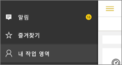

# Power BI 모바일 앱에서 알림 가져오기
적용 대상:

|  |  |  |  |  |
|:--- |:--- |:--- |:--- |:--- |
| iPhone |iPad |Android 휴대폰 |Android 태블릿 |Windows 10 장치 |

알림은 Power BI 서비스 또는 모바일 장치에서 사용자에게 바로 Power BI 환경에 관련된 정보를 제공합니다. 알림을 열면, 사용자가 [설정해 놓은 경고](mobile-set-data-alerts-in-the-mobile-apps.md)에 대한 연속적인 메시지 피드, 사용자와 공유된 새 대시보드, 그룹 작업 영역에 대한 변경 내용, Power BI 이벤트 및 회의에 대한 정보 등을 볼 수 있습니다.

> [!NOTE]
> iOS 장치에서 [Power BI 앱의 업데이트된 버전](https://powerbi.microsoft.com/mobile/)에 처음으로 로그인하면 Power BI에서 알림을 보낼 것인지 묻는 메시지가 표시됩니다. 장치에 대한 **설정**에서 Power BI가 알리는 방법을 구성할 수도 있습니다. 
> 
> 

## 모바일 장치에 대한 알림 보기
1. 모바일 장치에서 알림을 받게 되면 Power BI에서는 기본적으로 소리를 내고 알림 배너를 표시합니다.
   
   
   
   또는 iPad에서:
   
   
   
   [Power BI가 알리는 방법](mobile-apps-notification-center.md#change-or-turn-off-notifications-on-your-mobile-device)을 변경할 수 있습니다.
2. 알림을 받은 경우 모바일 장치에서 Power BI에 로그인할 때 전역 탐색 단추 (Android) 또는 **알림** 아이콘에 노란색 점이 표시됩니다. 
   
   
3. 알림 아이콘  (Windows 10)을 선택합니다.
   
    알림은 가장 최근 메시지부터 읽지 않은 메시지를 강조하여 표시됩니다. 알림은 삭제하거나 최대 제한인 100개에 도달하지 않는 한 90일 동안 유지됩니다.
   
   
4. 알림을 해제하려면 길게 눌러서 **해제**를 선택합니다.

## 모바일 장치에 대한 알림 변경 또는 해제
Power BI가 알리는 방법을 변경할 수 있습니다.

1. iOS 장치에서 **설정** > **알림**으로 이동합니다. 
   
    Android 휴대폰에서 **알림 설정**으로 이동합니다.
   
    Windows 장치의 **설정**에서 **시스템** > **알림 및 작업**으로 이동합니다.
2. 앱 목록에서 **Power BI**를 선택합니다. 
3. 여기서 알림을 완전히 해제하거나 원하는 알림을 선택할 수 있습니다.
   
    **iPhone에서**
   
    
   
    **Android 휴대폰에서**
   
    

    **Windows 10 장치에서**

    

## 다음 단계
* [Power BI 서비스의 데이터 경고](service-set-data-alerts.md)
* [iPhone 앱(iOS용 Power BI)의 데이터 경고 설정](mobile-set-data-alerts-in-the-mobile-apps.md)
* [Windows 10용 Power BI 모바일 앱의 데이터 경고 설정](mobile-set-data-alerts-in-the-mobile-apps.md)
* 모바일 장치에 대한 [최신 버전의 Power BI 앱 다운로드](https://powerbi.microsoft.com/mobile/)

