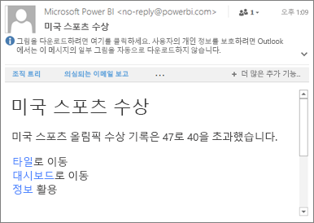

# Power BI Mobile Apps에서 데이터 경고 설정
적용 대상:

|  |  |  |  |  |
|:--- |:--- |:--- |:--- |:--- |
| iPhone |iPad |Android 휴대폰 |Android 태블릿 |Windows 10 장치 |

Power BI Mobile Apps 및 Power BI 서비스의 대시보드에서 경고를 설정할 수 있습니다. 타일의 데이터가 설정해 놓은 한도를 넘어 변경되면 알려주는 경고입니다. 경고는 카드 및 계기 같이 단일 숫자가 특징인 타일에 대해 작동하며 스트리밍 데이터에는 작동하지 않습니다. 모바일 장치에서 데이터 경고를 설정하고 Power BI 서비스에서 볼 수 있으며, 그 반대로도 가능합니다. 대시보드나 타일의 스냅숏을 공유했더라도 설정한 데이터 경고만 볼 수 있습니다.

Power BI Pro 라이선스가 있거나 무료 Power BI 라이선스가 있고 공유 대시보드가 프리미엄 용량일 경우 타일에 경고를 설정할 수 있습니다. 

> [!WARNING]
> 데이터 기반 경고 알림은 데이터에 관한 정보를 제공합니다. 장치를 분실한 경우 Power BI 서비스에 가서 모든 데이터 기반 경고 규칙을 해제하는 것이 좋습니다. 
> 
> [Power BI 서비스에서 데이터 경고 관리하기](service-set-data-alerts.md)에 대해 자세히 알아보세요.
> 
> 

## iPhone 또는 iPad의 데이터 경고
### iPhone 또는 iPad의 경고 설정
1. 대시보드에서 번호 또는 계기 타일을 탭하여 포커스 모드로 엽니다.  
   
   
2. 종 모양 아이콘 을(를) 눌러서 경고를 추가합니다.  
3. **경고 규칙 추가**를 탭합니다.
   
   
4. 값을 초과하거나 미만일 때 경고를 받도록 선택한 다음, 값을 설정합니다.
   
   
5. 경고를 매시간 또는 매일 받을지 결정하고, 경고를 받을 때 전자 메일도 수신할지 결정합니다.
   
   > [!NOTE]
   > 해당 시간에 실제로 데이터가 새로 고쳐지지 않으면 매시간 또는 매일 경고를 수신하지 않습니다.
   > 
   > 
6. 경고 제목을 변경할 수도 있습니다.
7. **저장**을 누릅니다.
8. 단일 타일에 임계값을 초과하는 값과 미달되는 값에 대한 경고를 모두 설정할 수 있습니다. **경고 관리**에서 **경고 규칙 추가**를 탭합니다.
   
   

### iPhone 또는 iPad에서 경고 관리
모바일 장치에서 개별 경고를 관리하거나 [Power BI 서비스에서 모든 경고를 관리](service-set-data-alerts.md)할 수 있습니다.

1. 대시보드에서 경고가 포함된 번호 또는 계기 타일을 탭합니다.  
   
   
2. 종 모양 아이콘 을 탭합니다.  
3. 경고 이름을 탭하여 편집하거나, 슬라이더를 탭하여 메일 경고를 해제하거나, 쓰레기통을 탭하여 경고를 삭제합니다.
   
    

## Android 장치의 데이터 경고
### Android 장치의 경고 설정
1. Power BI 대시보드에서 번호 또는 계기 타일을 탭하여 엽니다.  
2. 종 모양 아이콘 을(를) 눌러서 경고를 추가합니다.  
   
   
3. 더하기 아이콘(+)을 탭합니다.
   
   
4. 값을 초과하거나 미만일 때 경고를 받도록 선택한 다음, 값을 입력합니다.
   
   
5. **완료**를 탭합니다.
6. 경고를 매시간 또는 매일 받을지 결정하고, 경고를 받을 때 전자 메일도 수신할지 결정합니다.
   
   > [!NOTE]
   > 해당 시간에 실제로 데이터가 새로 고쳐지지 않으면 매시간 또는 매일 경고를 수신하지 않습니다.
   > 
   > 
7. 경고 제목을 변경할 수도 있습니다.
8. **저장**을 누릅니다.

### Android 장치의 경고 관리
Power BI 모바일 앱에서 개별 경고를 관리하거나 [Power BI 서비스에서 모든 경고를 관리](service-set-data-alerts.md)할 수 있습니다.

1. 대시보드에서 경고가 포함된 카드 또는 계기 타일을 탭합니다.  
2. 단색 벨 아이콘 을 탭합니다.  
3. 경고를 탭하여 값을 변경하거나, 해제합니다.
   
    
4. 같은 타일에 또 다른 경고를 추가하려면 더하기 아이콘(+)을 탭합니다.
5. 경고를 모두 삭제하려면 쓰레기통 아이콘 을 탭합니다.

## Windows 장치의 데이터 경고
### Windows 장치의 데이터 경고 설정
1. 대시보드에서 번호 또는 계기 타일을 탭하여 엽니다.  
2. 종 모양 아이콘 을(를) 눌러서 경고를 추가합니다.  
   
   
3. 더하기 아이콘(+)을 탭합니다.
   
   
4. 값을 초과하거나 미만일 때 경고를 받도록 선택한 다음, 값을 입력합니다.
   
   
5. 경고를 매시간 또는 매일 받을지 결정하고, 경고를 받을 때 전자 메일도 수신할지 결정합니다.
   
   > [!NOTE]
   > 해당 시간에 실제로 데이터가 새로 고쳐지지 않으면 매시간 또는 매일 경고를 수신하지 않습니다.
   > 
   > 
6. 경고 제목을 변경할 수도 있습니다.
7. 확인 표시를 탭합니다.
8. 단일 타일에 임계값을 초과하는 값과 미달되는 값에 대한 경고를 모두 설정할 수 있습니다. **경고 관리**에서 더하기 아이콘(+)을 탭합니다.
   
   

### Windows 장치의 경고 관리
Power BI 모바일 앱에서 개별 경고를 관리하거나 [Power BI 서비스에서 모든 경고를 관리](service-set-data-alerts.md)할 수 있습니다.

1. 대시보드에서 경고가 포함된 카드 또는 계기 타일을 탭합니다.  
2. 종 모양 아이콘 을 탭합니다.  
   
   
3. 경고를 탭하여 값을 변경하거나, 해제합니다.
   
    
4. 경고를 모두 함께 삭제하려면, 마우스 오른쪽 단추를 클릭하거나 탭하고 누른 채로 > **삭제**합니다.

## 경고 수신
다른 사람이 공유해 준 새 대시보드에 대한 알림과 함께 모바일 장치의 Power BI [알림 센터](mobile-apps-notification-center.md) 또는 Power BI 서비스에서 경고를 수신합니다.

데이터 소스는 매일 새로 고치도록 설정하는 경우가 많으며, 이 보다 빈번하게 설정하기도 합니다. 대시보드의 데이터가 새로 고쳐질 때, 추적되는 데이터가 설정해 놓은 임계값 중 하나에 도달하면, 몇 가지 현상이 발생합니다.

1. Power BI에서 마지막 경고가 전송된 후 1시간 이상이 경과했는지 또는 24시간 이상이 경과했는지(선택한 옵션에 따라) 확인됩니다.
   
   데이터가 임계값을 넘어서는 동안은, 매시간 또는 24시간마다 경고를 수신하게 됩니다.
2. 전자 메일을 보내도록 경고를 설정해 놓으면, 다음과 같은 내용을 받은 편지함에서 찾을 수 있습니다.
   
   
3. Power BI에서 메시지를 **알림 센터**에 추가하고 새로운 경고 아이콘 을 해당 타일에 추가합니다.
4. 전역 탐색 단추 를 탭하여 [**알림 센터**를 열고](mobile-apps-notification-center.md) 경고 세부 정보를 확인합니다.
   
      

> [!NOTE]
> 경고는 새로 고쳐지는 데이터에만 적용됩니다. 데이터가 새로 고쳐지면, Power BI에서 해당 데이터에 대해 경고가 설정되어 있는지 확인됩니다. 데이터가 경고 임계값에 도달하면, 경고가 트리거됩니다.
> 
> 

## 팁 및 문제 해결
* 현재 Bing 타일 또는 카드 타일에 대해서는 날짜/시간 측정값에 대한 경고가 지원되지 않습니다.
* 경고는 숫자 데이터에만 적용됩니다.
* 경고는 새로 고쳐지는 데이터에만 적용됩니다. 정적 데이터에 대해서는 적용되지 않습니다.
* 경고는 스트리밍 데이터가 포함된 타일에는 작동하지 않습니다.

## 다음 단계
* [Power BI 서비스에서 경고 관리](service-set-data-alerts.md)
* [Power BI 모바일 알림 센터](mobile-apps-notification-center.md)
* 궁금한 점이 더 있나요? [Power BI 커뮤니티에 질문합니다.](http://community.powerbi.com/)

