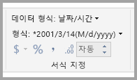
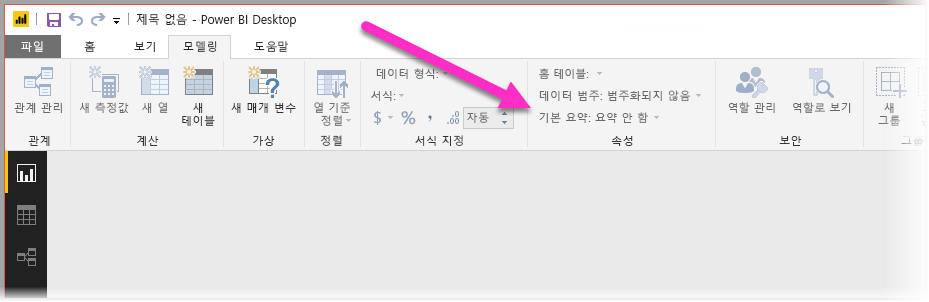
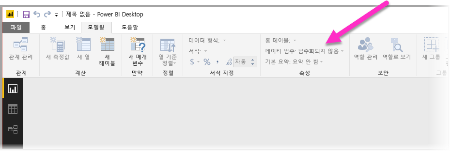

# Power BI에서 질문 및 답변을 최적화하는 모범 사례
일반적인 구 및 자연어를 사용하여 데이터에 대해 질문하는 것은 강력한 기능입니다. 데이터가 응답할 때 더욱 강력해지며, Power BI의 질문 및 답변은 바로 이 기능을 수행합니다.

Q&A가 대응이 가능한 수많은 질문을 성공적으로 해석하도록 하려면 Q&A에서 모델에 대한 가정을 만들어야 합니다. 사용자 모델의 구조가 이러한 가정을 하나 이상 충족하지 못하는 경우 모델을 조정해야 합니다. Q&A에 대한 이러한 조정은 질문과 대답의 사용 여부와 상관 없이 Power BI에서 모든 모델에 대해 동일한 최상의 최적화입니다.

다음 섹션에서는 Power BI의 Q&A가 잘 작동하도록 모델을 조정하는 방법에 대해 설명합니다.

## 질문 및 답변에서 수행하는 자동 조정

### 측정값 테이블

이전 버전의 질문 및 답변에서는 기본 테이블의 연결이 끊겼을 때 측정값 테이블로 인해 질문 및 답변에 오류가 발생했습니다. 이제 질문 및 답변이 측정값 테이블을 사용하여 제대로 작동합니다.

### 테이블 이름과 열 이름 충돌

이전 버전의 질문 및 답변에서는 테이블과 열의 이름이 같을 경우 테이블이 우선 적용되었습니다. 이 문제는 해결되었으므로 더 이상 모델에서 이 문제를 수정하지 않아도 됩니다.

## 질문 및 답변을 개선하기 위한 수동 단계

### 새로운 질문 및 답변 도구를 사용하여 질문 수정

질문 및 답변 도구를 사용하여 질문 및 답변에 핵심 비즈니스 용어를 학습하고 최종 사용자의 질문을 수정할 수 있습니다. 데이터 모양이 잘못되었거나 데이터가 누락되어 일부 질문을 수정할 수 없는 경우도 있습니다. 이 경우에는 아래의 다른 섹션을 참조하여 최적화하세요. [질문 및 답변 도구](q-and-a-tooling-intro.md)에 대해 자세히 알아봅니다.

## 누락된 관계 추가

모델에서 테이블 간 관계가 누락된 경우에는 Power BI 보고서와 질문 및 답변 모두 해당 테이블을 조인하는 방법을 해석할 수 없습니다. 관계는 적합한 모델의 기초입니다. 예를 들어 *orders* 테이블 및 *customers* 테이블 간 관계가 누락된 경우 “시애틀 고객의 총 매출”을 요청할 수 없습니다. 다음 이미지는 질문 및 답변을 위한 작업이 필요한 모델과 준비가 완료된 모델을 보여 줍니다. 

**작업 필요**

첫 번째 이미지에서 Customers, Sales 및 Products 테이블 간에 아무 관계도 없습니다.

**Q&A에 대해 준비됨**

첫 번째 이미지에서 테이블 간에 관계가 정의되었습니다.

## 테이블 및 열의 이름 변경

질문 및 답변에서는 테이블 및 열의 선택이 중요합니다. 예를 들어 고객 목록을 포함하는 *CustomerSummary*라는 테이블이 있다고 가정합니다. “시카고의 고객 나열” 대신에 “시카고의 고객 요약을 나열”과 같은 질문을 해야 합니다. 

질문 및 답변은 몇 가지 기본 단어 분리 및 복수형 검색을 수행할 수 있지만, 테이블 및 열 이름이 콘텐츠를 정확하게 반영한다고 가정합니다.

또 다른 예를 고려합니다. 이름 및 성과 직원 번호가 포함된 *Headcount*라는 테이블이 있다고 가정합니다. 직원 번호, 작업 번호 및 시작 날짜가 포함된 *Employees*라는 다른 테이블이 있습니다. 모델에 익숙한 사용자는 이 구조를 이해할 수 있습니다. “직원 수”를 묻는 다른 사용자가 “Employees” 테이블에서 행 수를 가져오려고 합니다. 이 결과는 각 직원이 담당했던 모든 작업 수이므로 사용자가 생각한 것과 다를 수 있습니다. 포함된 내용을 실제로 반영하도록 해당 테이블의 이름을 변경하는 것이 더 좋을 것입니다.

**작업 필요**

*StoreInfo* 및 *Product List*와 같은 테이블 이름은 작업이 필요합니다.

**Q&A에 대해 준비됨**

*Store* 및 *Products*와 같은 테이블 이름이 더 효과적입니다.

## 잘못된 데이터 형식 수정

가져온 데이터에 잘못된 데이터 형식이 있을 수 있습니다. 특히 ‘문자열’로 가져온 ‘날짜’ 및 ‘번호’ 열은 질문 및 답변에서 날짜 및 숫자로 해석되지 않습니다.    Power BI 모델에서는 올바른 데이터 형식을 선택해야 합니다.

## 연도 및 식별자 열을 요약 안 함으로 표시

Power BI는 적극적으로 기본적으로 숫자 열을 집계하기 때문에 “연도별 총 매출”과 같은 질문은 매출의 총계가 연도의 총계와 함께 결과로 표시되곤 합니다. 특정 열에서 Power BI가 이 동작을 나타내지 않도록 하려면, 열의 **기본 요약** 속성을 **요약 안 함**으로 설정합니다. **연도**, **월**, **일** 및 **ID** 열은 가장 흔한 문제이므로 주의해야 합니다. 요약하기에 적절하지 않은 ‘나이’ 등의 열도 **기본 요약**을 **요약 안 함** 또는 **평균**으로 설정하는 것이 좋습니다.  이 설정을 **모델링** 탭에서 찾을 수 있습니다.

## 각 날짜 및 지리 열에 대한 데이터 범주 선택

**데이터 범주**는 데이터 형식 이외의 열 콘텐츠에 대한 추가 의미 체계 정보를 제공합니다. 예를 들어 우편 번호 등의 정수 열과 도시, 국가/지역 등의 문자열 열을 표시할 수 있습니다. 질문 및 답변은 다음과 같은 두 가지 중요한 방법으로 이 정보를 사용합니다. 시각화 선택 및 언어 기준.

먼저, Q&A는 **데이터 범주** 정보를 사용하여 어떤 종류의 시각적 표시를 사용할지 선택하는 데 도움을 줍니다. 예를 들어 날짜 또는 시간 **데이터 범주**가 있는 열은 일반적으로 꺾은선형 차트의 가로 축 또는 거품형 차트의 재생 축에 적합한 것으로 인식합니다. 또한 지리적 **데이터 범주**가 있는 열을 포함한 결과는 지도에서 잘 표시되는 것으로 가정합니다.

둘째, Q&A는 특정 종류의 질문을 이해하는 데 도움이 되도록 사용자가 날짜 및 지리적 열에 대해 설명하는 방법에 대한 몇 가지 학습에 의한 추측을 만듭니다. 예를 들어 “John Smith가 고용된 시기”의 “시기”는 거의 확실히 날짜 열에 매핑되며, “Brown의 고객 카운트”의 “Brown”은 머리 색이 아닌 도시가 될 가능성이 더 높습니다.

## 관련 열에 대한 열 기준 정렬 선택

**열 기준 정렬** 속성을 사용하면 한 열에서의 정렬이 자동으로 다른 열을 대신 정렬할 수 있습니다. 예를 들어 “셔츠 사이즈를 기준으로 고객 정렬”이라고 질문하는 경우 아마도 셔츠 사이즈 열을 알파벳 순(L, M, S, XL, XS)이 아닌 기본 사이즈 번호(XS, S, M, L, XL) 순으로 정렬하려는 것입니다.

## 모델 표준화

전체 모델의 셰이프를 변경해야 함을 제안하지는 않을 것입니다. 그러나 특정 구조는 너무 어려워서 질문 및 답변에서 잘 처리하지 못합니다. 모델의 구조에 대한 몇 가지 기본 표준화를 수행하면 질문 및 답변 결과의 정확도와 함께 Power BI 보고서의 유용성도 크게 향상됩니다.

다음 일반 규칙을 따르세요. 사용자가 말하는 각 고유한 “항목”이 정확히 하나의 모델 개체(테이블 또는 열)로 나타나야 합니다. 따라서 사용자가 고객에 대해 말한다면 하나의 *고객* 개체가 있어야 합니다. 또한 사용자가 판매에 대해 말한다면 하나의 *판매* 개체가 있어야 합니다. 단순한 이야기이지 않나요? 사용자가 시작하는 데이터의 모양에 따라 다를 수 있습니다. 필요한 경우 **쿼리 편집기**에서 사용할 수 있는 다양한 데이터 셰이핑 기능이 있는 반면, 간단히 Power BI 모델에서 계산을 사용하면 더 쉬운 변환이 많이 발생할 수 있습니다.

다음 섹션에서는 사용자가 수행해야 할 수도 있는 몇 가지 일반적인 변환이 포함되어 있습니다.

### 다중 열 엔터티에 대한 새 테이블 만들기

더 큰 테이블 내에서 단일 고유 단위의 역할을 하는 열이 여러 개 있는 경우 해당 열을 각 테이블로 분할해야 합니다. 예를 들어 *Companies* 테이블 내 연락처 이름, 연락처 제목 및 연락처 전화 번호 열이 있다고 가정합니다. 더 나은 디자인은 이름, 제목 및 휴대폰이 포함된 별개의 *Contacts* 테이블과 *Companies* 테이블로 돌아가는 링크가 있는 것입니다. 그러면 연락처가 있는 회사 관련 질문 중 연락처에 관한 개별적인 질문을 더 손쉽게 할 수 있으며 유연성을 향상시킵니다.

**작업 필요**

**Q&A에 대해 준비됨**

### 속성 모음을 제거하는 피벗

모델에 ‘속성 모음’이 있는 경우, 속성당 하나의 열이 있도록 재구성해야 합니다.  속성 모음은 다양한 속성을 관리하기에 편리한 반면, Power BI 보고서와 Q&A에서 해결하도록 디자인되어 있지 않은 많은 내제된 제한 사항의 영향을 받습니다.

예를 들어 고객 ID, 속성, 값 열이 있는 *CustomerDemographics* 테이블을 가정해 보세요. 각 행에는 고객의 다른 속성(예: 나이, 혼인 여부, 도시 등)이 표시되어 있습니다. 속성 열의 콘텐츠에 따라 값 열의 의미를 오버로드하면 질문 및 답변이 이를 참조하는 대부분의 쿼리를 해석하지 못하게 됩니다. “각 고객의 나이를 표시”와 같은 간단한 질문은 “속성이 나이인 고객 및 고객 인구 통계를 표시”로 해석될 수 있으므로 작동할 수도 있습니다. 단, 모델 구조는 그저 “시카고에 있는 고객의 평균 나이”처럼 약간 더 복잡한 질문을 지원하지 않을 뿐입니다. 직접 Power BI 보고서를 작성하는 사용자는 종종 찾고 있는 데이터를 가져오는 명확한 방법을 찾을 수 있는 반면, Q&A는 각 열에 단일 의미만 있는 경우에만 작동합니다.

**작업 필요**

**Q&A에 대해 준비됨**

### 병합하여 분할 제거

데이터를 여러 테이블로 분할하거나 값을 여러 열로 피벗한 경우, 여러 일반적인 작업은 사용자가 수행하기 어렵거나 불가능하게 됩니다. *Sales2000-2010* 테이블 및 *Sales2011-2020* 테이블과 같은 일반적인 테이블 분할을 먼저 고려합니다. 중요한 보고서가 모두 특정 10년으로 제한된 경우 아마도 Power BI 보고서에 대해 이러한 방식으로 유지할 수 있습니다. 그러나 질문 및 답변의 유연성을 통해 사용자는 “연도별 총 매출”과 같은 질문에 대한 답을 기대할 수 있습니다. 이 쿼리가 수행되려면 데이터를 단일 Power BI 모델 테이블로 병합해야 합니다.

마찬가지로, 작성자, 책, 도시 1, 도시 2 및 도시 3 열이 포함된 *BookTour* 테이블과 같은 일반적인 피벗된 값 열을 고려합니다. 이와 같은 구조를 사용하면 “도시별 책 카운트”와 같이 간단한 질문도 올바르게 해석될 수 없습니다. 이 쿼리가 수행되려면 도시 값을 단일 열로 병합하는 별도의 *BookTourCities* 테이블을 만듭니다.

**작업 필요**

**Q&A에 대해 준비됨**

### 서식이 지정된 열 분할

데이터를 가져오는 원본에 서식이 지정된 열이 포함된 경우, Power BI 보고서(질문 및 답변)는 열 내부에 연결하여 해당 콘텐츠를 구문 분석하지 못합니다. 따라서 예를 들어 주소, 도시 및 국가가 포함된 **전체 주소** 열이 있는 경우 사용자가 개별적으로 쿼리할 수 있도록 주소, 도시 및 국가 열로 분할해야 합니다.

**작업 필요**

**Q&A에 대해 준비됨**

마찬가지로 사람의 전체 이름 열이 있다면, 부분 이름을 사용하여 질문하려는 경우를 위해 **이름** 및 **성** 열을 추가합니다. 

### 다중값 열에 대한 새 테이블 만들기

데이터를 가져오는 원본에 다중값 열이 포함된 비슷한 상황에서도 Power BI 보고서(질문 및 답변)는 열 내부에 연결하여 해당 콘텐츠를 구문 분석할 수 없습니다. 따라서 예를 들어 한 노래에 여러 작곡가의 이름이 포함된 작곡가 열이 있는 경우 개별 *작곡가* 테이블의 여러 행으로 분할해야 합니다.

**작업 필요**

**Q&A에 대해 준비됨**

### 비정규화로 비활성 관계 제거

한 테이블에서 다른 테이블로 가는 경로가 하나 이상인 경우에는 “정규화가 더 나은” 규칙에 대한 한 가지 예외가 발생합니다. 예를 들어 각각 *Cities* 테이블과 관련이 있는 SourceCityID 및 DestinationCityID 열이 포함된 *Flights* 테이블이 있다고 가정합니다. 해당 관계 중 하나는 비활성으로 표시해야 합니다. 질문 및 답변은 활성 관계만 사용할 수 있으므로 사용자 선택에 따라 출발지 또는 도착지 중 어느 하나에 관해서는 질문할 수가 없습니다. 대신에 도시 이름 열을 *Flights* 테이블로 비정규화하면 “출발지가 시애틀이고 도착지가 샌프란시스코인 내일 항공편을 나열”과 같은 질문을 할 수 있게 됩니다.

**작업 필요**

**Q&A에 대해 준비됨**

### 테이블 및 열에 동의어 추가

이 단계는 Q&A에 특별히 적용됩니다(일반적으로 Power BI 보고서에는 해당되지 않음). 사용자에게는 종종 총 매출액, 순매출액, 총 순매출액과 같이 동일한 항목을 참조하는 데 사용하는 다양한 용어가 있습니다. Power BI 모델의 테이블과 열에 이러한 동의어를 추가할 수 있습니다. 

이 단계는 중요할 수 있습니다. 간단한 테이블 및 열 이름을 사용하는 경우라도 질문 및 답변 사용자는 먼저 떠오르는 어휘를 사용하여 질문하고 미리 정의된 열 목록에서 선택하지 않습니다. 더 타당한 동의어를 추가할수록 보고서를 이용하는 사용자의 경험이 향상됩니다. 동의어를 추가하려면 Power BI Desktop에서 모델 뷰로 이동하고 모델링 탭을 선택한 다음, 필드 또는 테이블을 선택합니다. 속성 창에 동의어를 추가할 수 있는 **동의어** 상자가 표시됩니다.

 동의어를 추가할 때는 주의해야 합니다. 동일한 동의어를 둘 이상의 열이나 테이블에 추가하면 모호성이 발생합니다. 질문 및 답변은 가능한 경우 컨텍스트를 사용하여 모호한 동의어 중에서 선택하지만 모든 질문에 충분한 컨텍스트가 있는 것은 아닙니다. 예를 들어 사용자가 “고객 수”라고 질문하는 경우, 모델에 “고객” 동의어가 포함된 항목이 3개이면 고객이 찾고 있는 답변을 얻지 못할 수도 있습니다. 이러한 경우 재작성 시 사용되는 기본 동의어를 고유하게 만들어야 합니다. 사용자에게 모호성에 대한 경고(예: “저장된 고객 레코드의 수를 표시”의 재작성)가 표시될 수 있습니다. 이러한 힌트는 다르게 질문하라는 의미일 수 있습니다.
