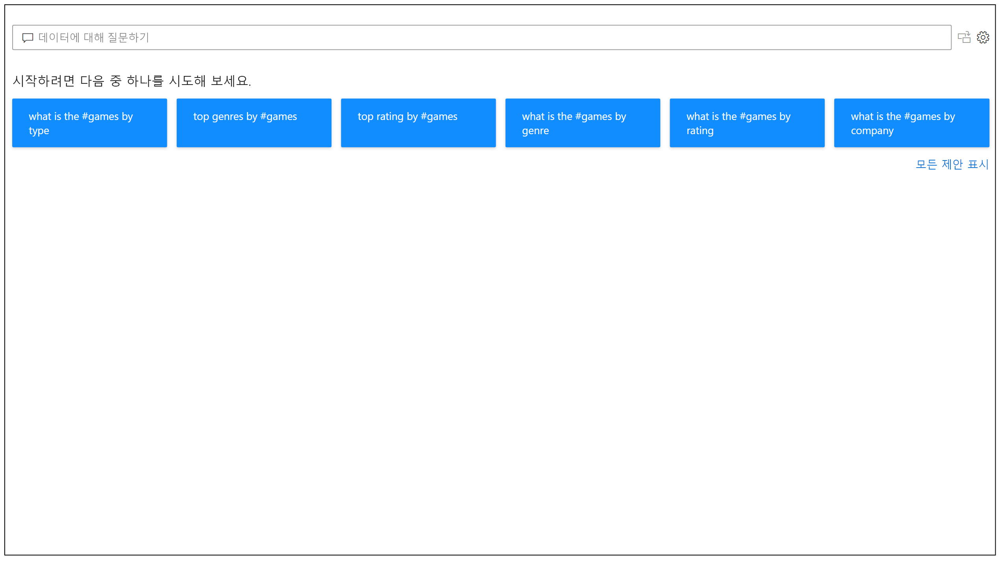
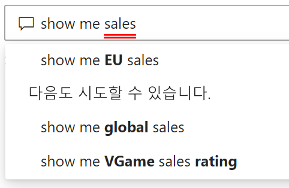
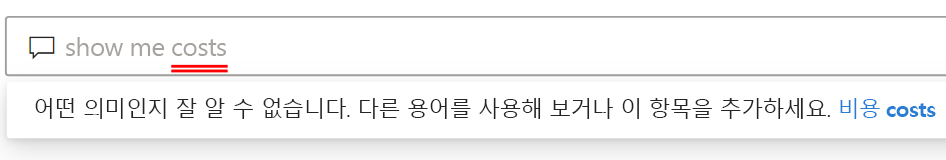
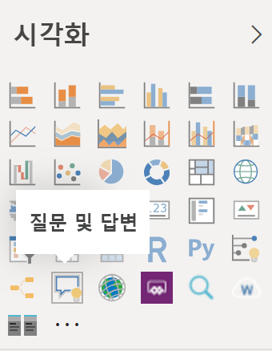
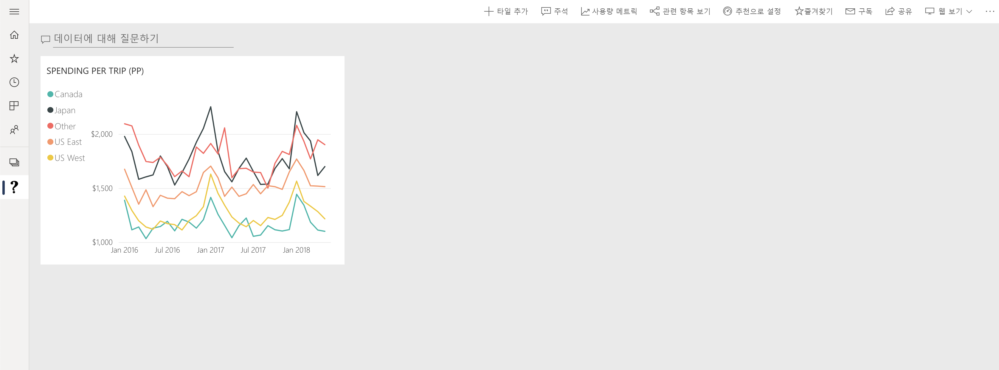

# Power BI 질문 및 답변 소개

자연어를 사용해서 데이터를 검색하는 것이 데이터에서 답변을 얻는 가장 빠른 방법인 경우도 있습니다. Power BI 질문 및 답변 기능을 사용하면 자연어를 통해 평소 사용하는 표현으로 데이터를 탐색할 수 있습니다. 질문 및 답변은 대화형이며 재미도 있습니다. 시각화가 관심 있는 경로를 표시하기 때문에 한 가지 질문이 다른 질문으로 이어지는 경우가 많습니다. 질문은 시작일 뿐입니다. 질문을 구체화 또는 확장하거나, 새로운 정보를 발견하거나, 세부 정보에 집중하거나, 한발 물러서서 폭넓게 파악하는 등 데이터를 다양하게 살펴봅니다. 메모리 내 스토리지에서 지원하는 빠른 대화형 환경이 제공됩니다. 

Power BI 질문 및 답변은 무료이며 모든 사용자가 사용할 수 있습니다. Power BI Desktop에서 보고서 디자이너는 질문 및 답변을 사용하여 데이터를 탐색하고 시각화를 만들 수 있습니다. Power BI 서비스에서 모든 사용자가 질문 및 답변을 사용하여 데이터를 탐색할 수 있습니다. 대시보드 또는 보고서를 편집할 수 있는 권한이 있는 경우, 질문 및 답변 결과를 고정할 수도 있습니다.

## 질문 및 답변 사용 방법

입력을 시작하기 전에 질문 및 답변이 제안과 함께 새 화면을 표시하여 질문 형성을 돕습니다. 제안된 질문 중 하나에서 시작하거나 고유한 질문을 입력합니다. 질문 및 답변은 다음을 포함하되 이에 제한되지 않고 다양한 질문을 지원합니다.

- **자연어로 질문하기** - 수익이 가장 높은 판매는 무엇인가요?
- **상대 날짜 필터링 사용** - 작년 매출 표시
- **상위 N개만 반환** - 매출별 상위 10개 제품
- **필터 제공** - 미국 내 매출 표시
- **복잡한 조건 제공** - 제품 범주가 범주 1 또는 범주 2인 매출 표시
- **특정 시각적 개체 반환** - 제품별 매출 원형 차트 표시
- **복합 집계 사용** - 제품별 중앙값 표시
- **결과 정렬** - 국가 코드 순으로 정렬하여 매출별 상위 10개 국가 표시
- **데이터 비교** - 총 매출 및 총 비용별 날짜 표시
- **추세 보기** - 시간별 매출 표시

### 자동 완성

질문을 입력할 때, Power BI 질문 및 답변에서는 자연어로 빠르고 간편하게 입력할 수 있도록 상황에 맞는 적절한 제안을 표시합니다. 입력하면서 즉각적인 피드백과 결과를 얻을 수 있습니다. 이 환경은 검색 엔진에 입력하는 것과 유사합니다.

### 빨간색/파란색 밑줄

질문 및 답변은 시스템이 인식할 수 있는 단어와 인식할 수 없는 단어를 알아보기 쉽도록 단어에 밑줄을 표시합니다. 파란색 실선 밑줄은 시스템이 데이터 모델의 필드 또는 값에 단어를 성공적으로 일치시켰음을 나타냅니다. 아래 예제에서는 질문 및 답변이 *EU Sales* 단어를 인식했음을 보여 줍니다.

질문 및 답변에 단어를 입력할 때 빨간색 밑줄이 표시되는 경우가 많습니다. 빨간색 밑줄은 두 가지 잠재적 문제 중 하나를 나타낼 수 있습니다. 첫 번째 문제 유형은 *‘낮은 신뢰도’* 로 분류된 것입니다. 모호한 단어를 입력하면 필드에 빨간색 밑줄이 표시됩니다. ‘Sales’ 단어를 예로 들 수 있습니다. 여러 필드에 ‘Sales’ 단어가 포함될 수 있으므로, 시스템에서 빨간색 밑줄을 사용하여 해당 필드를 선택하라는 메시지를 표시합니다. 낮은 신뢰도의 또 다른 예로 ‘area’ 단어를 입력했는데 일치하는 열이 ‘region’인 경우가 있습니다. Power BI 질문 및 답변은 Bing 및 Office와 통합되어 동일한 의미를 갖는 단어를 인식합니다. 질문 및 답변은 단어에 빨간색 밑줄을 표시하여 직접 일치하지 않음을 알립니다.

두 번째 문제 유형은 질문 및 답변에서 단어를 전혀 인식할 수 없는 경우입니다. 데이터에서 언급되지 않은 도메인 특정 용어를 사용하거나 데이터 필드의 이름이 잘못 지정된 경우에 이 문제가 발생할 수 있습니다. 데이터에 없는 ‘Costs’ 단어를 사용하는 경우를 예로 들 수 있습니다. 영어 사전에 단어가 있지만, 질문 및 답변에서는 이 용어에 빨간색 밑줄을 표시합니다.

> [!NOTE]
> 질문 및 답변 **시각적 개체 서식** 창에서 파랑/빨강 밑줄 색을 사용자 지정할 수 있습니다. 또한 [질문 및 답변 도구](q-and-a-tooling-teach-q-and-a.md) 문서에서는 질문 및 답변이 인식할 수 없는 용어를 정의하는 데 사용하는 ‘Q&A 교육’을 설명합니다. 

### 시각화 결과

질문을 입력하면 질문 및 답변에서 즉시 해석하고 답변을 시각화하려고 합니다. 최신 업데이트의 일부로, 이제 질문 및 답변에서 질문을 해석하고 올바른 축에 필드를 자동으로 그리려고 합니다. 예를 들어 ‘Sales by year’를 입력하는 경우, 질문 및 답변은 연도가 날짜 필드인 것을 검색하고 이 필드를 항상 X축에 배치하여 우선 순위를 둡니다. 시각화 유형을 변경하려면 질문 뒤에 ‘as *chart type*’을 입력합니다. 질문 및 답변은 현재 다음과 같은 시각화 유형을 지원합니다.

- 꺾은선형 차트
- 가로 막대형 차트
- Matrix
- 테이블
- 카드
- 영역
- 원형 차트
- 분산형/거품형 차트
 

## 보고서에 질문 및 답변을 추가합니다.

Power BI Desktop 또는 Power BI 서비스에서 다음 두 가지 방법으로 보고서에 질문 및 답변을 추가할 수 있습니다.

- 질문 및 답변 시각적 개체를 추가합니다.
- 질문 및 답변 단추를 추가합니다.

질문 및 답변 시각적 개체를 보고서에 추가하려면 새 **질문 및 답변** 아이콘을 선택하여 시각화 창에서 새 질문 및 답변 시각적 개체를 선택합니다. 또는 보고서 캔버스의 아무 곳이나 두 번 클릭하여 질문 및 답변 시각적 개체를 삽입합니다.

단추를 추가하려면 **홈** 리본에서 **단추** > **질문 및 답변**을 선택합니다. 질문 및 답변 단추 이미지를 완전히 사용자 지정할 수 있습니다.

> [!NOTE]
> 단추에서 질문 및 답변을 시작하면 여전히 이전 질문 및 답변이 사용됩니다. 후속 Power BI 릴리스에서 변경될 예정입니다.

## 대시보드에 질문 및 답변 사용

기본적으로 질문 및 답변은 대시보드의 맨 위에 제공됩니다. 질문 및 답변을 사용하려면 **데이터에 대해 질문하기** 상자에 입력합니다.

## 다음 단계

보고서에 자연어를 통합하는 방법에는 여러 가지가 있습니다. 자세한 내용은 다음 문서를 참조하세요.

* [질문 및 답변 시각적 개체](../visuals/power-bi-visualization-q-and-a.md)
* [질문 및 답변 모범 사례](q-and-a-best-practices.md)
