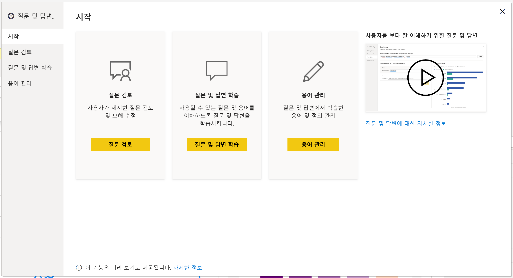
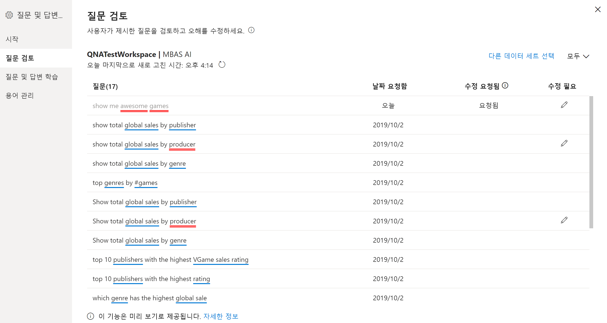
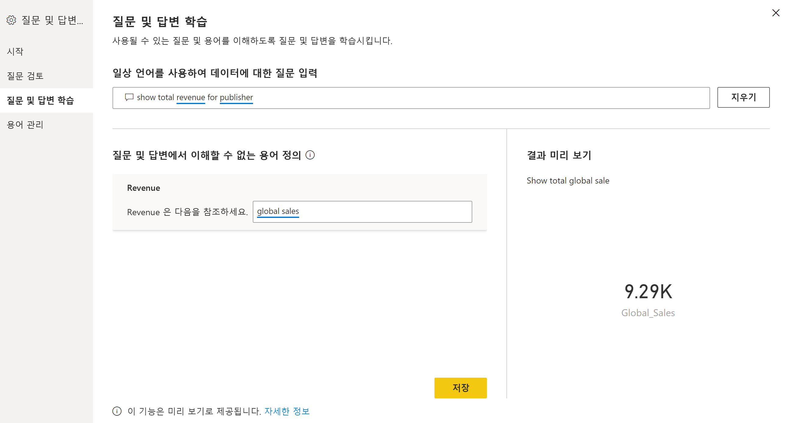
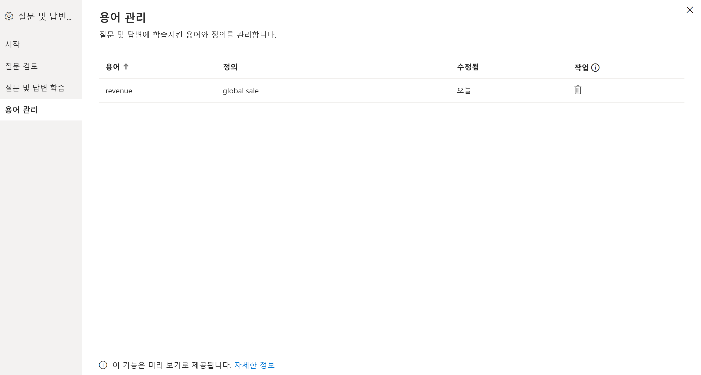
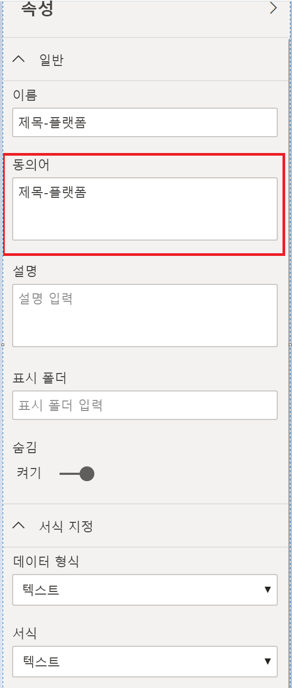

# Power BI Q&A 교육을 위한 질문 및 답변 도구 소개(미리 보기)

Power BI 질문 및 답변 ‘도구’를 사용하면 사용자의 자연어 환경을 개선할 수 있습니다.  디자이너나 관리자는 자연어 엔진을 조작하고 다음 세 가지 영역에서 기능을 개선할 수 있습니다. 

- 사용자의 질문 검토
- 질문을 이해하도록 Q&A 교육
- Q&A 교육에 사용된 용어 관리

이러한 전용 도구 기능 외에도 Power BI Desktop의 **모델링** 탭에는 더 많은 옵션이 제공됩니다.  

- 동의어
- 행 레이블
- 질문 및 답변에서 숨기기
- 언어 스키마 구성(고급)

## 질문 및 답변 도구 시작

질문 및 답변 도구는 Power BI Desktop에서만 사용할 수 있으며, 현재 가져오기 모드만 지원합니다.

1. Power BI Desktop을 열고 질문 및 답변을 사용하여 시각적 개체를 만듭니다. 
2. 시각적 개체의 모서리에서 기어 아이콘을 선택합니다. 

    

    시작 페이지가 열립니다.  

    

### 질문 검토

**질문 검토**를 선택하여 Power BI 서비스에서 테넌트에 사용 중인 데이터 세트 목록을 확인합니다. **질문 검토** 페이지에는 데이터 세트 소유자, 작업 영역 및 마지막으로 새로 고친 날짜도 표시됩니다. 여기서 데이터 세트를 선택하고 사용자의 질문을 확인할 수 있습니다. 데이터는 인식되지 않은 단어도 표시합니다. 여기에 표시된 모든 데이터는 지난 28일간의 데이터입니다.

### 질문 및 답변 학습

**Q&A 교육** 섹션에서는 단어를 인식하도록 질문 및 답변을 교육할 수 있습니다. 먼저 질문 및 답변에서 인식할 수 없는 단어가 포함된 질문을 입력합니다. 질문 및 답변에서 해당 용어의 정의를 묻는 메시지가 표시됩니다. 단어가 나타내는 항목에 해당하는 필터 또는 필드 이름을 입력합니다. 그러면 질문 및 답변에서 원래 질문을 다시 해석합니다. 결과가 만족스러우면 입력을 저장할 수 있습니다. 자세한 내용은 [Q&A 교육](q-and-a-tooling-teach-q-and-a.md)을 참조하세요.

### 용어 관리

Q&A 교육 섹션에서 저장한 모든 항목이 여기에 표시되므로 정의한 용어를 검토하거나 삭제할 수 있습니다. 현재 기존 정의를 편집할 수 없으므로 용어를 다시 정의하려면 해당 용어를 삭제하고 다시 만들어야 합니다.

## 기타 질문 및 답변 설정

### 대량 동의어

Power BI Desktop **모델링** 탭에는 질문 및 답변 환경을 개선하기 더 많은 옵션이 있습니다. 

1. Power BI Desktop에서 모델링 보기를 선택합니다.

2. 필드 또는 테이블을 선택하여 **속성** 창을 표시합니다.  이 창은 캔버스 오른쪽에 표시되고 여러 질문 및 답변 작업을 나열합니다. 한 가지 옵션은 **동의어**입니다. **동의어** 상자에서 선택한 테이블이나 필드에 대한 대안을 신속하게 정의할 수 있습니다. 도구 대화 상자의 **Q&A 교육** 섹션에서 동의어를 정의할 수도 있지만, 대체로 여기서 테이블의 많은 필드에 대해 동의어를 정의하는 것이 더 빠릅니다.

    

3. 단일 필드에 대해 여러 동의어를 정의하려면 쉼표를 사용하여 다음 동의어를 지정합니다.

### 질문 및 답변에서 숨기기

질문 및 답변 결과에 표시되지 않도록 필드와 테이블을 숨길 수도 있습니다. 

1. Power BI Desktop에서 모델링 보기를 선택합니다.

2. 필드 또는 테이블을 선택하여 **속성** 창을 표시하고 **숨김**을 **켜기**로 전환합니다.

    질문 및 답변은 해당 설정을 반영하고, 질문 및 답변에서 필드를 인식하지 않도록 합니다. 예를 들어 ID 필드와 외래 키를 숨겨 동일한 이름을 가진 불필요한 중복 필드를 방지할 수 있습니다. 필드를 숨기더라도 질문 및 답변 외부에 있는 Power BI Desktop의 시각적 개체에서는 계속 사용할 수 있습니다.

### 행 레이블 설정

행 레이블을 사용하면 테이블에서 단일 행을 가장 잘 나타내는 열(또는 ‘필드’)을 정의할 수 있습니다.  예를 들어 ‘Customer’라는 테이블의 경우 행 레이블은 일반적으로 ‘표시 이름’입니다. 이 추가 메타데이터를 제공하면 사용자가 ‘고객별 매출 표시’를 입력할 때 질문 및 답변에서 보다 유용한 시각적 개체를 그릴 수 있습니다. ‘Customer’를 테이블로 처리하는 대신, ‘표시 이름’을 사용하고 각 고객의 매출을 표시하는 가로 막대형 차트를 표시할 수 있습니다. 행 레이블 모델링 보기만 설정할 수 있습니다. 

1. Power BI Desktop에서 모델링 보기를 선택합니다.

2. 테이블을 선택하여 **속성** 창을 표시합니다.

3. **행 레이블** 상자에서 필드를 선택합니다.

## 언어 스키마 구성(고급)

Power BI의 질문 및 답변 내에서 기본 자연어 결과의 점수 및 가중치 변경을 포함하여 자연어 엔진을 완전히 교육하고 개선할 수 있습니다. 방법을 알아보려면 [질문 및 답변 언어 스키마 편집 및 관용구 추가](q-and-a-tooling-advanced.md)를 참조하세요.

## 다음 단계

자연어 엔진을 개선하기 위한 여러 가지 모범 사례가 있습니다. 자세한 내용은 다음 아티클을 참조하세요.

* [질문 및 답변 모범 사례](q-and-a-best-practices.md)
