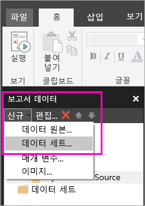
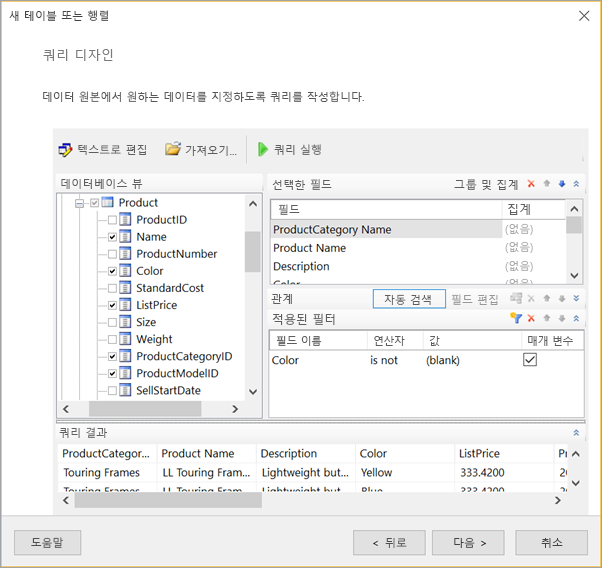
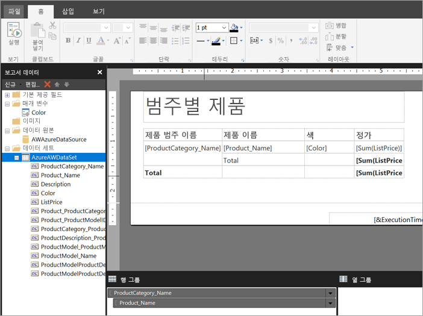

# Power BI 서비스에서 페이지를 매긴 보고서의 포함된 데이터 세트 만들기

이 문서에서는 Power BI 서비스에서 페이지를 매긴 보고서의 포함된 데이터 세트를 포함된 데이터 원본을 기반으로 만드는 방법을 알아봅니다. 포함된 데이터 세트는 해당 보고서에 사용할 수 있도록 하나의 페이지를 매긴 보고서에 있습니다. 현재 Power BI 서비스에 게시된 페이지를 매긴 보고서에는 포함된 데이터 세트 및 포함된 데이터 원본이 필요합니다. 보고서를 만드는 동안 Power BI 보고서 작성기에서 포함된 데이터 원본 및 데이터 세트를 만듭니다. 

데이터 세트를 만들려면 먼저 데이터 원본을 만들어야 합니다. 방법을 알아보려면 Power BI 서비스에서 [페이지를 매긴 보고서의 포함된 데이터 원본](paginated-reports-embedded-data-source.md)을 참조하세요.
  
## 포함된 데이터 세트 만들기
  
1. Power BI 보고서 작성기의 보고서 데이터 창에서 **새로 만들기** > **데이터 세트**를 선택합니다.

1. **데이터 집합 속성** 대화 상자의 **쿼리** 탭에서 데이터 세트에 이름을 지정합니다. 포함된 데이터 원본이 **데이터 원본** 상자에 이미 있거나 **새로 만들기**를 선택하여 다른 포함된 데이터 원본을 만들 수 있습니다.
 
     

3. **쿼리 유형**에서 데이터 세트에 사용할 명령 또는 쿼리의 유형을 선택합니다. 
    - **텍스트**는 쿼리를 실행하여 데이터베이스에서 데이터를 검색합니다. 기본값이며 대부분의 쿼리에 사용됩니다. 쿼리를 입력하거나 **가져오기**를 선택하여 기존 쿼리를 가져옵니다. 그래픽 방식으로 쿼리를 빌드하려면 **쿼리 디자이너**를 선택합니다. 쿼리 디자이너를 사용하여 쿼리를 빌드하는 경우 쿼리의 텍스트가 이 상자에 나타납니다. 표현식을 사용하여 쿼리를 동적으로 생성하려면 **표현식**(**fx**) 단추를 선택합니다. 
    - **테이블**은 테이블 내의 모든 필드를 선택합니다. 데이터 세트로 사용할 테이블의 이름을 입력합니다.
    - **저장 프로시저**는 이름별로 저장 프로시저를 실행합니다.

4. 쿼리 디자이너에서는 데이터 세트의 테이블 및 필드를 보고 조작하거나, 쿼리를 가져오거나, 텍스트로 편집할 수 있습니다. 여기에서 필터 및 매개 변수를 추가할 수도 있습니다. 

    

5. 쿼리 디자이너에서 **쿼리 실행**을 선택하여 테스트하고 **확인**을 선택합니다.

1. 다시 데이터 세트 속성 대화 상자의 **시간 초과(초)** 상자에 쿼리가 시간 초과될 때까지의 시간(초)을 입력합니다. 기본값은 30초입니다. **시간 초과** 값은 비어 있거나 0보다 커야 합니다. 쿼리는 비어 있는 경우 시간 초과되지 않습니다.

7.  다음과 같이 다른 탭에서 데이터 세트의 다른 속성을 설정할 수 있습니다.
    - **필드** 탭에서 계산 필드를 만듭니다.
    - **옵션** 탭에서 고급 옵션을 설정합니다.
    - 각 탭에서 **필터** 및 **매개 변수**를 추가하거나 업데이트합니다.

8. **확인**을 선택합니다.
 
   보고서 디자인 뷰에 보고서가 열립니다. 데이터 원본, 데이터 세트 및 데이터 세트 필드 컬렉션이 보고서 데이터 창에 표시되며 페이지를 매긴 보고서를 계속 디자인할 수 있습니다.  

     
 
## 다음 단계 

- [Power BI Premium에서 페이지를 매긴 보고서란?](paginated-reports-report-builder-power-bi.md)  
- [자습서: 페이지를 매긴 보고서를 만들어 Power BI 서비스에 업로드](paginated-reports-quickstart-aw.md)
- [Power BI 서비스에 페이지를 매긴 보고서 게시](paginated-reports-save-to-power-bi-service.md)

