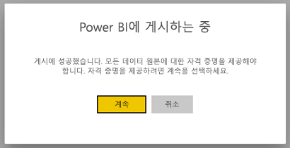
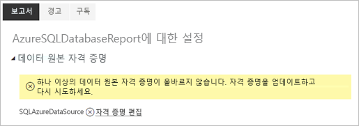
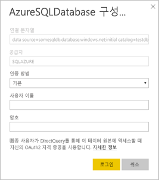

# Power BI 페이지를 매긴 보고서의 지원되는 데이터 원본

이 문서에서는 Power BI 서비스의 페이지를 매긴 보고서에서 지원되는 데이터 원본 및 Azure SQL Database 데이터 원본에 연결하는 방법을 자세히 설명합니다. 일부 데이터 원본은 기본적으로 지원됩니다. 데이터 게이트웨이를 통해 다른 데이터 원본에 연결할 수 있습니다.

## 기본적으로 지원되는 데이터 원본

페이지를 매긴 보고서는 기본적으로 다음 데이터 원본 목록을 지원합니다.

| 데이터 원본 | 인증 | 참고 |
| --- | --- | --- |
| Azure SQL Database  Azure SQL Data Warehouse | 기본, SSO(Single Sign-On), OAuth2 |   |
| Azure Analysis Services | SSO, OAuth2 |   |
| Power BI 데이터 세트 | SSO | Premium 및 Premium이 아닌 Power BI 데이터 세트 |
| Premium Power BI 데이터 세트(XMLA) | SSO |   |
| 데이터 입력 | 해당 없음 | 데이터가 보고서에 포함됩니다. |

Power BI 서비스에 보고서를 업로드한 후에는 Azure SQL Database를 제외한 모든 데이터 원본을 사용할 수 있습니다. 데이터 원본은 기본적으로 SSO(Single Sign-On)를 사용합니다(적용 가능한 경우). Azure Analysis Services의 경우 인증 형식을 OAuth2로 변경할 수 있습니다.

Azure SQL Database 데이터 원본의 경우 [Azure SQL Database 인증](#azure-sql-database-authentication) 섹션에 설명된 대로 추가 정보를 제공해야 합니다.

## 기타 데이터 원본

[Power BI 데이터 게이트웨이](service-gateway-onprem.md)를 통해 위의 기본적으로 지원되는 데이터 원본 외에도 다음 데이터 원본에 액세스할 수 있습니다.

- SQL Server
- SQL Server Analysis Services
- Oracle
- Teradata

페이지를 매긴 보고서의 경우 현재는 Power BI 데이터 게이트웨이를 통해 Azure SQL Database 및 Azure Analysis Services에 액세스할 수 없습니다.

## Azure SQL Database 인증

Azure SQL Database 데이터 원본의 경우 보고서를 실행하기 전에 인증 형식을 설정해야 합니다. 이 설정은 작업 영역에서 데이터 원본을 처음 사용하는 경우에만 적용됩니다. 처음에는 다음 메시지가 표시됩니다.

자격 증명을 제공하지 않으면 보고서를 실행할 때 오류가 발생합니다. **계속**을 선택하여 방금 업로드한 보고서에 대한 **데이터 원본 자격 증명** 페이지로 이동합니다.

지정된 데이터 원본의 **자격 증명 편집** 링크를 선택하여 **구성** 대화 상자를 표시합니다.

Azure SQL Database 데이터 원본의 경우 지원되는 인증 형식은 다음과 같습니다.

- 기본(사용자 이름 및 암호)
- SSO(Single Sign-On)
- OAuth2(저장된 AAD 토큰)

SSO 및 OAuth2가 제대로 작동하려면 데이터 원본이 연결된 Azure SQL Database 서버에서 [AAD 인증 지원을 사용하도록 설정](https://docs.microsoft.com/azure/sql-database/sql-database-aad-authentication-configure)해야 합니다. OAuth2 인증 방법의 경우 AAD는 토큰을 생성하고 향후 데이터 원본 액세스를 위해 저장합니다. [SSO 인증 방법](https://docs.microsoft.com/power-bi/service-azure-sql-database-with-direct-connect#single-sign-on)을 대신 사용하려면 바로 아래에서 SSO 옵션인 **최종 사용자가 DirectQuery를 통해 이 데이터 원본에 액세스할 때 자신의 OAuth2 자격 증명을 사용합니다.** 를 선택합니다.
  
## 다음 단계

[Power BI 서비스에서 페이지를 매긴 보고서 보기](paginated-reports-view-power-bi-service.md)

궁금한 점이 더 있나요? [Power BI 커뮤니티를 이용하세요.](http://community.powerbi.com/)
