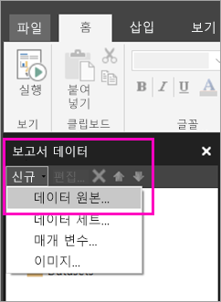

# Power BI 서비스에서 페이지를 매긴 보고서의 포함된 데이터 원본 만들기

이 문서에서는 Power BI 서비스에서 페이지를 매긴 보고서의 포함된 데이터 원본을 만들고 수정하는 방법을 알아봅니다. 단일 보고서에 포함된 데이터 원본을 정의하고 해당 보고서에서만 사용합니다. 현재 Power BI 서비스에 게시된 페이지를 매긴 보고서에는 포함된 데이터 세트 및 포함된 데이터 원본이 필요하며 이 보고서를 다음 데이터 원본에 연결할 수 있습니다.

- Azure Analysis Services
- 라이브 데이터에 
- Azure SQL Data Warehouse
- SQL Server
- SQL Server Analysis Services
- Oracle 
- Teradata 

다음 데이터 원본에 대해 [SQL Server Analysis Services 연결](service-premium-connect-tools.md) 옵션을 사용합니다.

- Power BI Premium 데이터 세트

페이지를 매긴 보고서는 [Power BI 게이트웨이](service-gateway-onprem.md)를 통해 온-프레미스 데이터 원본에 연결됩니다. 보고서를 Power BI 서비스에 게시한 후 게이트웨이를 설정합니다.

자세한 내용은 [Power BI 보고서 작성기의 보고서 데이터](report-builder-data.md)를 참조하세요.

## 포함된 데이터 원본 만들기
  
1. Power BI 보고서 작성기를 엽니다.

1. [보고서 데이터] 창의 도구 모음에서 **새로 만들기** > **데이터 원본**을 선택합니다. **데이터 원본 속성** 대화 상자가 열립니다.

    
  
2.  **이름** 텍스트 상자에 데이터 원본의 이름을 입력하거나 기본값을 그대로 사용합니다.  
  
3.  **내 보고서에 포함된 연결 사용**을 선택합니다.  
  
1.  **연결 유형 선택** 목록에서 데이터 원본 형식을 선택합니다. 

1.  다음 방법 중 하나를 사용하여 연결 문자열을 지정합니다.  
  
    -   **연결 문자열** 텍스트 상자에 직접 연결 문자열을 입력합니다. 
  
    -   식(**fx)** 단추를 선택하여 연결 문자열로 평가되는 식을 만듭니다. **식** 대화 상자의 [식] 창에 식을 입력합니다. **확인**을 선택합니다. 
  
    -   **작성**을 선택하여 2단계에서 선택한 데이터 원본의 **연결 속성** 대화 상자를 엽니다.  
  
        **연결 속성** 대화 상자의 필드를 데이터 원본 형식에 맞게 채웁니다. 연결 속성에는 데이터 원본 형식, 데이터 원본 이름 및 사용할 자격 증명이 포함됩니다. 이 대화 상자에서 값을 지정한 후 **연결 테스트**를 선택하여 데이터 원본이 사용 가능하고 지정한 자격 증명이 올바른지 확인합니다.  
  
4.  **자격 증명**을 선택합니다.  
  
     이 데이터 원본에 사용할 자격 증명을 지정합니다. 데이터 원본의 소유자가 지원되는 자격 증명 유형을 선택합니다. 자세한 내용은 [보고서 데이터 원본에 대한 자격 증명 및 연결 정보 지정](https://docs.microsoft.com/sql/reporting-services/report-data/specify-credential-and-connection-information-for-report-data-sources)을 참조하세요.
  
5.  **확인**을 선택합니다.  
  
     데이터 원본은 [보고서 데이터] 창에 표시됩니다.  
     
## 제한 사항 및 고려 사항

Power BI 데이터 세트에 연결하는 페이지를 매긴 보고서는 Power BI의 공유 데이터 세트에 대한 규칙을 따르며 몇 가지 사소한 변경 사항이 있습니다.  사용자가 Power BI 데이터 세트를 사용하여 페이지를 매긴 보고서를 올바르게 보고, RLS(행 수준 보안)를 활성화하여 시청자에게 적용하려면 다음 규칙을 따르십시오.

### 클래식 앱 및 앱 작업 영역

- 데이터 세트와 동일한 작업 영역의 .rdl(동일한 소유자): 지원됨
- 데이터 세트와 다른 작업 영역의 .rdl(동일한 소유자): 지원됨
- 공유 .rdl: 데이터 세트 수준에서 보고서를 보는 각 사용자에 대해 할당된 빌드 권한이 필요합니다.
- 공유 앱: 데이터 세트 수준에서 보고서를 보는 각 사용자에 대해 할당된 빌드 권한이 필요합니다.
- 데이터 세트와 동일한 작업 영역의 .rdl(다른 사용자): 지원됨
- 데이터 세트와 다른 작업 영역의 .rdl(다른 사용자): 데이터 세트 수준에서 보고서를 보는 각 사용자에 대해 할당된 빌드 권한이 필요합니다.
- 역할 수준 보안: 데이터 세트 수준에서 보고서를 보는 각 사용자에 대해 할당된 빌드 권한이 있어야 강제 적용할 수 있습니다.

### 새 환경 앱 및 앱 작업 영역

- 데이터 세트와 동일한 작업 영역의 .rdl: 지원됨
- 데이터 세트와 다른 작업 영역의 .rdl(동일한 소유자): 지원됨
- 공유 .rdl: 데이터 세트 수준에서 보고서를 보는 각 사용자에 대해 할당된 빌드 권한이 필요합니다.
- 공유 앱: 데이터 세트 수준에서 보고서를 보는 각 사용자에 대해 할당된 빌드 권한이 필요합니다.
- 데이터 세트와 동일한 작업 영역의 .rdl(다른 사용자) - 지원됨
- 데이터 세트와 다른 작업 영역의 .rdl(다른 사용자): 데이터 세트 수준에서 보고서를 보는 각 사용자에 대해 할당된 빌드 권한이 필요합니다.
- 역할 수준 보안: 데이터 세트 수준에서 보고서를 보는 각 사용자에 대해 할당된 빌드 권한이 있어야 강제 적용할 수 있습니다.

## 다음 단계

- [Power BI 서비스에서 페이지를 매긴 보고서의 포함된 데이터 세트 만들기](paginated-reports-create-embedded-dataset.md)
- [Power BI Premium에서 페이지를 매긴 보고서란?](paginated-reports-report-builder-power-bi.md)
