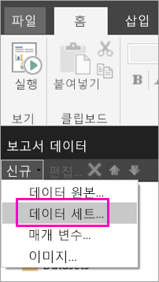
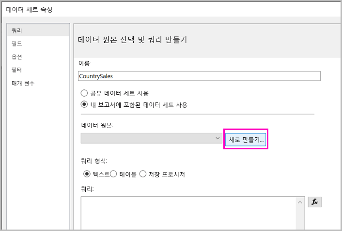
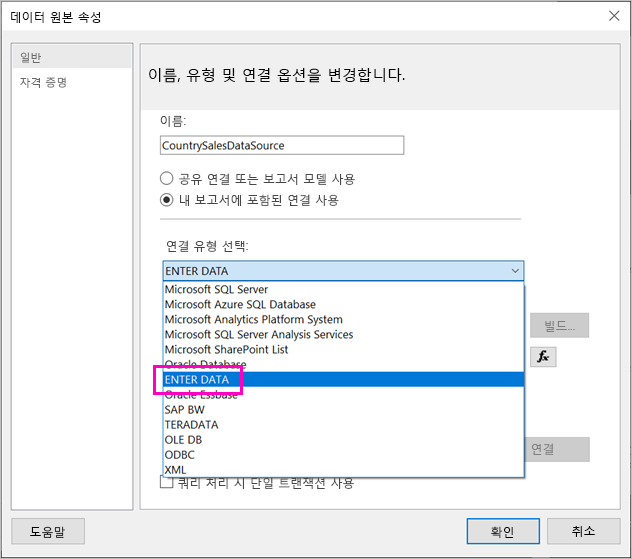
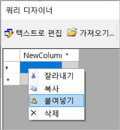
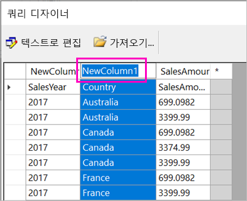
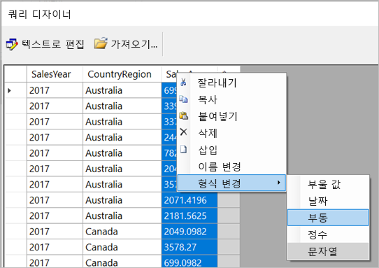
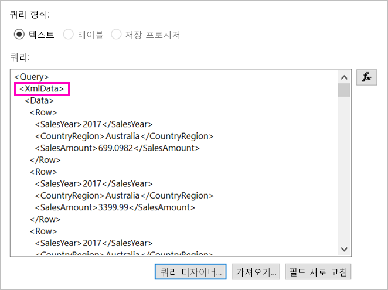
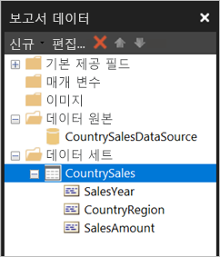

# <a name="enter-data-directly-in-a-paginated-report-in-report-builder---power-bi"></a>보고서 작성기 - Power BI에서 페이지를 매긴 보고서에 직접 데이터 입력

이 문서에서는 포함된 데이터 세트로 RDL 보고서에 직접 데이터를 입력할 수 있는 SQL Server 2016 보고서 작성기의 새 버전 기능에 대해 알아봅니다.  이 기능은 Power BI Desktop과 비슷합니다. 보고서의 데이터 세트에 직접 데이터를 입력하거나 Microsoft Excel과 같은 다른 프로그램에서 붙여넣을 수 있습니다. 데이터를 입력하여 데이터 세트를 만든 후에는 다른 포함된 데이터 세트와 마찬가지로 데이터 세트를 사용할 수 있습니다. 또한 둘 이상의 테이블을 추가하고 하나를 다른 테이블을 위한 필터로 사용할 수 있습니다. 이 기능은 보고서 매개 변수처럼 보고서에서 사용해야 할 수 있는 작고 정적인 데이터 세트에 특히 유용합니다.
 
## <a name="prerequisites"></a>필수 조건

- 페이지를 매긴 보고서에 직접 데이터를 입력하려면 [Microsoft 다운로드 센터에서 보고서 작성기](https://www.microsoft.com/download/details.aspx?id=53613)의 새 버전을 설치합니다. 
- 페이지를 매긴 보고서를 Power BI 서비스에 저장하려면 [Power BI Pro 계정](service-self-service-signup-for-power-bi.md)이 필요하고 [Power BI Premium 용량](service-premium-what-is.md)의 작업 영역에 대한 액세스 권한을 작성해야 합니다.
- 보고서 서버에 페이지를 매긴 보고서를 저장하려면 [RsReportServer.config 파일 편집](#upload-the-paginated-report-to-a-report-server)에 대한 사용 권한이 필요합니다.

## <a name="get-started"></a>시작

보고서 작성기를 다운로드하고 설치한 후에는 포함된 데이터 원본과 데이터 세트를 보고서에 추가하는 데 사용하는 것과 동일한 워크플로를 수행합니다. 다음 프로시저에서는 **데이터 원본** 아래에 새 옵션인 **데이터 입력**이 표시됩니다.  이 데이터 원본은 보고서에 한 번만 설정하면 됩니다. 그런 다음, 입력된 데이터의 여러 테이블을 별도의 데이터 세트로 만들 수 있으며, 모두 해당 단일 데이터 원본을 사용합니다.

1. **보고서 데이터** 창에서 **새로 만들기** > **데이터 세트**를 선택합니다.

    

1. **데이터 세트 속성** 대화 상자에서 **내 보고서에 포함된 데이터 집합 사용**을 선택합니다.

1. **데이터 원본** 옆에 **새로 만들기**를 선택합니다.

    

1. **데이터 원본 속성** 대화 상자에서 **내 보고서에 포함된 연결 사용**을 선택합니다.
2. **연결 유형 선택** 상자에서 **ENTER DATA** > **확인**을 선택합니다.

    

1. **데이터 세트 속성** 대화 상자로 돌아가서 **쿼리 디자이너**를 선택합니다.
2. **쿼리 디자이너** 창에서 데이터를 마우스 오른쪽 단추로 클릭하고 테이블에 데이터를 붙여넣습니다.

    

1. 열 이름을 설정하려면 각 **NewColumn**을 두 번 클릭하고 열 이름을 입력합니다.

    

1. 첫 번째 행에 원래 데이터의 열 머리글이 포함된 경우 마우스 오른쪽 단추로 클릭하고 삭제합니다.
    
9. 기본적으로 각 열의 데이터 형식은 문자열입니다. 데이터 형식을 변경하려면 열 머리글 > **형식 변경**을 마우스 오른쪽 단추로 클릭하고 날짜 또는 Float와 같은 다른 데이터 형식으로 설정합니다.

    

1. 테이블 만들기를 완료한 경우 **확인**을 선택합니다.  

    생성되는 쿼리는 XML 데이터 원본에서 볼 수 있는 것과 동일합니다. 내부적으로 XML을 데이터 공급자로 사용하고 있습니다.  이 시나리오에도 사용하도록 용도를 변경했습니다.

    

12. **데이터 세트 속성** 대화 상자에서 **확인**을 선택합니다.

13. **보고서 데이터** 창에 데이터 원본 및 데이터 세트가 표시됩니다.

    

데이터 세트를 보고서의 데이터 시각화를 위한 기초로 사용할 수 있습니다. 다른 데이터 세트를 추가하고 동일한 데이터 원본을 사용할 수도 있습니다.

## <a name="upload-the-paginated-report-to-the-power-bi-service"></a>Power BI 서비스에 페이지를 매긴 보고서 업로드

이제 Power BI 서비스에서 페이지를 매긴 보고서가 지원되므로, 페이지를 매긴 보고서를 프리미엄 용량으로 업로드할 수 있습니다. 자세한 정보는 [페이지를 매긴 보고서 업로드](paginated-reports-save-to-power-bi-service.md#upload-a-paginated-report)를 참조하세요.

## <a name="upload-the-paginated-report-to-a-report-server"></a>보고서 서버에 페이지를 매긴 보고서 업로드

Power BI Report Server, SQL Server Reporting Services 2016 또는 2017 보고서 서버에 페이지를 매긴 보고서를 업로드할 수도 있습니다. 수행하기 전에 RsReportServer.config에 다음 항목을 추가 데이터 확장으로 추가해야 합니다. 문제가 발생할 경우를 대비하여 변경하기 전에 RsReportServer.config 파일을 백업하세요.

```xml
<Extension Name="ENTERDATA" Type="Microsoft.ReportingServices.DataExtensions.XmlDPConnection,Microsoft.ReportingServices.DataExtensions">
    <Configuration>
        <ConfigName>ENTERDATA</ConfigName>
    </Configuration>
</Extension>
```

편집한 후 구성 파일의 데이터 공급자의 목록이 다음과 같이 표시되어야 합니다.


끝났습니다. 이제 이 새로운 기능을 사용하는 보고서를 보고서 서버에 게시할 수 있습니다.

## <a name="next-steps"></a>다음 단계

- [Power BI Premium에서 페이지를 매긴 보고서란?](paginated-reports-report-builder-power-bi.md)
- [Power BI Report Server란?](report-server/get-started.md)
