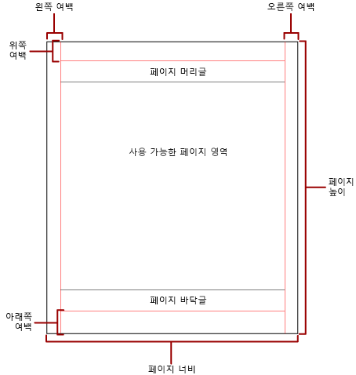

# Power BI 페이지를 매긴 보고서의 페이지 매김

 *페이지 매김*은 보고서의 페이지 수와 이 페이지에서 보고서 항목이 정렬되는 방식을 나타냅니다. Power BI 페이지를 매긴 보고서의 페이지 매김은 보고서를 보고 전송하는 데 사용하는 렌더링 확장 프로그램에 따라 달라집니다. 보고서 서버에서 보고서를 실행하면 보고서는 HTML 렌더러를 사용합니다. HTML은 페이지 매김과 관련하여 일련의 특별한 규칙을 따릅니다. 동일한 보고서를 PDF로 내보내는 경우, 예를 들어 다른 규칙 집합을 사용하는 PDF 렌더러를 사용합니다. 따라서 보고서의 페이지가 다르게 지정됩니다. Power BI 페이지를 매긴 보고서에서 페이지 매김을 제어하는 데 사용되는 규칙을 이해해야 합니다. 그러면 보고서를 전달하는 데 사용할 렌더러에 적합한 읽기 쉬운 보고서를 디자인할 수 있습니다.  
  
 이 항목에서는 하드 페이지 나누기 렌더러에서 보고서를 렌더링하는 방법에 대한 보고서의 레이아웃과 실제 페이지 크기의 영향에 대해 설명합니다. 실제 페이지 크기와 여백을 수정할 수 있도록 속성을 설정하고, **보고서 속성** 창, **속성** 창 또는 **페이지 설정** 대화 상자를 사용하여 보고서를 열로 나눌 수 있습니다. 보고서 본문 외부의 파란색 영역을 클릭하여 **보고서 속성** 창에 액세스합니다. [홈] 탭에서 **실행**을 클릭하고 [실행] 탭에서 **페이지 설정**을 클릭하여 **페이지 설정** 대화 상자에 액세스합니다.  
  
> [!NOTE]  
>  보고서를 한 페이지 너비로 디자인했지만 여러 페이지에서 렌더링하는 경우 여백을 포함한 보고서 본문의 너비가 실제 페이지 크기의 너비보다 크지 않은지 확인합니다. 보고서에 빈 페이지가 추가되지 않게 하려면 컨테이너 모퉁이를 왼쪽으로 끌어 컨테이너 크기를 줄일 수 있습니다.  

## 보고서 본문  
 보고서 본문은 디자인 화면에 공백으로 표시되는 사각형 컨테이너입니다. 해당 컨테이너에 포함된 보고서 항목에 맞게 확장하거나 축소할 수 있습니다. 보고서 본문은 물리적 페이지 크기를 반영하지 않으며 실제로 보고서 본문은 여러 보고서 페이지에 걸쳐 있는 실제 페이지 크기의 경계를 넘어 늘어날 수 있습니다. Microsoft Excel, Word, HTML 및 MHTML과 같은 일부 렌더러에서는 페이지의 내용에 따라 늘어나거나 축소되는 보고서를 렌더링합니다. 이러한 형식으로 렌더링된 보고서는 웹 브라우저와 같은 화면 기반 보기에 최적화되어 있습니다. 이러한 렌더러는 필요할 때 세로 페이지 나누기를 추가합니다.  
  
 테두리 색, 테두리 스타일 및 테두리 두께를 사용하여 보고서 본문의 서식을 지정할 수 있습니다. 배경색과 배경 이미지도 추가할 수 있습니다.  
  
## 실제 페이지  
 실제 페이지 크기는 용지 크기입니다. 보고서에 대해 지정한 용지 크기에 따라 보고서의 렌더링 방식이 달라집니다. 하드 페이지 나누기 형식으로 렌더링된 보고서는 실제 페이지 크기에 따라 가로 및 세로 방향으로 페이지 나누기를 삽입합니다. 이 페이지 나누기는 하드 페이지 나누기 파일 형식으로 인쇄하거나 볼 때 가장 적합한 읽기 환경을 제공합니다. 소프트 페이지 나누기 형식으로 렌더링된 보고서는 실제 크기에 따라 가로 방향으로 페이지 나누기를 삽입합니다. 또한 이 페이지 나누기는 웹 브라우저에서 볼 때 가장 적합한 읽기 환경을 제공 합니다.  
  
 기본적으로 페이지 크기는 8.5 x 11인치이지만, 이 크기는 **보고서 속성** 창 또는 **페이지 설정** 대화 상자에서 변경하거나 **속성** 창에서 PageHeight 및 PageWidth 속성을 변경하여 크기를 조정할 수 있습니다. 페이지 크기는 보고서 본문의 내용에 맞게 커지거나 축소되지 않습니다. 보고서를 한 페이지에 표시하려면 보고서 본문의 모든 내용이 물리적 페이지 크기에 맞아야 합니다. 맞지 않지만 하드 페이지 나누기 형식을 사용하는 경우 보고서에 추가 페이지가 필요합니다. 보고서 본문이 너무 커서 물리적 페이지의 오른쪽 가장자리를 벗어나면 가로 방향으로 페이지 나누기가 삽입됩니다. 보고서 본문이 실제 페이지의 맨 아래 가장자리를 벗어나면 세로 방향으로 페이지 나누기가 삽입됩니다.  
  
 보고서에 정의된 실제 페이지 크기를 재정의하려는 경우 보고서를 내보내는 데 사용하는 특정 렌더러의 디바이스 정보 설정을 사용하여 실제 페이지 크기를 지정할 수 있습니다. 전체 목록은 SQL Server Reporting Services 설명서에서 [렌더링 확장 프로그램의 디바이스 정보](https://docs.microsoft.com/sql/reporting-services/device-information-settings-for-rendering-extensions-reporting-services?view=sql-server-2017)를 참조하세요.  
  
### 여백

 실제 페이지 크기의 가장자리에서 지정된 여백 설정까지 안쪽 여백으로 그려집니다. 보고서 항목이 여백 영역으로 확장되면 겹치는 영역이 렌더링되지 않도록 잘립니다. 페이지의 가로 또는 세로 너비를 0으로 설정하는 여백 크기를 지정하면 여백 설정의 기본값은 0입니다. 여백은 **보고서 속성** 창 또는 **페이지 설정** 대화 상자에서 지정하거나, **속성** 창에서 TopMargin, BottomMargin, LeftMargin 및 RightMargin 속성을 변경하여 지정합니다. 보고서에 정의된 여백 크기를 재정의하려는 경우 보고서를 내보내는 데 사용하는 특정 렌더러의 디바이스 정보 설정을 사용하여 여백 크기를 지정할 수 있습니다.  
  
 여백, 단 간격, 페이지 머리글 및 바닥글에 공간을 할당한 후에 남는 물리적 페이지의 영역을 *사용 가능한 페이지 영역*이라고 합니다. 여백은 하드 페이지 나누기 렌더러 형식으로 보고서를 렌더링하고 인쇄할 때만 적용됩니다. 다음 그림에서는 물리적 페이지의 여백과 사용 가능한 페이지 영역을 보여 줍니다.  
  
 
  
### 뉴스레터 스타일의 열  

 보고서는 신문의 컬럼처럼 열로 나눌 수 있습니다. 열은 동일한 *실제* 페이지에서 렌더링된 *논리적* 페이지로 처리됩니다. 왼쪽에서 오른쪽으로, 위쪽에서 아래쪽으로 정렬되고 각 열 사이에 공백으로 구분됩니다. 보고서가 둘 이상의 열로 나뉘어 있는 경우 각 실제 페이지는 세로로 나뉘어 열이 생성되고 각 열은 논리 페이지로 간주됩니다. 예를 들어 실제 페이지에 두 개의 열이 있다고 가정합니다. 보고서의 내용으로 첫 번째 열과 두 번째 열을 차례로 채웁니다. 보고서가 처음 두 열에 완전히 맞지 않는 경우 보고서는 다음 페이지의 첫 번째 및 두 번째 열을 채웁니다. 열은 모든 보고서 항목이 렌더링될 때까지 왼쪽에서 오른쪽으로, 위쪽에서 아래쪽으로 계속 채워집니다. 가로 너비나 세로 너비가 0이 되도록 열 크기를 지정하면 열 간격의 기본값은 0이 됩니다.  
  
 열은 **보고서 속성** 창 또는 **페이지 설정** 대화 상자에서 지정하거나, **속성** 창에서 TopMargin, BottomMargin, LeftMargin 및 RightMargin 속성을 변경하여 지정합니다. 정의되지 않은 여백 크기를 사용하려는 경우 보고서를 내보낼 특정 렌더러의 디바이스 정보 설정을 사용하여 여백 크기를 지정할 수 있습니다. 열은 PDF 또는 이미지 형식으로 보고서를 렌더링하고 인쇄할 때만 적용됩니다. 다음 이미지는 열을 포함하는 페이지의 사용 가능한 페이지 영역을 나타냅니다.  
  

  
## 페이지 나누기 및 페이지 이름

 보고서에 페이지 이름이 있으면 보고서를 더 읽기 쉽고 데이터를 더 쉽게 감사하고 내보낼 수 있습니다. Reporting Services에서는 페이지 매김을 제어하고 페이지 번호를 재설정하며 페이지 나누기에서 새로운 보고서 페이지 이름을 제공하기 위해 보고서에서 직사각형, 그룹, 목록 데이터 영역, 행렬, 테이블과 같은 보고서의 속성을 제공합니다. 이러한 기능은 보고서가 렌더링되는 형식과 관계없이 보고서를 향상할 수 있지만, 보고서를 Excel 통합 문서로 내보낼 때 특히 유용합니다.

> [!NOTE]
> 테이블, 행렬 및 목록 데이터 영역은 모두 화면 이면에서는 사실상 동일한 유형의 데이터 영역입니다(*테이블릭스*). 따라서 이 이름이 표시될 수 있습니다. 

 InitialPageName 속성을 통해서는 보고서의 초기 페이지 이름을 제공합니다. 보고서에 페이지 나누기에 대한 페이지 이름이 포함되어 있지 않으면 페이지 나누기를 통해 만든 모든 새 페이지에 초기 페이지 이름이 사용됩니다. 사용자는 초기 페이지 이름을 사용하지 않아도 됩니다.  
  
 렌더링된 보고서에서는 페이지 나누기로 인해 발생하는 새 페이지의 새 페이지 이름을 제공할 수 있습니다. 페이지 이름을 제공하려면 테이블, 행렬, 목록, 그룹 또는 사각형의 PageName 속성을 설정합니다. 중단 시 페이지 이름을 지정할 필요가 없습니다. 그렇지 않으면 InitialPageName의 값이 대신 사용됩니다. InitialPageName도 비어 있으면 새 페이지에 이름이 없습니다.  
  
 테이블, 행렬 및 목록 데이터 영역, 그룹 및 사각형은 페이지 나누기를 지원합니다.  
  
 페이지 나누기에는 다음 속성이 포함됩니다.  
  
- **BreakLocation**을 통해서는 시작, 끝 또는 시작과 끝에서 페이지 나누기 사용 보고서 요소의 나누기 위치를 제공합니다. 그룹에서 BreakLocation은 그룹 사이에 있을 수 있습니다.  
  
- **Disabled**는 페이지 나누기를 보고서 요소에 적용할지를 나타냅니다. 이 속성이 True로 평가되면 페이지 나누기가 무시됩니다. 이 속성은 보고서를 실행할 때 식에 따라 페이지 나누기를 동적으로 비활성화하는 데 사용됩니다.  
  
- **Resetpagenumber**는 페이지 나누기가 발생할 때 페이지 번호를 1로 다시 설정할지를 나타냅니다. 이 속성이 True로 평가되면 페이지 번호가 다시 설정됩니다.  
  
 **테이블릭스 속성**, **직사각형 속성** 또는 **그룹 속성** 대화 상자에서 BreakLocation 속성을 설정할 수 있지만, 보고서 작성기 속성 창에서 Disabled, ResetPageNumber 및 PageName 속성을 설정해야 합니다. 속성 창의 속성을 범주별로 구성하면 **PageBreak** 범주에 속성이 있습니다. 그룹의 경우 **PageBreak** 범주는 **그룹** 범주에 포함됩니다.  
  
 상수 및 단순식이나 복잡한 식을 사용하여 Disabled 및 ResetPageNumber 속성의 값을 설정할 수 있습니다. 그러나 BreakLocation 속성과는 식을 사용할 수 없습니다. 식 작성 및 사용에 관한 자세한 내용은 [Power BI 보고서 작성기의 식](report-builder-expressions.md)을 참조하세요.  
  
 보고서에서 **Globals** 컬렉션을 사용하여 현재 페이지 이름과 페이지 번호를 참조하는 식을 쓸 수 있습니다. 자세한 내용은 보고서 작성기 및 보고 서비스 문서의 [기본 제공 글로벌 및 사용자 참조서](https://docs.microsoft.com/sql/reporting-services/report-design/built-in-collections-built-in-globals-and-users-references-report-builder?view=sql-server-2017)를 확인하세요.
  
### Excel 워크시트 탭 이름 지정

 이러한 속성은 보고서를 Excel 통합 문서로 내보낼 때 유용합니다. InitialPage 속성을 사용하여 보고서를 내보낼 때 워크시트 탭 이름의 기본 이름을 지정하고, 페이지 나누기 및 PageName 속성을 사용하여 각 워크시트에 대해 다른 이름을 제공할 수 있습니다. 페이지 나누기로 정의되는 각각의 새 보고서 페이지를 PageName 속성값으로 명명된 다른 워크시트로 내보냅니다. PageName이 비어 있지만 보고서에 초기 페이지 이름이 있으면 Excel 통합 문서의 모든 워크시트가 같은 이름(초기 페이지 이름)을 사용합니다.  
  
 보고서를 Excel로 내보낼 때 이러한 속성이 작동하는 방식에 관한 자세한 내용은 보고서 작성기 및 보고 서비스 문서의 [Microsoft Excel로 내보내기](https://docs.microsoft.com/sql/reporting-services/report-builder/exporting-to-microsoft-excel-report-builder-and-ssrs?view=sql-server-2017)를 참조하세요.  
  
## 다음 단계

- [Power BI 서비스에서 페이지를 매긴 보고서 보기](consumer/paginated-reports-view-power-bi-service.md)
- [페이지를 매긴 보고서를 인쇄할 때 빈 페이지 방지](guidance/report-paginated-blank-page.md)
- 추가 질문이 있으신가요? [Power BI 커뮤니티를 이용하세요.](https://community.powerbi.com/)
