# 자습서:  페이지를 매긴 보고서를 만들어 Power BI 서비스에 업로드

이 자습서에서 사용자는 샘플 Azure SQL Database에 연결합니다. 그런 다음 Power BI 보고서 작성기에서 마법사를 사용하여 여러 페이지에 걸쳐 있는 테이블을 사용하여 페이지를 매긴 보고서를 만듭니다. 그런 다음, Power BI 서비스에 있는 프리미엄 용량의 작업 영역에 페이지를 매긴 보고서를 업로드합니다.

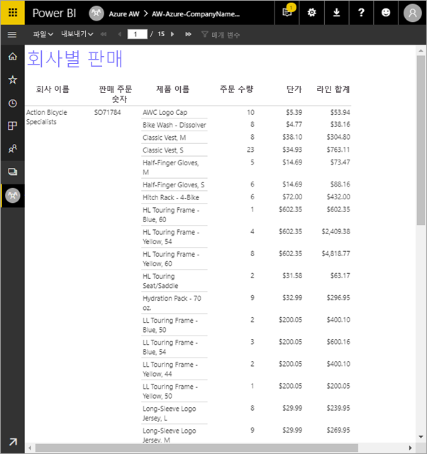

이 자습서에서 수행하는 단계는 다음과 같습니다.

> [!div class="checklist"]
> * Azure 샘플 데이터베이스를 만듭니다.
> * 마법사를 사용하여 Power BI 보고서 작성기에서 행렬을 만듭니다.
> * 각 페이지에 제목, 페이지 번호, 열 제목이 포함되도록 보고서 형식을 지정합니다.
> * 통화 형식을 지정합니다.
> * Power BI 서비스에 보고서를 업로드합니다.

Azure 구독이 없는 경우 시작하기 전에 [체험 계정](https://azure.microsoft.com/free/?WT.mc_id=A261C142F)을 만듭니다.
 
## 필수 조건  

페이지를 매긴 보고서를 만드는 데 필요한 필수 조건은 다음과 같습니다.

- [Power BI 보고서 작성기는 Microsoft 다운로드 센터에서](https://go.microsoft.com/fwlink/?linkid=2086513) 설치합니다. 

- 빠른 시작 [Azure Portal에서 Azure SQL Database 샘플 만들기](https://docs.microsoft.com/azure/sql-database/sql-database-get-started-portal)를 따릅니다. **개요** 탭에 있는 **서버 이름** 상자의 값을 복사하여 저장합니다. Azure에서 만든 사용자 이름과 암호를 기억하세요.

Power BI 서비스로 페이지를 매긴 보고서를 업로드하는 데 필요한 필수 조건은 다음과 같습니다.

- [Power BI Pro 라이선스](service-admin-power-bi-pro-in-your-organization.md)가 있어야 합니다.
- [Power BI Premium 용량](service-premium-what-is.md)에 서비스 작업 영역이 있어야 합니다. 해당 용량의 작업 영역 이름 옆에는 다이아몬드 아이콘()이 있습니다.

## 마법사를 사용하여 행렬 만들기
  
1.  컴퓨터에서 Power BI Report Builder를 시작합니다.  
  
     **시작** 대화 상자가 열립니다.  
  
     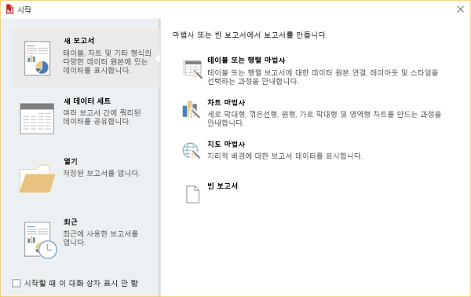
  
1.  왼쪽 창에서 **새 보고서**가 선택되어 있는지 확인하고, 오른쪽 창에서 **테이블 또는 행렬 마법사**를 선택합니다.  
  
4.  **데이터 세트 선택** 페이지에서 **데이터 세트 만들기** > **다음**을 선택합니다.  

    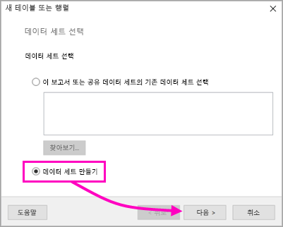
  
5.  **데이터 원본에 대한 연결 선택** 페이지에서 **새로 만들기**를 선택합니다. 

    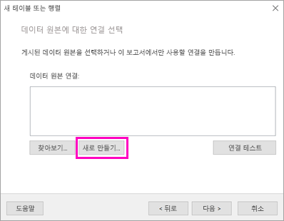
  
     **데이터 원본 속성** 대화 상자가 열립니다.  
  
6.  문자 및 밑줄을 사용하여 원하는 대로 데이터 원본의 이름을 지정할 수 있습니다. 이 자습서에서는 **이름** 상자에 **MyAzureDataSource**를 입력합니다.  
  
7.  **연결 형식 선택** 상자에서 **Microsoft Azure SQL Database**를 선택합니다.  
  
8.  **연결 문자열** 상자 옆에 있는 **작성**을 선택합니다. 

    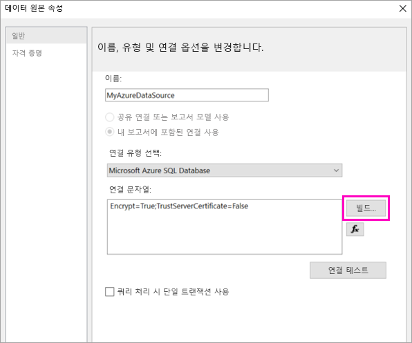

9. **Azure에서:** Azure Portal로 다시 돌아가 **SQL 데이터베이스**를 선택합니다.

1. 이 문서의 **필수 조건** 섹션에 있는 빠른 시작 “Azure Portal에서 Azure SQL Database 샘플 만들기”에서 만든 Azure SQL Database를 선택합니다.

1. **개요** 탭에서 **서버 이름** 상자에 값을 복사합니다.

2. **보고서 작성기에서**: **연결 속성** 대화 상자의 **서버 이름** 아래에 복사한 서버 이름을 붙여넣습니다. 

1. **서버에 로그온**하려면 **SQL Server 인증 사용**이 선택되어 있는지 확인하고 Azure에서 샘플 데이터베이스에 대해 만든 사용자 이름과 암호를 입력합니다.

1. **데이터베이스에 연결** 아래에서 드롭다운 화살표를 선택하고 Azure에서 만든 데이터베이스 이름을 선택합니다.
 
    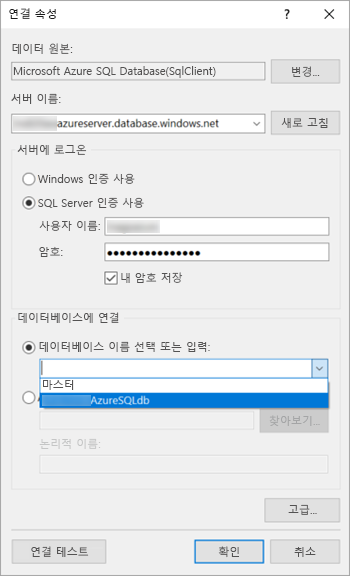

1. **연결 테스트**를 선택합니다. **연결 테스트에 성공했습니다.** **테스트 결과** 메시지가 표시됩니다.

1. **확인** > **확인**을 선택합니다. 

   이제 보고서 작성기는 **연결 문자열** 상자에 방금 만든 연결 문자열을 표시합니다. 

    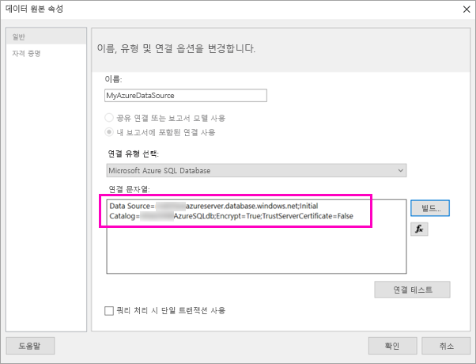

1. **확인**을 선택합니다.
  
9. **데이터 원본에 대한 연결 선택** 페이지에 있는 방금 만든 데이터 원본 연결 아래에 “(이 보고서)”가 표시됩니다. 해당 데이터 원본 > **다음**을 선택합니다.  

    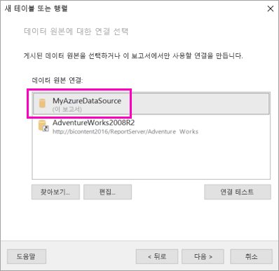

10. 동일한 사용자 이름 및 암호를 상자에 입력합니다. 
  
10. **쿼리 디자인** 페이지에서 SalesLT, 테이블을 차례로 확장하고 다음 테이블을 선택합니다.

    - Address
    - Customer
    - Product
    - ProductCategory
    - SalesOrderDetail
    - SalesOrderHeader

     **관계** > **자동 검색**이 선택되어 있으므로 보고서 작성기가 해당 테이블 간 관계를 검색합니다. 
    
    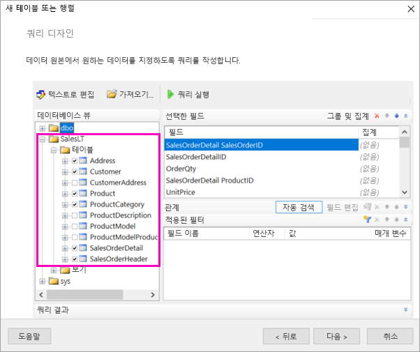
 
1.  **쿼리 실행**을 선택합니다. 보고서 작성기가 **쿼리 결과**를 표시합니다. 
 
     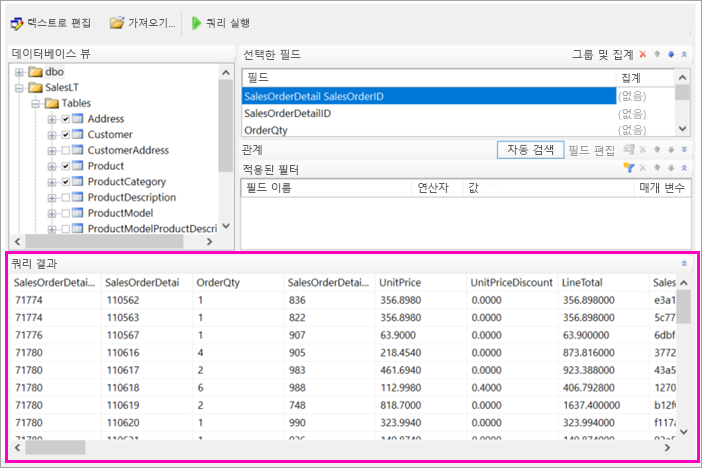

18. **다음**을 선택합니다. 

19. **데이터 집합 선택** 페이지에서 방금 만든 데이터 세트를 선택하고 > **다음**을 선택합니다.

    

1. **필드 정렬** 페이지의 **사용 가능한 필드** 상자에서 **행 그룹** 상자로 다음 필드를 끌어 옵니다.

    - CompanyName
    - SalesOrderNumber
    - Product_Name

1. **사용 가능한 필드** 상자에서 **값** 상자로 다음 필드를 끌어 옵니다.

    - OrderQty
    - UnitPrice
    - LineTotal

    보고서 작성기가 자동으로 **값** 상자에 있는 필드의 합계를 냅니다.

    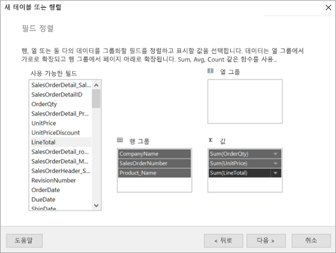

24. **레이아웃 선택** 페이지에서 모든 기본 설정을 유지하되 **그룹 확장/축소**는 선택 취소합니다. 일반적으로 그룹 확장/축소 기능은 매우 유용하지만 여기에서는 테이블이 여러 페이지로 래핑되도록 하려고 합니다.

1. **다음** > **마침**을 선택합니다. 테이블이 디자인 화면에 표시됩니다.
 
## 만든 항목

잠시 진행을 멈추고 마법사의 결과를 살펴보겠습니다.

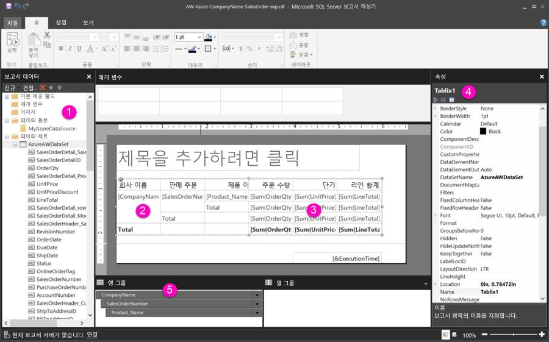

1. 보고서 데이터 창에는 포함된 Azure 데이터 원본과 이를 기반으로 한 포함된 데이터 세트가 표시됩니다. 데이터 원본과 데이터 세트 모두 직접 만든 것입니다. 

2. 디자인 화면은 너비가 약 6인치입니다. 디자인 화면에서 열 제목과 자리 표시자 값이 표시된 행렬을 볼 수 있습니다. 행렬은 열이 6개 있으며 5개 행만 표시되는 높이로 나타납니다. 

3. 주문 수량, 단가 및 라인 합계는 모두 합계이며 각 행 그룹에는 소계가 있습니다. 

    실제 데이터 값은 아직 표시되지 않습니다. 해당 값을 보려면 보고서를 실행해야 합니다.

4. 속성 창에서 선택한 행렬은 Tablix1이라고 합니다. 보고서 작성기의 ‘테이블릭스’는 행과 열로 데이터를 표시하는 데이터 영역입니다. 테이블이거나 행렬입니다.

5. 그룹화 창에는 마법사에서 만든 다음 세 개의 행 그룹이 표시됩니다. 

    - CompanyName
    - SalesOrderNumber
    - Product_Name

    이 매트릭스에는 열 그룹이 없습니다.

### 보고서 실행

실제 값을 보려면 보고서를 실행해야 합니다.

1. **홈** 도구 모음에서 **실행**을 선택합니다.

   이제 값이 표시됩니다. 행렬에는 디자인 뷰에 표시되는 것보다 훨씬 더 많은 행이 있습니다. 보고서 작성기에 **1**/**2?** 페이지로 표시된 것에 유의하세요. 보고서 작성기는 가능한 한 빠르게 보고서를 로드하므로 소수의 페이지를 표시하는 데 충분한 데이터만 한 번에 검색합니다. 물음표는 보고서 작성기가 아직 일부 데이터를 로드하지 않았음을 나타냅니다.

   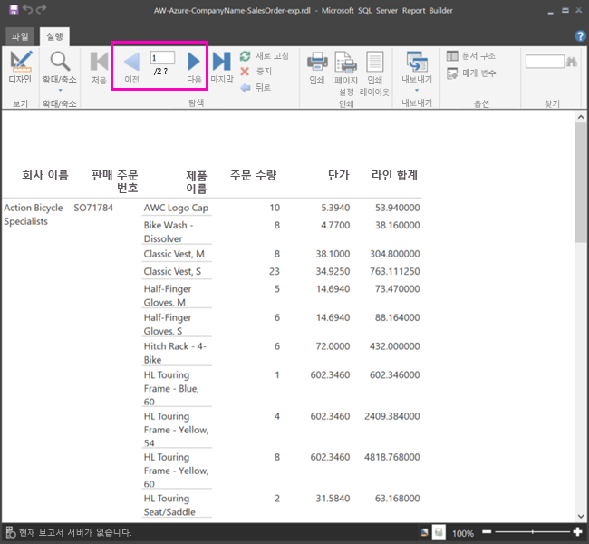

2. **인쇄 레이아웃**을 선택합니다. 보고서를 인쇄하면 해당 형식이 됩니다. 이제 보고서 작성기는 보고서에 33페이지가 있음을 알고 있으며 바닥글에 날짜 및 시간 스탬프를 자동으로 추가했습니다.

## 보고서 형식 지정

이제 33페이지로 래핑된 행렬이 있는 보고서가 있습니다. 몇 가지 다른 기능을 추가하여 보고서 모양을 개선해 보겠습니다. 각 단계를 마칠 때마다 보고서를 실행하여 각 단계가 보고서에 어떻게 적용되었는지 확인할 수 있습니다.

- 리본의 **실행** 탭에서 **디자인**을 선택하여 수정을 계속할 수 있습니다.  

### 페이지 너비 설정

일반적으로 페이지를 매긴 보고서는 인쇄용으로 형식 지정되며 일반적인 페이지는 8.5 X 11인치입니다. 

1. 눈금자를 끌어 디자인 화면 너비가 7인치가 되도록 합니다. 기본 여백은 양쪽 모두 각각 1인치이므로 양쪽 여백을 더 좁혀야 합니다.

1. 디자인 화면 주위의 회색 영역을 클릭하여 **보고서** 속성을 표시합니다.

    속성 창이 표시되지 않으면 **보기** 탭 > **속성**을 클릭합니다.

2. **여백**을 확장하고 **왼쪽** 및 **오른쪽**을 1인치에서 0.75인치로 변경합니다. 

    
  
### 보고서 제목 추가  

1. 페이지 맨 위에서 **제목을 추가하려면 클릭**을 선택하고 **회사별 판매액**을 입력합니다.  

2. 제목 텍스트를 선택하고 **글꼴** 아래 속성 창에서 **색**을 **파란색**으로 변경합니다.
  
### 페이지 번호 추가

보고서 바닥글에 날짜 및 시간 스탬프가 있는 것을 알 수 있습니다. 바닥글에 페이지 번호도 추가할 수 있습니다.

1. 디자인 화면 아래쪽 바닥글의 오른쪽에 [&ExecutionTime]이 표시되어 있습니다. 

2. 보고서 데이터 창에서 기본 제공 필드 폴더를 확장합니다. **페이지 번호**를 바닥글 왼쪽 [&ExecutionTime]과 같은 높이로 끌어 옵니다.

3. [&PageNumber] 상자 오른쪽을 끌어 정사각형으로 만듭니다.

4. **삽입** 탭에서 **입력란**을 선택합니다

5. [&PageNumber] 오른쪽을 클릭하고 “/”를 입력한 후 텍스트 상자를 정사각형으로 지정합니다.

6. **전체 페이지 수**를 바닥글 “/” 오른쪽으로 끌어온 후 오른쪽 측면을 끌어 정사각형으로 만듭니다.

    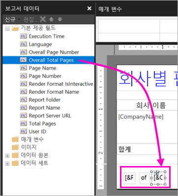

### 테이블 더 넓게 만들기  

이제 페이지 너비를 채우도록 행렬 너비를 충분히 넓게 하고 이름을 별로 스크롤하지 않아도 되도록 텍스트 열을 넓게 합니다. 
 
1. 행렬을 선택한 후 회사 이름 열을 선택합니다.

3. 행렬 맨 위의 회사 이름 열 오른쪽 가장자리에 있는 회색 막대 위에 마우스를 올립니다. 열이 1과 3/8인치에서 끝날 때까지 오른쪽으로 끕니다. 

    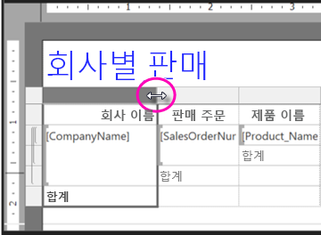

4. 열이 3과 3/4인치에서 끝날 때까지 제품 이름의 오른쪽 가장자리를 끕니다.   

이제 행렬이 인쇄 영역과 너비가 거의 비슷합니다.

### 통화 형식 지정

보고서를 실행했을 때 알 수 있었던 것처럼 달러 금액이 아직 통화로 형식 지정되지 않았습니다.

1. 왼쪽 상단 [Sum(OrderQty)] 셀을 선택하고 Shift 키를 누른 채 오른쪽 하단 [Sum(LineTotal)] 셀을 선택합니다.

    

2. **홈** 탭에서 달러 기호(**$**) 통화 기호를 선택하고 **자리 표시자** > **보기 값** 옆에 있는 화살표를 선택합니다.
 
    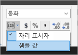

    이제 값이 통화로 형식 지정된 것을 볼 수 있습니다.

    

### 각 페이지에서 열 머리글 추가

Power BI 서비스에 보고서를 게시하기 전에 한 가지 더 형식 지정 사항을 개선하여 열 머리글이 보고서의 각 페이지에 표시되도록 하겠습니다.

1. 그룹화 창 위쪽 막대 맨 오른쪽 끝에서 드롭다운 화살표 > **고급 모드**를 선택합니다.

    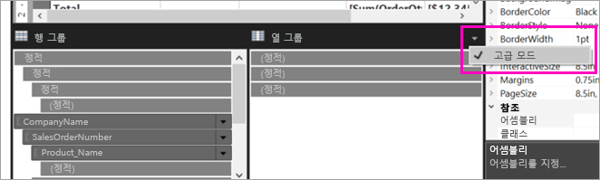

2. **행 그룹**에서 맨 위 **정적** 막대를 선택합니다. 행렬에서 회사 이름 셀이 선택되어 있는 것을 알 수 있습니다.

   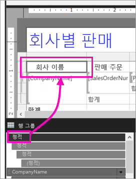

3. **속성** 창에 **테이블릭스 멤버** 속성이 표시되어 있습니다. **KeepWithGroup**을 **After**로 설정하고 **RepeatOnNewPage**를 **True**로 설정합니다.

    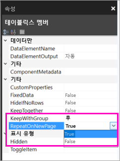

    이제 보고서를 실행하여 어떻게 표시되는지 확인합니다.

5. **홈** 탭에서 **실행**을 선택합니다.

6. **인쇄 레이아웃**이 아직 선택되어 있지 않은 경우 선택합니다. 이제 보고서는 29페이지로 구성되어 있습니다. 몇 페이지를 스크롤합니다. 통화가 형식 지정되었고, 모든 페이지의 열에 제목이 있고, 보고서의 모든 페이지에 페이지 번호와 날짜 및 시간 스탬프로 된 바닥글이 있는 것을 볼 수 있습니다.
 
    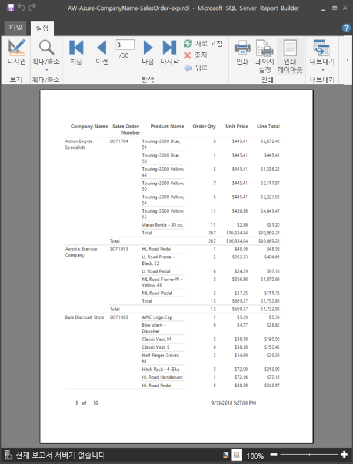

7. 보고서를 컴퓨터에 저장합니다.
 
##  서비스에 보고서 업로드

페이지를 매긴 보고서를 만들었으므로 이제 Power BI 서비스에 이 보고서를 업로드합니다.

1. Power BI 서비스(http://app.powerbi.com)의 왼쪽 탐색에서 **작업 영역** > **작업 영역 만들기**를 선택합니다.

2. 작업 영역 이름을 **Azure AW** 또는 다른 고유한 이름으로 지정합니다. 지금까지는 사용자가 유일한 구성원입니다. 

3. **고급** 옆에 있는 화살표를 선택하고 **전용 용량**을 켭니다. 

    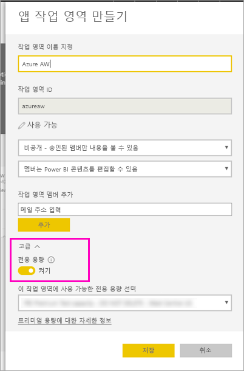

    켤 수 없는 경우 전용 프리미엄 용량에 작업 영역을 추가할 수 있는 권한을 부여해 달라고 Power BI 관리자에게 요청해야 합니다.

4. **이 작업 영역에 사용 가능한 전용 용량**을 선택하고 필요한 경우 > **저장**을 선택합니다.
    
    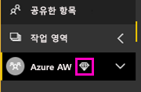

    작업 영역이 프리미엄 용량에 없는 경우 보고서를 업로드하려고 하면 “페이지를 매긴 보고서를 업로드할 수 없음” 메시지가 표시됩니다. Power BI 관리자에게 문의하여 작업 영역을 이동하세요.

1. 새 작업 영역에서 **데이터 가져오기**를 선택합니다.

2. **파일** 상자에서 > **가져오기**를 선택합니다.

3. **로컬 파일**을 선택하고 파일을 저장한 위치로 이동하여 > **열기**를 선택합니다.

   Power BI가 파일을 가져오면 앱 목록 페이지의 **보고서** 아래에 표시됩니다.

    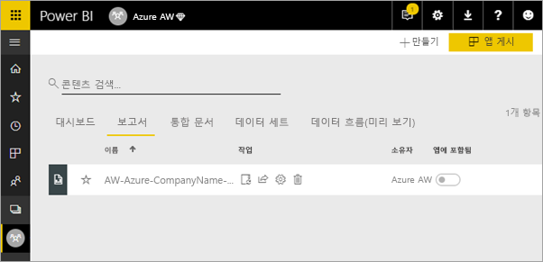

4. 보려는 보고서를 선택합니다.

5. 오류가 발생하는 경우 자격 증명을 다시 입력해야 할 수도 있습니다. **관리** 아이콘을 선택합니다.

    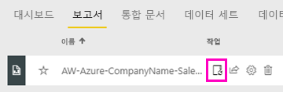

6. **자격 증명 편집**을 선택하고 Azure 데이터베이스를 만들 때 Azure에서 사용한 자격 증명을 입력합니다.

    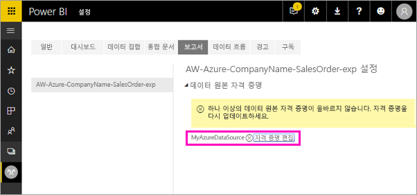

7. 이제 Power BI 서비스에서 페이지를 매긴 보고서를 볼 수 있습니다.

    

## 다음 단계

[Power BI Premium에서 페이지를 매긴 보고서란?](paginated-reports-report-builder-power-bi.md)

