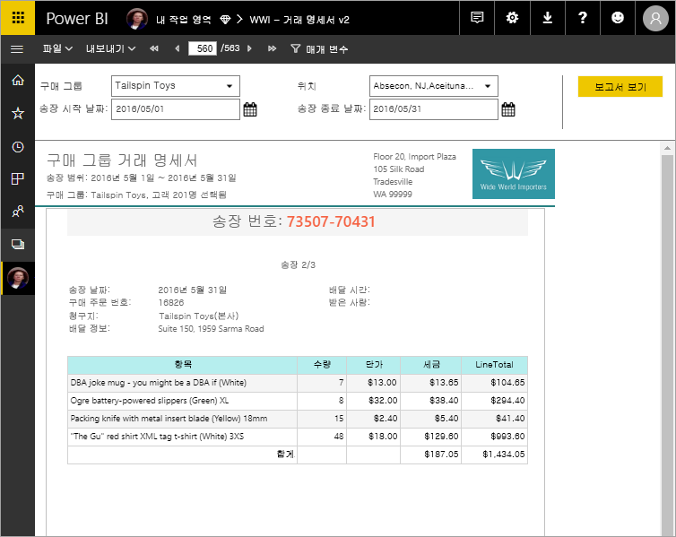

# Power BI Premium의 페이지를 매긴 보고서란? (미리 보기)

페이지를 매긴 보고서는 SQL Server Reporting Services의 표준 보고서 형식과 함께 이제 Power BI 서비스에서 사용할 수 있습니다. 이러한 보고서를 인쇄 또는 공유할 수 있습니다. 이러한 보고서가 “페이지를 매긴” 보고서로 불리는 이유는 페이지에 적합하게 형식 지정되어 있기 때문입니다. 이러한 보고서에는 테이블이 여러 페이지에 걸쳐 있는 경우에도 테이블의 모든 데이터가 표시됩니다. 보고서 페이지 레이아웃을 정확하게 제어할 수 있기 때문에 “pixel perfect”라고도 합니다. 페이지를 매긴 보고서는 SQL Server Reporting Services의 RDL 보고서 기술을 기반으로 합니다. 보고서 작성기는 페이지를 매긴 보고서를 작성하기 위한 독립 실행형 도구입니다. 

페이지를 매긴 보고서에는 여러 페이지가 있을 수 있습니다. 예를 들어 이 보고서에는 563페이지가 있습니다. 각 페이지는 청구서당 한 페이지가 정확하게 배치되고 머리글과 바닥글이 반복됩니다.

보고서 작성기에서 보고서를 미리 본 후 Power BI 서비스, http://app.powerbi.com 에 게시할 수 있습니다. 서비스에 보고서를 게시하려면 Power BI Pro 라이선스가 필요합니다. 작업 영역이 Power BI Premium 용량에 포함된 경우 내 작업 영역 또는 앱 작업 영역에서 페이지를 매긴 보고서를 게시하고 공유할 수 있습니다. 또한 Power BI 관리자는 Power BI 관리 포털에서 페이지를 매긴 보고서를 사용하도록 설정해야 합니다. 

## Power BI 보고서 작성기에서 보고서 만들기

페이지 매긴된 보고서에는 고유한 디자인 도구인 Power BI 보고서 작성기. Power BI Report Server 또는 SQL Server Reporting Services (SSRS)에 대 한 페이지 매긴된 보고서를 만들려면 이전에 사용한 도구와 동일한 기반을 공유 하는 새 도구입니다. 실제로 SSRS 2016 및 2017 또는 Power BI Report Server 온-프레미스용으로 만드는 페이지를 매긴 보고서는 Power BI 서비스와 호환됩니다. Power BI 서비스는 이전 버전과의 호환성을 유지 관리하므로 보고서를 앞으로 이동할 수 있고 이전 버전의 페이지를 매긴 보고서를 업그레이드할 수 있습니다. 일부 보고서 기능은 시작 시 사용할 수 없습니다. 자세한 내용은 이 문서의 [제한 사항 및 고려 사항](#limitations-and-considerations)을 참조하세요.
     
## 다양한 데이터 원본의 보고서

하나의 페이지를 매긴 보고서에 다양하고 많은 데이터 원본이 포함될 수 있습니다. Power BI 보고서와 달리, 이 보고서에는 기본 데이터 모델이 없습니다. Power BI 서비스의 페이지를 매긴 보고서 초기 릴리스의 경우 보고서 자체에 포함된 데이터 원본 및 데이터 세트를 만듭니다. 지금은 공유 데이터 원본 또는 공유 데이터 세트를 사용할 수 없습니다. 로컬 컴퓨터의 보고서 작성기에서 보고서를 만듭니다. 보고서가 온-프레미스 데이터에 연결되면 보고서를 Power BI 서비스에 업로드한 후 게이트웨이를 만들고 데이터 연결을 리디렉션해야 합니다. 다음은 데이터 원본에 연결할 수 있습니다.

- Azure SQL Database 및 Data Warehouse
- (SSO)를 통해 azure Analysis Services
- 게이트웨이를 통해 SQL Server
- 게이트웨이를 통해 SQL Server Analysis Services
- Power BI 프리미엄 데이터 집합
- Oracle
- Teradata
 
추가 데이터 원본이 미리 보기 기간 중에 제공될 예정입니다.

## 보고서 디자인  

### 행렬, 차트 및 자유 형식 레이아웃을 사용하여 페이지를 매긴 보고서 만들기

테이블 보고서는 열 기반 데이터에 적합합니다. 크로스탭 또는 피벗 테이블 보고서와 같은 행렬 보고서는 요약된 데이터에 적합합니다. 차트 보고서는 그래픽 형식으로 데이터를 제공하고 자유 형식 ‘목록’ 보고서는 청구서와 같은 거의 모든 다른 것을 제공할 수 있습니다.  
  
보고서 작성기 마법사 중 하나로 시작할 수 있습니다. 테이블, 행렬 및 차트 마법사는 포함된 데이터 원본 연결 및 포함된 데이터 세트를 만드는 과정을 안내합니다. 그런 다음, 필드를 끌어서 놓아 데이터 세트 쿼리를 만들고, 레이아웃 및 스타일을 선택하고, 보고서를 사용자 지정합니다.  
  
지도 마법사를 사용하여 지리적 또는 기하학적 배경에 집계된 데이터를 표시하는 보고서를 만듭니다. 지도 데이터는 Transact-SQL 쿼리 또는 ESRI(Environmental Systems Research Institute, Inc.) 셰이프 파일의 공간 데이터일 수 있습니다. Microsoft Bing 지도 타일 배경을 추가할 수도 있습니다.  

### 보고서에 다른 항목 추가

데이터를 필터링, 그룹화 및 정렬하거나 공식 또는 식을 추가하여 데이터를 수정합니다. 차트, 계기, 스파크라인 및 표시기를 추가하여 데이터를 시각적 형식으로 요약합니다.  매개 변수 및 필터를 사용하여 사용자 지정된 보기에 대한 데이터를 필터링합니다. 외부 콘텐츠를 포함하여 이미지 및 기타 리소스를 포함하거나 참조합니다.  

보고서 자체부터 모든 텍스트 상자, 이미지, 테이블 및 차트까지, 페이지를 매긴 보고서의 모든 항목에는 보고서를 원하는 대로 정확하게 표시하기 위해 설정할 수 있는 속성 배열이 있습니다.

## 보고서 정의 만들기

페이지를 매긴 보고서를 디자인할 때 실제로는 ‘보고서 정의’를 만듭니다.  보고서 정의는 데이터를 포함하지 않습니다. 데이터를 가져올 위치, 가져올 데이터 및 데이터 표시 방법을 지정합니다. 보고서를 실행할 때 보고서 처리기는 지정한 보고서 정의를 사용하고, 데이터를 검색하고, 보고서 레이아웃과 결합하여 보고서를 생성합니다. 보고서 정의를 Power BI 서비스, http://app.powerbi.com 의 내 작업 영역 또는 동료와 공유된 작업 영역에 업로드합니다. 보고서 데이터 원본이 온-프레미스인 경우 보고서를 업로드한 후 데이터 원본 연결을 리디렉션하여 게이트웨이를 통과합니다. 

## 페이지를 매긴 보고서 보기
브라우저의 Power BI 서비스 및 Power BI 모바일 앱에서 페이지를 매긴 보고서를 볼 수 있습니다. Power BI 서비스에서 보고서를 HTML, MHTML, PDF, XML, CSV, TIFF, Word 및 Excel과 같은 여러 형식으로 내보낼 수 있습니다. 다른 사용자와 공유할 수도 있습니다.  

## 보고서에 대 한 구독 만들기

이제 Power BI 서비스에서 페이지 매긴된 보고서에 대 한 직접 및 다른 사용자에 대 한 전자 메일 구독을 설정할 수 있습니다. 일반적으로 프로세스는 Power BI 서비스에서 보고서 및 대시보드 구독와 같습니다. 구독을 설정 하면 선택 전자 메일 수신 빈도: 매일, 매주 또는 시간입니다. 구독에는 전체 보고서 출력의 PDF 첨부 파일을 포함합니다.

자세한 내용은 문서를 참조 [자신과 다른 사람이 Power BI 서비스에서 페이지 매긴된 보고서를 구독할](paginated-reports-subscriptions.md)합니다. 

## 제한 사항 및 고려 사항

초기 릴리스에서 지원되지 않는 몇 가지 다른 기능은 다음과 같습니다.

- 보고서 페이지 또는 시각적 개체를 Power BI 대시보드에 고정. Power BI Report Server 또는 Reporting Services 보고서 서버의 온-프레미스 페이지를 매긴 보고서에서 Power BI 대시보드에 시각화를 고정할 수 있습니다. 자세한 내용은 [Power BI 대시보드에 Reporting Services 항목 고정](https://docs.microsoft.com/sql/reporting-services/pin-reporting-services-items-to-power-bi-dashboards)을 참조하세요.
- 문서 구조 및 단추 표시/숨기기와 같은 대화형 기능.
- 하위 보고서 및 드릴스루 보고서.
- 공유 데이터 원본 및 공유 데이터 세트.
- Power BI 보고서의 시각적 개체.
 
## 다음 단계

- [Microsoft 다운로드 센터에서 Power BI 보고서 작성기를 설치 합니다.](https://go.microsoft.com/fwlink/?linkid=2086513)
- [자습서: 페이지를 매긴 보고서 만들기](paginated-reports-quickstart-aw.md)
- [페이지를 매긴 보고서에 직접 데이터 입력](paginated-reports-enter-data.md)

  

