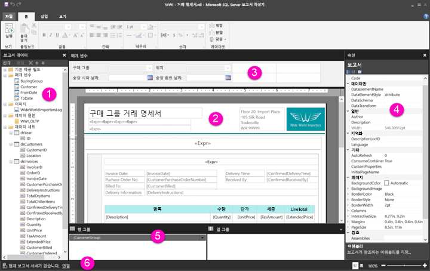

# 페이지를 매긴 보고서의 보고서 디자인 뷰 살펴보기

보고서 작성기의 보고서 디자인 뷰는 Power BI 서비스에 게시할 수 있는 페이지를 매긴 보고서를 만들기 위한 디자인 공간입니다. 디자인 화면은 보고서 작성기의 가운데에 있고 그 주위에 리본 및 창이 있습니다. 디자인 화면에서 보고서 항목을 추가하고 구성할 수 있습니다. 이 문서에서는 보고서 리소스를 추가, 선택 및 구성하고 보고서 항목 속성을 변경하는 데 사용하는 창에 대해 설명합니다.  

1.  [보고서 데이터 창](#report-data-pane) 
2.  [보고서 디자인 화면](#report-design-surface)  
3.  [매개 변수 창](#parameters-pane) 
4.  [속성 창](#properties-pane) 
5.  [그룹화 창](#grouping-pane) 
6.  [현재 보고서 상태 표시줄](#current-report-status-bar)  
  
## 1 [보고서 데이터] 창  
 [보고서 데이터] 창에서 보고서 레이아웃을 디자인하기 전에 보고서에 필요한 보고서 데이터와 보고서 리소스를 정의합니다. 예를 들어 데이터 원본, 데이터 세트, 계산 필드, 보고서 매개 변수 및 이미지를 [보고서 데이터] 창에 추가할 수 있습니다.  
  
 [보고서 데이터] 창에 항목을 추가한 후 필드를 디자인 화면의 보고서 항목으로 끌어서 보고서에 데이터가 나타나는 위치를 제어합니다.  
  
> [!TIP]  
>  [보고서 데이터] 창의 필드를 테이블 또는 차트와 같은 데이터 영역에 배치하지 않고 보고서 디자인 화면으로 직접 끌면, 보고서 실행 시 해당 필드에는 데이터의 첫 번째 값만 표시됩니다.  
  
 또한 [보고서 데이터] 창에서 보고서 디자인 화면으로 기본 제공 필드를 끌 수도 있습니다. 렌더링될 때 이러한 필드는 보고서 이름, 보고서의 총 페이지 수 및 현재 페이지 번호와 같은 보고서 관련 정보를 제공합니다.  
  
 일부 항목은 보고서 디자인 화면에 항목을 추가할 때 [보고서 데이터] 창에 자동으로 추가됩니다. 예를 들어 보고서에 이미지를 포함하면 이 이미지는 [보고서 데이터] 창의 이미지 폴더에 추가됩니다.  
  
> [!NOTE]  
>  **새로 만들기** 단추를 사용하여 [보고서 데이터] 창에 새 항목을 추가할 수 있습니다. 동일한 데이터 원본 또는 다른 데이터 원본의 여러 데이터 세트를 보고서에 추가할 수 있습니다. 동일한 데이터 원본의 새 데이터 세트를 추가하려면 데이터 원본을 마우스 오른쪽 단추로 클릭하고 **데이터 세트 추가**를 선택합니다.  
  
## 2 보고서 디자인 화면  
 보고서 작성기의 보고서 디자인 화면은 보고서를 디자인하기 위한 기본 작업 영역입니다. 보고서 항목(예: 데이터 영역, 하위 보고서, 텍스트 상자, 이미지, 사각형 및 줄)을 보고서에 배치하려면 리본 또는 보고서 파트 갤러리의 보고서 항목을 디자인 화면에 추가합니다. 여기에서 그룹, 식, 매개 변수, 필터, 작업, 표시 여부 및 서식을 보고서 항목에 추가할 수 있습니다.  
  
 다음을 변경할 수도 있습니다.  
  
-   보고서 본문 속성(예: 테두리 및 채우기 색) - 디자인 화면에서 보고서 항목 밖의 흰색 영역을 마우스 오른쪽 단추로 클릭하고 **본문 속성**을 선택합니다.  
  
-   머리글 및 바닥글 속성(예: 테두리 및 채우기 색) - 머리글 또는 바닥글 영역 디자인 화면에서 보고서 항목 밖의 흰색 영역을 마우스 오른쪽 단추로 클릭하고 **머리글 속성** 또는 **바닥글 속성**을 선택합니다.  
  
-   보고서 자체의 속성(예: 페이지 설정) - 디자인 화면 주위의 회색 영역을 마우스 오른쪽 단추로 클릭하고 **보고서 속성**을 선택합니다.  
  
-   보고서 항목의 속성 - 보고서 항목을 마우스 오른쪽 단추로 클릭하고 **속성**을 선택합니다.  
  
### 디자인 화면 크기 및 인쇄 영역  
디자인 화면 크기는 보고서를 인쇄하기 위해 지정하는 페이지 크기 인쇄 영역과 다를 수 있습니다. 디자인 화면 크기를 변경해도 보고서의 인쇄 영역은 변경되지 않습니다. 보고서의 인쇄 영역에 설정한 크기와 관계없이 전체 디자인 영역 크기는 변경되지 않습니다. 자세한 내용은 렌더링 동작을 참조하세요. 
  
- 눈금자를 표시하려면 **보기** 탭에서 **눈금자** 확인란을 선택합니다.  
  
## 3 매개 변수 창  
 보고서 매개 변수를 사용하면 보고서 데이터를 제어하고, 관련 보고서를 함께 연결하고, 보고서 프레젠테이션을 다양화할 수 있습니다. [매개 변수] 창은 보고서 매개 변수의 유연한 레이아웃을 제공합니다.  
  
 보고서 매개 변수에 대한 자세한 정보   
  
## 4 속성 창
 데이터 영역, 이미지, 텍스트 상자 및 보고서 본문 자체를 포함하여 보고서의 모든 항목에는 연결된 속성이 있습니다. 예를 들어 텍스트 상자의 BorderColor 속성은 텍스트 상자 테두리의 색 값을 표시하고 보고서의 PageSize 속성은 보고서의 페이지 크기를 표시합니다.  
  
 이러한 속성은 [속성] 창에 표시됩니다. 창의 속성은 선택한 보고서 항목에 따라 변경됩니다.  
  
- [속성] 창을 보려면 **표시/숨기기** 그룹의 **보기** 탭에서 **속성**을 선택합니다.  
  
### 속성 값 변경  
 보고서 작성기에서 다음과 같은 여러 가지 방법으로 보고서 항목의 속성을 변경할 수 있습니다.  
  
-   리본에서 단추 및 목록을 선택합니다.  
  
-   대화 상자 내에서 설정을 변경합니다.  
  
-   [속성] 창에서 속성 값을 변경합니다.  
  
 가장 일반적으로 사용되는 속성은 대화 상자 및 리본에서 사용할 수 있습니다.  
  
 속성에 따라 드롭다운 목록에서 속성 값을 설정하거나, 값을 입력하거나, `<Expression>`을 선택하여 식을 만들 수 있습니다.  
  
### 속성 창 보기 변경  
 기본적으로 [속성] 창에 표시된 속성은 작업, 테두리, 채우기, 글꼴 및 일반과 같은 광범위한 범주로 구성됩니다. 각 범주에는 연결된 속성 집합이 있습니다. 예를 들어 다음 속성은 글꼴 범주에 나열됩니다. Color, FontFamily, FontSize, FontStyle, FontWeight, LineHeight 및 TextDecoration. 원하는 경우 창에 나열된 모든 속성을 사전순으로 정렬할 수 있습니다. 이렇게 하면 범주가 제거되고 범주에 상관없이 모든 속성이 사전순으로 나열됩니다.  
  
 [속성] 창의 맨 위에는 세 개의 단추인 **범주**, **사전순 정렬** 및 **속성 페이지**가 있습니다. [범주] 및 [사전순 정렬] 단추를 선택하여 [속성] 창 보기 간에 전환합니다. **속성 페이지** 단추를 선택하여 선택된 보고서 항목의 속성 대화 상자를 엽니다.  
  
  
## 5 그룹화 창

 그룹은 보고서 데이터를 시각적 계층 구조로 구성하고 합계를 계산하는 데 사용됩니다. 디자인 화면의 데이터 영역 내에서, 그리고 [그룹화] 창에서도 행 및 열 그룹을 볼 수 있습니다. [그룹화] 창에는 두 개의 창인 [행 그룹] 및 [열 그룹]이 있습니다. 데이터 영역을 선택하면 [그룹화] 창에 해당 데이터 영역 내의 모든 그룹이 계층 구조 목록으로 표시됩니다. 자식 그룹은 부모 그룹 아래에 들여쓰기로 표시됩니다.  
  
 [보고서 데이터] 창에서 필드를 끌어서 디자인 화면이나 [그룹화] 창에 놓으면 그룹을 만들 수 있습니다. [그룹화] 창에서 부모, 인접 및 자식 그룹을 추가하고, 그룹 속성을 변경하고, 그룹을 삭제할 수 있습니다.  
  
 [그룹화] 창은 기본적으로 표시되지만 [보기] 탭의 [그룹화 창] 확인란을 선택 취소하여 닫을 수 있습니다. 차트 또는 계기 데이터 영역에는 [그룹화] 창을 사용할 수 없습니다.  
  
 자세한 내용은 그룹화 창 및 그룹 이해를 참조하세요.  
  
## 6 현재 보고서 상태 표시줄

현재 보고서 상태 표시줄에는 보고서가 연결된 서버의 이름이 표시되거나 “현재 보고서 서버 없음”이 표시됩니다. **연결**을 선택하여 서버에 연결할 수 있습니다.

## 다음 단계

[What are paginated reports in Power BI Premium? (Preview)](paginated-reports-report-builder-power-bi.md)(Power BI Premium의 페이지를 매긴 보고서란?(미리 보기)) 

  
  
