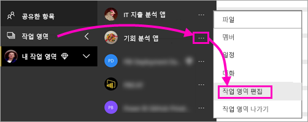
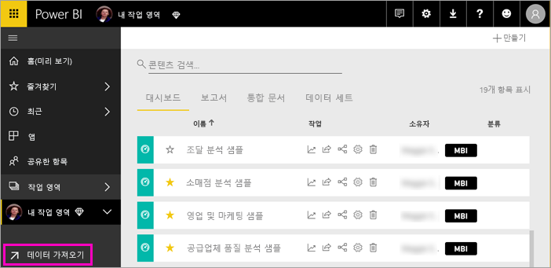
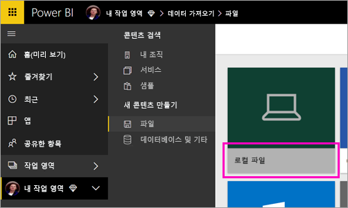
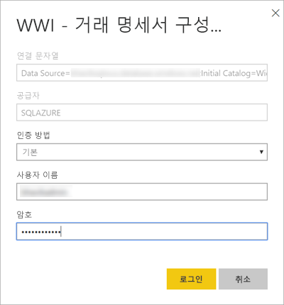
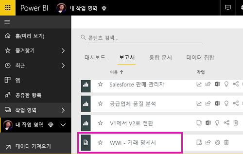
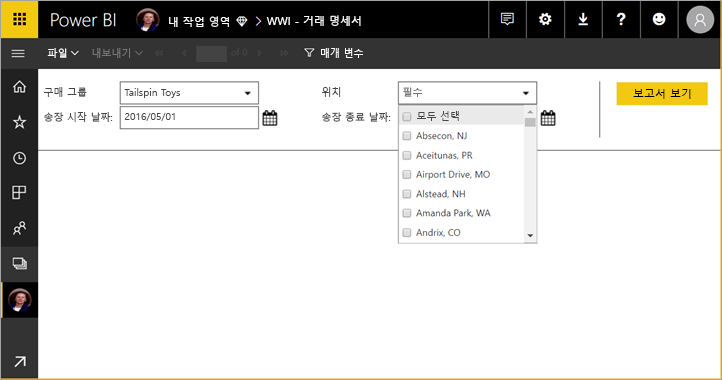

# Power BI 서비스에 페이지를 매긴 보고서 게시(미리 보기)

이 문서에서는 페이지를 매긴 보고서를 로컬 컴퓨터에서 업로드하여 Power BI 서비스에 게시하는 방법을 알아봅니다. 작업 영역이 프리미엄 용량에 포함된 경우 내 작업 영역 또는 다른 작업 영역에 페이지를 매긴 보고서를 업로드할 수 있습니다. 작업 영역 이름 옆의 다이아몬드 아이콘  을 찾으세요. 

보고서 데이터 원본이 온-프레미스에 있는 경우 보고서를 업로드한 후 [게이트웨이를 만들어야](#create-a-gateway-to-an-on-premises-data-source) 합니다.

## 프리미엄 용량에 작업 영역 추가

작업 영역의 이름 옆에 다이아몬드 아이콘  이 없는 경우 작업 영역을 프리미엄 용량에 추가해야 합니다. 

1. **작업 영역**을 선택하고 작업 영역 이름 옆의 줄임표(**...**), **작업 영역 편집**을 차례로 선택합니다.

    

1. **작업 영역 편집** 대화 상자에서 **고급**을 확장하고 **전용 용량**을 **켜기**로 밉니다.

    

   이 설정을 변경할 수 없는 경우도 있습니다. 변경할 수 없는 경우 Power BI Premium 용량 관리자에게 문의하여 프리미엄 용량에 작업 영역을 추가할 수 있는 할당 권한을 받으세요.

## 페이지를 매긴 보고서 업로드

1. 보고서 작성기에서 페이지를 매긴 보고서를 만들어 로컬 컴퓨터에 저장합니다.

1. 브라우저에서 Power BI 서비스를 열고 보고서를 게시할 Power BI Premium 작업 영역을 찾습니다. 이름 옆의 다이아몬드 아이콘  에 유의하세요. 

1. **데이터 가져오기**를 선택합니다.

    

1. **파일** 상자에서 **가져오기**를 선택합니다.

    

1. **로컬 파일** > [페이지를 매긴 보고서 찾아보기] > **열기**를 선택합니다.

    

1. **계속** > **자격 증명 편집**을 선택합니다.

    

1. 자격 증명 > **로그인**을 구성합니다.

    

   보고서 목록에 보고서가 표시됩니다.

    

1. 보고서를 선택하여 Power BI 서비스에서 엽니다. 매개 변수가 있는 경우 보고서를 보려면 먼저 매개 변수를 선택해야 합니다.
 
    

## 게이트웨이 만들기

다른 Power BI 보고서와 마찬가지로 보고서 데이터 원본이 온-프레미스에 있는 경우 데이터에 액세스하려면 게이트웨이를 만들거나 연결해야 합니다.

1. 보고서 이름 옆에 있는 **관리**를 선택합니다.

   

1. 자세한 내용 및 다음 단계를 보려면 Power BI 서비스 문서 [게이트웨이 설치](service-gateway-install.md)를 참조하세요.

### 게이트웨이 제한 사항

현재 게이트웨이는 다중값 매개 변수를 지원하지 않습니다.

## 다음 단계

- [Power BI 서비스에서 페이지를 매긴 보고서 보기](paginated-reports-view-power-bi-service.md)
- [What are paginated reports in Power BI Premium? (Preview)](paginated-reports-report-builder-power-bi.md)(Power BI Premium의 페이지를 매긴 보고서란?(미리 보기))

